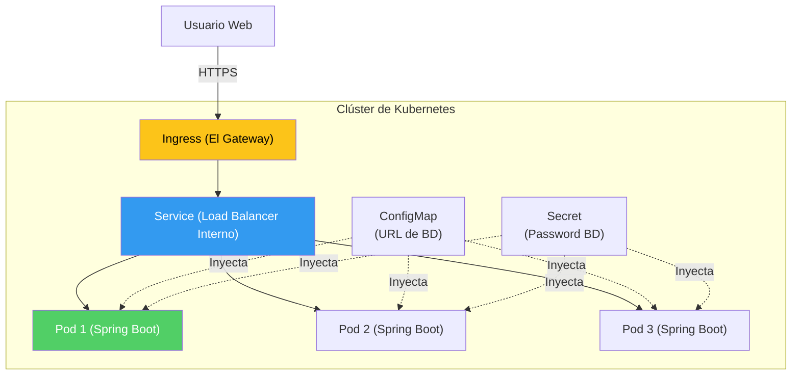

## 48 — Orquestación en Kubernetes (K8s) para Spring Boot

### Propósito
Aprender a desplegar una aplicación Spring Boot dentro de un clúster de Kubernetes, configurando de manera nativa los "Health Checks" (Liveness y Readiness Probes) y consumiendo variables de entorno de forma segura a través de ConfigMaps y Secrets.

### Problema que resuelve
En el Módulo 26 aprendimos a empaquetar la app en un contenedor Docker. Pero un contenedor aislado no es un sistema de producción.
- ¿Qué pasa si el contenedor muere por un `OutOfMemoryError` en la madrugada?
- ¿Cómo distribuyo el tráfico si quiero correr 10 instancias (réplicas) de mi contenedor de "Ventas" simultáneamente?
- ¿Dónde guardo la contraseña de la Base de Datos para que no esté hardcodeada en el archivo `application.yml`?

### Cómo lo resuelve
**Kubernetes (K8s)** es un orquestador de contenedores. 
1. Le dices a K8s: *"Quiero que SIEMPRE existan 3 contenedores de Ventas"*. Si uno muere a las 3:00 AM, K8s crea uno nuevo automáticamente en segundos (Self-Healing).
2. K8s incluye su propio "Eureka" (Service Discovery) interno. Agrupa los 3 contenedores bajo un nombre DNS interno `http://ventas-service:8080` y balancea la carga entre ellos.
3. Almacena las contraseñas en objetos encriptados (`Secrets`) e inyecta esos valores como variables de entorno directamente en Spring Boot antes de arrancarlo.

### Por qué aprenderlo
Si Docker revolucionó cómo empaquetamos software, Kubernetes revolucionó cómo lo operamos. Hoy en día, es el estándar absoluto (AWS EKS, Google GKE, Azure AKS) para alojar microservicios corporativos. Dominar los descriptores YAML de K8s y las configuraciones de Spring Actuator para K8s es fundamental.



---

### Glosario Básico

#### `Pod`
La unidad de despliegue más pequeña en K8s. Es el "envoltorio" que corre tu contenedor de Spring Boot.

#### `Deployment`
Un archivo YAML donde describes cuántas réplicas (Pods) quieres correr, qué imagen de Docker usar y cuánta RAM/CPU le asignas. K8s vigila este Deployment eternamente.

#### `Service`
Como los Pods nacen y mueren (cambiando de IP cada vez), el Service es una IP estática interna (y un nombre DNS) que enruta el tráfico hacia los Pods vivos de forma balanceada. (Hace que Eureka sea innecesario en K8s).

#### `Probes` (Sondas de Salud)
- **Liveness Probe**: K8s te pregunta "¿Estás vivo?". Si respondes que no (HTTP 500), K8s reinicia el contenedor (mata el proceso).
- **Readiness Probe**: K8s te pregunta "¿Estás listo para recibir tráfico HTTP?". Si respondes que no, K8s no te enviará peticiones de usuarios, pero no te mata (ideal mientras Spring Boot arranca y conecta a la BD).

---

### Conceptos

#### 1. Configurando Spring Boot para Kubernetes (Actuator)
- **Qué es** — Spring Boot sabe si se está ejecutando dentro de K8s. Expone automáticamente URLs específicas para los Probes.
- **Código** — (En `application.yml`):
  ```yaml
  management:
    endpoint:
      health:
        probes:
          enabled: true # Activa /actuator/health/liveness y /readiness
  ```
  Al compilar y ejecutar, Spring tendrá dos endpoints listos para que K8s los consulte periódicamente.

#### 2. Escribiendo el Descriptor YAML (El Deployment)
- **Qué es** — El archivo que le entregamos a K8s para que orqueste la app.
- **Código** — `k8s-deployment.yml`:
  ```yaml
  apiVersion: apps/v1
  kind: Deployment
  metadata:
    name: spring-boot-app
  spec:
    replicas: 3
    selector:
      matchLabels:
        app: spring-boot-app
    template:
      metadata:
        labels:
          app: spring-boot-app
      spec:
        containers:
        - name: spring-app
          image: mi-empresa/spring-boot-app:1.0.0
          ports:
          - containerPort: 8080
          # Configuración Vital: Le dice a K8s cómo vigilar a Spring Boot
          livenessProbe:
            httpGet:
              path: /actuator/health/liveness
              port: 8080
            initialDelaySeconds: 15 # Dale tiempo a que arranque el contexto de Spring
            periodSeconds: 10
          readinessProbe:
            httpGet:
              path: /actuator/health/readiness
              port: 8080
            initialDelaySeconds: 15
            periodSeconds: 5
  ```

#### 3. Inyección de Configuración (ConfigMap y Secrets)
- **Qué es** — En vez de tener 3 archivos `application.yml` (dev, qa, prod), tienes un solo JAR, y le inyectas las variables desde K8s.
- **Código K8s**:
  ```yaml
  apiVersion: v1
  kind: ConfigMap
  metadata:
    name: spring-config
  data:
    DB_URL: "jdbc:postgresql://mi-bd-prod:5432/ventas"
  ```
- **Código K8s (En el Deployment inyectando el valor)**:
  ```yaml
          env:
          - name: SPRING_DATASOURCE_URL
            valueFrom:
              configMapKeyRef:
                name: spring-config
                key: DB_URL
  ```
  *(Nota de Spring: Si la variable de entorno se llama `SPRING_DATASOURCE_URL`, Spring Boot mágicamente sobreescribe la propiedad `spring.datasource.url` del application.yml).*

#### 4. K8s Service (Reemplazando a Eureka)
- **Qué es** — Crea el balanceador de carga interno.
- **Código**:
  ```yaml
  apiVersion: v1
  kind: Service
  metadata:
    name: spring-boot-service # ESTE SERÁ EL NOMBRE DNS
  spec:
    selector:
      app: spring-boot-app
    ports:
      - protocol: TCP
        port: 80
        targetPort: 8080
  ```
  Si otro microservicio tuyo dentro del clúster hace `restClient.get().uri("http://spring-boot-service/api")`, K8s lo ruteará perfectamente a uno de los 3 pods.

#### 5. Edge Cases y Errores Comunes

| Error | Causa | Solución |
|-------|-------|----------|
| `CrashLoopBackOff` | K8s reinicia el contenedor infinitamente porque el `LivenessProbe` falló. | Pusiste el `initialDelaySeconds` en 5 segundos. Spring Boot tarda 12 segundos en arrancar. K8s asume que el contenedor está defectuoso y lo mata antes de que termine de iniciar. Aumenta el delay. (O mejor aún, usa una `startupProbe`). |
| OOMKilled (Out Of Memory) | Spring Boot asume que tiene toda la RAM del nodo K8s, reserva el 25% de 16GB, y excede el límite impuesto por el YAML de K8s. | K8s aniquila los pods que exceden sus límites (`resources.limits.memory`). Configura JVM options en el Dockerfile: `-XX:MaxRAMPercentage=75.0` para que Java sea consciente de que corre en un contenedor pequeño. |
| Logs perdidos al reiniciar el Pod | Los logs se estaban guardando en un archivo local (ej. `/app/logs/spring.log`). K8s borró el Pod y creó uno nuevo en otro nodo. El archivo desapareció. | En K8s, **jamás debes loggear a un archivo de disco**. Loggea siempre y exclusivamente hacia la Consola (STDOUT). K8s captura la consola y tú usas ELK/Loki (Módulo 45) para consultarlo. |

---

### Ejercicios
1. Asegúrate de tener Kubernetes activado en Docker Desktop, o usa `minikube`.
2. Habilita los probes de Actuator en tu `application.yml` y compila una imagen Docker de tu proyecto (`docker build -t app-k8s:v1 .`).
3. Crea un archivo `deployment.yaml` con las instrucciones del concepto #2.
4. Aplica el archivo a tu clúster local: `kubectl apply -f deployment.yaml`.
5. Verifica cómo K8s crea los pods con `kubectl get pods`. Haz un `kubectl port-forward svc/spring-boot-service 8080:80` y visita la app en tu navegador. 

### Cómo ejecutar
```bash
cd 48-kubernetes
# Compilar imagen local (Para que K8s la encuentre)
docker build -t mi-spring-k8s:1.0.0 .

# Aplicar manifiestos
kubectl apply -f k8s/configmap.yml
kubectl apply -f k8s/deployment.yml
kubectl apply -f k8s/service.yml

# Ver el estado mágico de autocuración
kubectl get pods -w
```

### Archivos del Proyecto
| Archivo | Propósito |
|---------|-----------|
| `pom.xml` | Configuración de Actuator (`spring-boot-starter-actuator`). |
| `k8s/deployment.yml` | Despliegue de los Pods y configuración de Probes. |
| `k8s/configmap.yml` | Inyección de propiedades como Variables de Entorno. |
| `k8s/service.yml` | Balanceador de Carga nativo de Kubernetes. |
