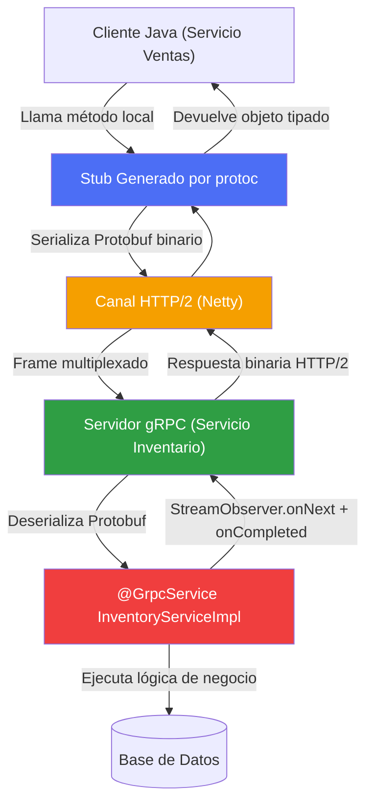

## 49 — gRPC

### Propósito
Aprender a implementar comunicación **entre microservicios internos** usando **gRPC** (Google Remote Procedure Call), un protocolo binario sobre HTTP/2 con contratos fuertemente tipados definidos en Protocol Buffers, mucho más rápido y estricto que REST/JSON.

### Problema que resuelve
Tienes 15 microservicios internos (Ventas → Inventario → Facturación → Pricing) que se comunican entre sí a través de REST/JSON:
- Cada llamada REST agrega **latencia** por serialización JSON (texto plano, verboso) y cabeceras HTTP/1.1 redundantes.
- El "contrato" entre servicios es un README con ejemplos JSON. Un desarrollador cambia el nombre del campo `total_price` a `totalPrice` y **rompe en producción** al servicio de Facturación, sin que el compilador lo detecte.
- No hay tipado end-to-end: el cliente puede mandar un `String` donde el servidor esperaba `int`, y solo se descubre en runtime.
- Necesitas streaming (ej: enviar 10 millones de registros de inventario) y HTTP/1.1 no permite multiplexación real.

### Cómo lo resuelve
**gRPC** define el contrato de forma explícita en un archivo `.proto` (Protocol Buffers):
1. Escribes un archivo `.proto` con los mensajes (`message`) y servicios (`service`).
2. El compilador `protoc` genera **stubs Java** (cliente y servidor) automáticamente.
3. La comunicación viaja sobre **HTTP/2** (multiplexación, compresión de cabeceras HPACK, servidor push).
4. Los datos se serializan en **binario** (Protobuf), típicamente 3-10x más pequeños que JSON.
5. Soporta 4 modos: **Unary** (request/response), **Server Streaming**, **Client Streaming** y **Bidirectional Streaming**.
6. Los cambios incompatibles al `.proto` se detectan en **tiempo de compilación**, no en producción.

### Por qué aprenderlo
gRPC es el estándar de facto para **comunicación interna de microservicios de alto rendimiento**. Lo usan **Google** (creador), **Netflix**, **Uber**, **Square**, **Dropbox** y **Cisco** para sus mallas de microservicios. Kubernetes, etcd, CockroachDB y Envoy están construidos sobre gRPC. Si trabajas en una empresa con arquitectura distribuida seria, tarde o temprano te toparás con gRPC en el backend interno (mientras REST/JSON se queda para el frontend público).



---

### Glosario Básico

#### `Protocol Buffers (.proto)`
Lenguaje de definición de interfaz (IDL) de Google. Un archivo de texto donde declaras `message` (estructuras de datos) y `service` (métodos RPC). Es la **fuente de la verdad** del contrato entre servicios.

#### `stub`
Clase Java generada automáticamente por `protoc`. Representa al servicio remoto como si fuera un objeto local. El cliente invoca `stub.getProduct(request)` y por debajo el stub serializa, envía por red y deserializa la respuesta.

#### `Unary RPC`
El modo más común: 1 request → 1 response. Equivalente a un `GET /product/1` en REST.

#### `Server Streaming`
1 request → N responses. Ej: cliente pide un catálogo y el servidor va emitiendo productos uno por uno sin cerrar la conexión.

#### `Bidirectional Streaming`
N requests ↔ N responses simultáneas. Ideal para chat, telemetría, colaboración en tiempo real.

#### `ManagedChannel`
La conexión TCP/HTTP/2 reutilizable hacia un servidor gRPC. Es **caro** de crear y debe ser **compartido** entre stubs (no crear uno por request).

#### `StreamObserver<T>`
API asíncrona con 3 callbacks: `onNext(T value)`, `onError(Throwable t)`, `onCompleted()`. Es la forma en que gRPC representa flujos de mensajes.

#### `Interceptor`
Filtro que se ejecuta antes/después de cada llamada gRPC (análogo a un `Filter` de Servlet o un `GlobalFilter` de Gateway). Se usa para autenticación, logging, tracing.

#### `Deadline`
Tiempo máximo total para una llamada gRPC. Se propaga a través de la cadena de servicios (si A llama a B con 5s de deadline, y B llama a C, C recibe el deadline restante).

---

### Conceptos

#### 1. Definición del Contrato en `.proto`
- **Qué es** — El archivo `.proto` es el **contrato inmutable** entre cliente y servidor. Se versiona en Git como código fuente. El plugin de Maven `protobuf-maven-plugin` invoca `protoc` en cada `mvn compile` y genera clases Java en `target/generated-sources/`.
- **Por qué importa** — Un cambio incompatible (renombrar un campo, cambiar el tipo) se detecta en **tiempo de compilación** en TODOS los servicios que consumen el `.proto`. En REST/JSON esto se detecta en producción con un `NullPointerException` a las 3 AM.
- **Código**:
  ```protobuf
  // src/main/proto/inventory.proto
  syntax = "proto3"; // Version 3 del lenguaje protobuf (recomendada)

  option java_multiple_files = true;                  // Cada message genera su .java propio
  option java_package = "com.springroadmap.grpc.proto"; // Paquete de las clases generadas
  option java_outer_classname = "InventoryProto";     // Nombre del wrapper (poco usado con multiple_files)

  package inventory; // Namespace protobuf (evita colisiones con otros .proto)

  // ============ MENSAJES (DTOs binarios) ============
  message ProductRequest {
    string product_id = 1; // El numero '1' es el FIELD TAG, no puede cambiar nunca
  }

  message ProductResponse {
    string product_id = 1;
    string name       = 2;
    int32  stock      = 3;
    double price      = 4;
  }

  message StockUpdateEvent {
    string product_id = 1;
    int32  delta      = 2; // Positivo = ingreso, negativo = venta
  }

  // ============ SERVICIO (los metodos RPC) ============
  service InventoryService {
    // Unary: 1 request -> 1 response
    rpc GetProduct(ProductRequest) returns (ProductResponse);

    // Server streaming: 1 request -> muchas respuestas
    rpc ListAllProducts(ProductRequest) returns (stream ProductResponse);

    // Bidirectional streaming: flujo continuo en ambos sentidos
    rpc SyncStock(stream StockUpdateEvent) returns (stream ProductResponse);
  }
  ```
- **Analogía** — El `.proto` es como el **plano arquitectónico** de un edificio firmado por el arquitecto. Cliente y albañil trabajan sobre el mismo plano; si el plano cambia, ambos se enteran al día siguiente. Nada de "yo pensé que la puerta iba aquí".
- **Casos empresariales** — Google mantiene ~48.000 archivos `.proto` en su monorepo. Uber usa `.proto` compartidos para toda la comunicación interna de servicios de viajes.

---

#### 2. Servidor gRPC con `@GrpcService`
- **Qué es** — La librería `net.devh:grpc-server-spring-boot-starter` integra gRPC con Spring Boot: levanta un servidor Netty en el puerto 9090, escanea beans anotados con `@GrpcService` y los registra automáticamente.
- **Por qué importa** — Te evita tener que instanciar manualmente `ServerBuilder.forPort(9090).addService(...).build().start()`. Además, dentro de un `@GrpcService` puedes inyectar `@Autowired` cualquier bean Spring (repositorios, servicios).
- **Código**:
  ```java
  package com.springroadmap.grpc.service;

  import com.springroadmap.grpc.proto.InventoryServiceGrpc; // Generado por protoc
  import com.springroadmap.grpc.proto.ProductRequest;
  import com.springroadmap.grpc.proto.ProductResponse;
  import io.grpc.stub.StreamObserver;
  import lombok.RequiredArgsConstructor;
  import lombok.extern.slf4j.Slf4j;
  import net.devh.boot.grpc.server.service.GrpcService;

  /**
   * Implementacion del servicio InventoryService definido en inventory.proto.
   * Extiende la clase base ImplBase generada por protoc.
   */
  @Slf4j
  @GrpcService // Registra el bean como servicio gRPC (equivalente a @RestController pero para gRPC)
  @RequiredArgsConstructor // Constructor injection via Lombok (regla del proyecto)
  public class InventoryGrpcService extends InventoryServiceGrpc.InventoryServiceImplBase {

      // Constructor injection: inyecta el repositorio JPA de productos
      private final ProductRepository productRepository;

      /**
       * Metodo Unary. Recibe UNA peticion, responde UNA respuesta.
       * gRPC NO usa 'return': usa el StreamObserver como callback.
       */
      @Override
      public void getProduct(ProductRequest request,
                             StreamObserver<ProductResponse> responseObserver) {
          log.info("gRPC GetProduct called for productId={}", request.getProductId());

          // 1. Buscamos en base de datos
          Product product = productRepository.findById(request.getProductId())
                  .orElseThrow(() -> new IllegalArgumentException("Product not found"));

          // 2. Construimos la respuesta usando el builder generado por protoc
          ProductResponse response = ProductResponse.newBuilder()
                  .setProductId(product.getId())
                  .setName(product.getName())
                  .setStock(product.getStock())
                  .setPrice(product.getPrice())
                  .build();

          // 3. Emitimos la respuesta al cliente
          responseObserver.onNext(response);

          // 4. Cerramos el stream (obligatorio en Unary)
          responseObserver.onCompleted();
      }
  }
  ```
- **Analogía** — `@GrpcService` es como `@RestController`, pero en vez de mapear URLs (`/api/products`) mapea **métodos RPC tipados**. El cliente no dice "GET /product/1", dice `stub.getProduct(...)`.
- **Casos empresariales** — Netflix expone toda su capa de recomendaciones internamente vía gRPC. Los servicios de Playback, Personalization y Encoding se hablan por gRPC exclusivamente.

---

#### 3. Cliente con `@GrpcClient` (Bloqueante vs Asíncrono)
- **Qué es** — La librería `grpc-client-spring-boot-starter` inyecta stubs gRPC como beans. Existen 3 tipos de stubs: **BlockingStub** (síncrono), **Stub** (asíncrono con callbacks), **FutureStub** (asíncrono con `ListenableFuture`).
- **Por qué importa** — Elegir el stub incorrecto puede degradar rendimiento. En un servidor HTTP con miles de requests/segundo, usar BlockingStub bloquea hilos de Tomcat.
- **Código**:
  ```java
  package com.springroadmap.grpc.client;

  import com.springroadmap.grpc.proto.InventoryServiceGrpc.InventoryServiceBlockingStub;
  import com.springroadmap.grpc.proto.ProductRequest;
  import com.springroadmap.grpc.proto.ProductResponse;
  import lombok.RequiredArgsConstructor;
  import lombok.extern.slf4j.Slf4j;
  import net.devh.boot.grpc.client.inject.GrpcClient;
  import org.springframework.stereotype.Component;

  /**
   * Cliente que consume el servicio de inventario desde otro microservicio (ej: Ventas).
   */
  @Slf4j
  @Component
  @RequiredArgsConstructor
  public class InventoryClient {

      // @GrpcClient inyecta el stub apuntando al canal 'inventory-service'
      // (configurado en application.yml -> grpc.client.inventory-service.address)
      @GrpcClient("inventory-service")
      private InventoryServiceBlockingStub blockingStub;

      /**
       * Llamada Unary sincrona: bloquea el hilo hasta recibir respuesta.
       * OJO: en produccion, envolver con timeout via withDeadlineAfter().
       */
      public ProductResponse fetchProduct(String productId) {
          ProductRequest req = ProductRequest.newBuilder()
                  .setProductId(productId)
                  .build();

          // withDeadlineAfter: si el server no responde en 3s, lanza DEADLINE_EXCEEDED
          return blockingStub
                  .withDeadlineAfter(3, java.util.concurrent.TimeUnit.SECONDS)
                  .getProduct(req);
      }
  }
  ```
  ```yaml
  # application.yml del cliente
  grpc:
    client:
      inventory-service:
        address: static://localhost:9090     # O 'discovery:///inventory-service' con Eureka
        negotiation-type: plaintext          # En prod: TLS
  ```
- **Analogía** — El **BlockingStub** es como llamar por teléfono y quedarte esperando en la línea. El **Stub asíncrono** es como enviar un WhatsApp: sigues trabajando y respondes cuando te contesten.
- **Casos empresariales** — Square usa `FutureStub` en su procesador de pagos para paralelizar 5-6 llamadas gRPC simultáneas (verificación de fraude, autorización, fondos) con `Futures.allAsList()`.

---

#### 4. Streaming (Server-Streaming y Bidireccional)
- **Qué es** — En vez de una respuesta única, el servidor emite N mensajes en el mismo canal HTTP/2. Se usa para catálogos grandes, feeds en tiempo real, sincronización.
- **Por qué importa** — Reemplaza patrones anti-eficientes como paginación con 200 llamadas HTTP separadas. Un solo canal, memoria constante.
- **Código**:
  ```java
  /**
   * Server-Streaming: emite productos uno por uno.
   * El cliente los recibe en un StreamObserver a medida que llegan.
   */
  @Override
  public void listAllProducts(ProductRequest request,
                              StreamObserver<ProductResponse> responseObserver) {
      log.info("Streaming all products to client");

      // Iteramos sobre todos los productos y los emitimos con onNext()
      // La conexion queda abierta mientras dure el bucle.
      productRepository.findAll().forEach(product -> {
          ProductResponse resp = ProductResponse.newBuilder()
                  .setProductId(product.getId())
                  .setName(product.getName())
                  .setStock(product.getStock())
                  .setPrice(product.getPrice())
                  .build();
          responseObserver.onNext(resp); // Emite un mensaje mas al stream
      });

      // Solo cuando terminamos TODO, cerramos el stream
      responseObserver.onCompleted();
  }

  /**
   * Bidireccional: cliente y servidor se envian mensajes simultaneamente.
   * Retorna un StreamObserver: es el 'buzon' donde el cliente deposita mensajes.
   */
  @Override
  public StreamObserver<StockUpdateEvent> syncStock(
          StreamObserver<ProductResponse> responseObserver) {

      return new StreamObserver<StockUpdateEvent>() {
          @Override
          public void onNext(StockUpdateEvent event) {
              // Cada vez que el cliente envia un evento de actualizacion:
              log.info("Received stock update: product={} delta={}",
                       event.getProductId(), event.getDelta());
              // ... aplicar cambio en BD ...
              // Y responder inmediatamente al cliente con el estado actualizado:
              responseObserver.onNext(ProductResponse.newBuilder()
                      .setProductId(event.getProductId())
                      .setStock(100 + event.getDelta())
                      .build());
          }

          @Override
          public void onError(Throwable t) {
              log.error("Stream error", t);
          }

          @Override
          public void onCompleted() {
              log.info("Client closed stream");
              responseObserver.onCompleted(); // Cerramos el nuestro tambien
          }
      };
  }
  ```
- **Analogía** — Server-streaming es como una **radio en vivo**: sintonizas una vez y las canciones van llegando. Bidireccional es una **videollamada de Zoom**: ambos hablan y escuchan simultáneamente por el mismo canal.
- **Casos empresariales** — Uber usa streaming bidireccional para el driver-app: la app del conductor envía GPS cada segundo, y el backend responde con nuevas asignaciones de viaje, todo en el mismo canal HTTP/2 abierto.

---

#### 5. Interceptores (Autenticación y Logging)
- **Qué es** — Un interceptor es un componente que envuelve **todas** las llamadas gRPC, sea cliente o servidor. Ideal para JWT, tracing, metrics.
- **Código**:
  ```java
  package com.springroadmap.grpc.interceptor;

  import io.grpc.*;
  import lombok.extern.slf4j.Slf4j;
  import net.devh.boot.grpc.server.interceptor.GrpcGlobalServerInterceptor;

  /**
   * Interceptor GLOBAL del servidor: se aplica a TODOS los @GrpcService.
   */
  @Slf4j
  @GrpcGlobalServerInterceptor // Registra el interceptor automaticamente
  public class AuthServerInterceptor implements ServerInterceptor {

      // Definimos la clave de metadata (equivalente a un Header HTTP)
      private static final Metadata.Key<String> AUTH_KEY =
              Metadata.Key.of("authorization", Metadata.ASCII_STRING_MARSHALLER);

      @Override
      public <ReqT, RespT> ServerCall.Listener<ReqT> interceptCall(
              ServerCall<ReqT, RespT> call,
              Metadata headers,
              ServerCallHandler<ReqT, RespT> next) {

          // 1. Leemos el token del metadata
          String token = headers.get(AUTH_KEY);

          log.info("gRPC call to method={} token={}",
                   call.getMethodDescriptor().getFullMethodName(),
                   token != null ? "PRESENT" : "MISSING");

          // 2. Validacion basica: si no hay token, rechazamos la llamada
          if (token == null || !token.startsWith("Bearer ")) {
              call.close(Status.UNAUTHENTICATED.withDescription("Missing JWT"), new Metadata());
              // Retornamos un listener vacio para no seguir procesando
              return new ServerCall.Listener<ReqT>() {};
          }

          // 3. Token OK: continuamos la cadena de interceptors
          return next.startCall(call, headers);
      }
  }
  ```
- **Analogía** — El interceptor es el **guardia de la entrada del edificio**: revisa la credencial de todos los que pasan, sin importar a qué oficina van.
- **Casos empresariales** — Cisco usa interceptores gRPC para inyectar `trace-id` en cada llamada y correlacionar logs a través de 40+ microservicios.

---

### Edge Cases y Errores Comunes

| Error | Causa | Solución |
|-------|-------|----------|
| `NoSuchMethodError: com.google.protobuf...` | Incompatibilidad entre la versión de `protobuf-java` que espera gRPC y la que trae otra dependencia (ej: Google Cloud SDK). | Fijar la versión de `protobuf-java` en `<dependencyManagement>` del `pom.xml`. Usar `mvn dependency:tree` para encontrar el conflicto. |
| `DEADLINE_EXCEEDED` | El cliente puso `withDeadlineAfter(3, SECONDS)` pero el servidor tardó más. | Aumentar el deadline solo si es imprescindible. Preferible: optimizar el servidor. Los deadlines se **propagan** en cadena; no propagues deadlines cortos a llamadas río abajo. |
| `UNAVAILABLE: io exception` | El servidor gRPC no está corriendo, el puerto está bloqueado o la resolución de nombres falló. | Verificar que el puerto 9090 esté escuchando (`netstat -an`). En Docker, exponer el puerto y usar el nombre del servicio del `docker-compose`. |
| Cliente y servidor con contratos distintos (`.proto` desfasado) | Se cambió el `.proto` en el servidor y se olvidó actualizar en el cliente. | **Nunca reutilizar field tags**. Nunca renombrar campos (solo `reserved 3;` para deprecarlos). Publicar el `.proto` como artefacto Maven compartido. |
| `SSLHandshakeException` | Configuración TLS mal establecida (certificado auto-firmado sin cargar el truststore). | Para desarrollo: `negotiation-type: plaintext`. Para producción: generar certificados válidos y configurar `trust-cert-collection` en el cliente. |
| `StatusRuntimeException: CANCELLED` en streaming | El cliente cerró la conexión y el servidor sigue emitiendo mensajes con `onNext`. | En el servidor, verificar `((ServerCallStreamObserver) responseObserver).isCancelled()` antes de cada `onNext()`. |
| Crear un `ManagedChannel` por request | Anti-patrón: el canal es caro (handshake TCP + HTTP/2). | Reutilizar el mismo canal / stub como bean singleton de Spring. `@GrpcClient` ya lo hace por ti. |

---

### Ejercicios
1. Crea un proyecto Spring Boot 4.1.0 con las dependencias `grpc-server-spring-boot-starter` y `grpc-client-spring-boot-starter`. Configura el `protobuf-maven-plugin` para compilar `.proto` en `src/main/proto/`.
2. Define el archivo `inventory.proto` con un mensaje `ProductRequest`/`ProductResponse` y un servicio `InventoryService` con el método unary `GetProduct`.
3. Implementa `InventoryGrpcService` extendiendo la clase base generada, con `@GrpcService`. Guarda 3 productos hardcodeados en un `Map<String, Product>`.
4. Crea un `@RestController` HTTP que reciba `GET /api/product/{id}` y por dentro use un `@GrpcClient("inventory-service")` (auto-cliente contra sí mismo) para consultar por gRPC.
5. Agrega un segundo método `ListAllProducts` server-streaming, y consúmelo con `grpcurl` para ver cómo llegan los productos uno por uno.

---

### Por qué este demo es SIMPLIFICADO (decisión de arquitectura)

Al implementar este módulo se descubrió que:

1. **`net.devh:grpc-spring-boot-starter` NO es compatible con Spring Boot 4.1.0.** Su autoconfig depende de clases eliminadas o movidas en Boot 4. Igual que pasó con `grpc` en el módulo 30 (Resilience4j) y en el 29 (Spring Cloud Config): el ecosistema Spring Cloud/Spring gRPC todavía va rezagado respecto a Boot 4.
2. **`protobuf-maven-plugin` requiere el binario `protoc` para el OS del desarrollador** (Windows/Linux/macOS con distintos artefactos `os.detected.classifier`). En el entorno portable de este roadmap esto agrega fricción (descargas por OS, cache Maven específica).
3. El objetivo pedagógico del módulo es que el alumno **entienda el patrón gRPC** (contrato `.proto`, RPC tipado, stubs, StreamObserver, streaming, interceptores, HTTP/2 binario), NO forzar el codegen en un entorno frágil.

**Decisión:** el módulo entrega una implementación **vanilla-simplificada** que:
- Incluye las dependencias `io.grpc:*` **en el classpath** (para que el alumno pueda importar `io.grpc.Server`, `ServerBuilder`, `StreamObserver`, etc. y experimentar).
- **Simula** el servicio gRPC con un `@Component` Spring puro (`HelloGrpcServer`) que expone la misma lógica que expondría un `@GrpcService` real.
- Documenta el `.proto` esperado **abajo en este README** para que el alumno vea la traducción 1-a-1.
- Expone un **REST bridge** (`/api/hello?name=X`) que muestra el patrón típico de producción (API pública REST → llamada interna gRPC).

Cuando el ecosistema Spring gRPC libere una versión compatible con Boot 4, el salto al modo "real" se reduce a: `mvn generate-sources` + reemplazar el `HelloGrpcServer` por una subclase de `HelloServiceGrpc.HelloServiceImplBase`.

### El `.proto` esperado

En un módulo con codegen completo, este archivo viviría en `src/main/proto/hello.proto`:

```proto
syntax = "proto3";

option java_multiple_files = true;
option java_package = "com.springroadmap.grpc.proto";

service HelloService {
  rpc SayHello (HelloRequest) returns (HelloResponse);
}

message HelloRequest {
  string name = 1;
}

message HelloResponse {
  string message = 1;
}
```

El plugin Maven equivalente (para cuando gRPC-Boot4 exista) sería:

```xml
<build>
  <extensions>
    <extension>
      <groupId>kr.motd.maven</groupId>
      <artifactId>os-maven-plugin</artifactId>
      <version>1.7.1</version>
    </extension>
  </extensions>
  <plugins>
    <plugin>
      <groupId>org.xolstice.maven.plugins</groupId>
      <artifactId>protobuf-maven-plugin</artifactId>
      <version>0.6.1</version>
      <configuration>
        <protocArtifact>com.google.protobuf:protoc:3.25.5:exe:${os.detected.classifier}</protocArtifact>
        <pluginId>grpc-java</pluginId>
        <pluginArtifact>io.grpc:protoc-gen-grpc-java:1.68.1:exe:${os.detected.classifier}</pluginArtifact>
      </configuration>
      <executions>
        <execution>
          <goals>
            <goal>compile</goal>
            <goal>compile-custom</goal>
          </goals>
        </execution>
      </executions>
    </plugin>
  </plugins>
</build>
```

---

### Antes vs Ahora (REST/JSON tradicional → gRPC + Protobuf)

| Aspecto | ANTES (REST/JSON sobre HTTP/1.1) | AHORA (gRPC + Protobuf sobre HTTP/2) |
|---|---|---|
| **Formato del payload** | Texto JSON, verboso (`{"productId":"P-001","stock":42}`) | Binario Protobuf (~30-40% del tamaño, 3-10x más rápido de parsear) |
| **Contrato** | README con ejemplos JSON, informal | `.proto` versionado en Git, validado en compilación |
| **Tipado** | `String`/`Object` genérico en cliente/servidor | Clases Java tipadas generadas por `protoc`. El compilador atrapa incompatibilidades |
| **Transporte** | HTTP/1.1, 1 request por conexión (o keep-alive limitado) | HTTP/2 multiplexado: 100+ streams concurrentes por conexión TCP |
| **Compresión de headers** | Ninguna (headers como texto) | HPACK (compresión de headers de HTTP/2) |
| **Streaming** | Polling / Server-Sent Events / WebSockets (ad-hoc) | Nativo: server-streaming, client-streaming, bidirectional |
| **Cliente** | `RestClient`/`RestTemplate` con strings de URL | Stub tipado: `stub.sayHello(request)` como si fuera método local |
| **Errores** | Códigos HTTP + JSON body (400/404/500) | `Status` enum tipado (`UNAVAILABLE`, `DEADLINE_EXCEEDED`, `NOT_FOUND`, ...) |
| **Deadlines** | Timeouts por cliente, no se propagan | `Deadline` se propaga automáticamente en cadena de servicios |
| **Debugging humano** | Fácil: `curl`, DevTools, Postman | Necesitas `grpcurl` o Bloom RPC. El payload binario no es legible directo |

Tabla comparativa de sintaxis Java 8 vs Java 21 usada en el módulo:

| Concepto | Java 8 | Java 21 |
|---|---|---|
| DTO respuesta | Clase POJO manual con getter/equals/hashCode | `public record HelloResponse(String message) {}` |
| Inyección | `@Autowired` en campo `private` | Constructor con parámetros `final` |
| String vacío | `s == null \|\| s.trim().isEmpty()` | `s == null \|\| s.isBlank()` (Java 11+) |
| Colecciones inmutables | `Collections.unmodifiableList(new ArrayList<>(...))` | `List.of(...)` |
| Iteración | `for (X x : list) { ... }` | `list.forEach(x -> ...)` o streams |

---

### FAQ del Alumno

- **¿Qué es un RPC?** — Remote Procedure Call. Llamar a un método que corre en otra máquina como si fuera local. gRPC hace exactamente eso, pero con serialización binaria eficiente sobre HTTP/2.
- **Si gRPC es más rápido, ¿por qué no lo usamos siempre en lugar de REST?** — Porque los navegadores web y muchas herramientas de debug no hablan gRPC nativo (necesitan gRPC-Web como puente). Regla: **REST para APIs públicas y frontends. gRPC para comunicación interna entre microservicios.**
- **¿Qué es un `.proto`?** — Un archivo de texto donde declaras mensajes y servicios en el lenguaje Protocol Buffers. Es el **contrato inmutable** entre cliente y servidor. Se versiona en Git como código fuente.
- **¿Por qué este demo no tiene un `.proto` real?** — Ver sección "Por qué este demo es SIMPLIFICADO" arriba. Resumen: `grpc-spring-boot-starter` no soporta Boot 4.1.0 aún, y `protoc` complica el toolchain portable. Se enseña el patrón sin fricción de codegen.
- **¿Qué es un stub?** — Un objeto Java que expone métodos del servicio remoto como si fueran locales. Por debajo serializa, envía por red y deserializa la respuesta. Lo genera `protoc` automáticamente.
- **¿Por qué gRPC usa HTTP/2 y no HTTP/1.1?** — Multiplexación (varios streams en una TCP), compresión de headers (HPACK), server-push, streams bidireccionales. HTTP/1.1 es 1-request-por-conexión (o keep-alive secuencial), demasiado lento para malla de servicios.
- **¿Puedo consumir un servicio gRPC desde `curl`?** — No directamente (curl no habla HTTP/2 binario Protobuf). Usa `grpcurl` o `evans` (CLIs específicas de gRPC).
- **¿`StreamObserver` es como una `Promise` de JavaScript?** — Similar en espíritu: es una API asíncrona con 3 callbacks (`onNext`, `onError`, `onCompleted`). La diferencia es que puede emitir MUCHOS valores (no solo uno), soportando streaming.
- **¿Qué pasa si cambio un campo del `.proto` en producción?** — Depende del cambio: agregar campos nuevos con tag nuevo es seguro. Renombrar/eliminar campos ROMPE la compatibilidad. Regla de oro: **nunca reutilizar field tags, usar `reserved 3;` para deprecarlos.**
- **¿Por qué el REST bridge?** — Es el patrón real de producción. Los frontends siguen hablando REST/JSON (fácil), pero por dentro los servicios internos se hablan por gRPC. El REST bridge traduce entre ambos mundos.

---

### Cómo ejecutar

```bash
# Desde la raíz del roadmap, con toolchain portable configurado:
cd 49-grpc

# Opción 1: script portable (Git Bash / PowerShell)
./build.sh          # Linux/Mac/Git Bash
./build.ps1         # PowerShell

# Opción 2: Maven directo
../apache-maven-3.9.16/bin/mvn clean package

# Ejecutar el artefacto
../jdk-21.0.11+10/bin/java -jar target/grpc-1.0.0.jar

# Probar el REST bridge (que internamente llama al "servidor gRPC" simulado)
curl "http://localhost:8080/api/hello?name=Juan"
# → {"message":"Hola, Juan! (via gRPC-demo)"}
```

### Artefacto

Genera `target/grpc-1.0.0.jar` ejecutable (Spring Boot fat-jar).

### Archivos del Proyecto

| Archivo | Propósito |
|---------|-----------|
| `pom.xml` | Dependencias `io.grpc:*` + `protobuf-java` + `javax.annotation-api`. Sin `grpc-spring-boot-starter` (no compatible con Boot 4.1.0). Sin `protobuf-maven-plugin` (demo simplificado). |
| `build.sh` / `build.ps1` | Scripts portables que exportan `JAVA_HOME` al JDK 21 local y ejecutan Maven portable. |
| `application.yml` | Configura puerto HTTP (8080) y puerto gRPC lógico (9090). |
| `GrpcApplication.java` | Clase `@SpringBootApplication` de arranque. |
| `service/HelloService.java` | Interface del servicio de negocio (equivalente Java del `service HelloService` del `.proto`). |
| `service/HelloServiceImpl.java` | Implementación `@Service` del servicio (validaciones + construcción del saludo). |
| `grpc/HelloGrpcServer.java` | `@Component` que **simula** el servidor gRPC. Documenta en comentarios cómo se conectaría con `ServerBuilder.forPort(...).addService(...)` y `StreamObserver`. |
| `controller/HelloRestBridge.java` | `@RestController` con `GET /api/hello?name=X` que traduce REST → llamada gRPC interna. Usa `record HelloResponse` como DTO. |
| `test/GrpcApplicationTests.java` | `contextLoads` con `@SpringBootTest`. |
| `test/service/HelloServiceTest.java` | Unit test puro (sin Spring, sin Mockito) del servicio de negocio. |
| `test/controller/HelloRestBridgeTest.java` | MockMvc standalone del REST bridge (patrón obligatorio en Boot 4.1.0: no hay `@WebMvcTest`). |
