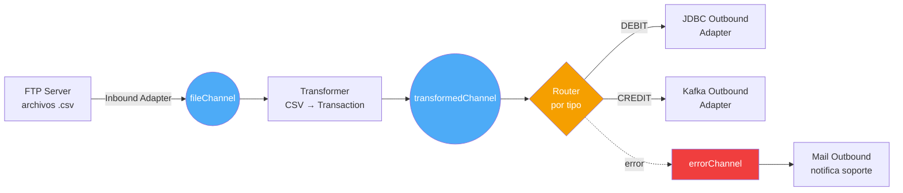

## 51 — Spring Integration

### Propósito
Aprender a implementar los **Enterprise Integration Patterns (EIP)** con Spring Integration para conectar sistemas heterogéneos (archivos, FTP, bases de datos, correo, colas) usando canales, adaptadores y transformadores declarativos, sin escribir código spaghetti de plomería.

### Problema que resuelve
Trabajas en un banco. Cada noche, un proveedor deposita un archivo `.csv` con transacciones en un servidor **FTP**. Ese archivo debe:
1. Ser descargado automáticamente cada 5 minutos.
2. Ser transformado a objetos Java (`Transaction`).
3. Ser dividido en lotes de 100 registros y guardado en una **base de datos Oracle**.
4. Enviar un **correo** al equipo de conciliación si algún registro falla.
5. Publicar un evento en **Kafka** para que otros microservicios reaccionen.

Sin Spring Integration terminarías escribiendo un `@Scheduled` con `FTPClient` a pelo, un `try/catch` de 200 líneas, un `JdbcTemplate.batchUpdate` con manejo manual de errores, un `JavaMailSender` y un `KafkaTemplate` **todo mezclado** en una clase de 800 líneas imposible de testear.

### Cómo lo resuelve
**Spring Integration** implementa el libro *Enterprise Integration Patterns* de Gregor Hohpe. Modela cada paso como un **`Message`** (payload + headers) que viaja por **canales (`MessageChannel`)** conectando **endpoints (`MessageEndpoint`)**:

1. Un **Inbound Adapter** (FTP, File, JMS, Mail) escucha una fuente externa y crea `Message`s.
2. Los `Message`s viajan por un **`Channel`** (como una tubería).
3. **Transformers**, **Filters**, **Routers**, **Splitters** y **Aggregators** procesan el flujo.
4. Un **Outbound Adapter** (JDBC, Kafka, Mail) entrega el resultado al destino.

Todo se declara con el **DSL de Java (`IntegrationFlow`)** o XML, y Spring conecta las piezas por ti.

### Por qué aprenderlo
En **banca, seguros, retail y logística**, el 40% del código empresarial es **integración**: mover datos entre el core legacy (AS/400, SAP, Mainframe) y sistemas modernos (APIs REST, Kafka, S3). Spring Integration es el estándar de facto para construir esos pipelines en el ecosistema Java, y compite directamente con **Apache Camel** y **Mule ESB**. Saberlo te abre puertas en proyectos de **middleware, ETL y EAI**.



---

### Glosario Básico

#### `Message<T>`
Sobre postal genérico. Tiene un **payload** (los datos, ej: un `Transaction`) y **headers** (metadatos: id, timestamp, correlationId).

#### `MessageChannel`
Tubería por la que viajan los `Message`s. Puede ser `DirectChannel` (síncrono), `QueueChannel` (asíncrono con buffer) o `PublishSubscribeChannel` (broadcast).

#### `MessageEndpoint`
Componente que consume o produce mensajes: `@ServiceActivator`, `@Transformer`, `@Filter`, `@Router`.

#### `Gateway` (`@MessagingGateway`)
Interfaz Java que **oculta** la mensajería. Llamas un método normal y por debajo dispara un flujo de integración.

#### `Adapter`
Puente con el mundo exterior. **Inbound** = entra al flujo (leer FTP, POP3). **Outbound** = sale del flujo (guardar en BD, enviar mail).

#### `Transformer`
Convierte el payload de un tipo a otro (`String` → `Transaction`, XML → JSON).

#### `Router`
Decide a qué canal enviar el mensaje según su contenido o headers (patrón *Content-Based Router*).

#### `Splitter`
Divide un mensaje grande en varios pequeños (una lista de 100 → 100 mensajes individuales).

#### `Aggregator`
Lo opuesto al Splitter: junta N mensajes relacionados (por `correlationId`) en uno solo.

---

### Conceptos

#### 1. DSL de Java con `IntegrationFlow`
- **Qué es** — La forma moderna de declarar flujos: encadenas operaciones en un builder fluido, sin XML.
- **Código**:
  ```java
  @Configuration
  @Slf4j
  @RequiredArgsConstructor
  public class FileIntegrationFlowConfig {

      private final TransactionTransformer transformer;
      private final JdbcTemplate jdbcTemplate;

      @Bean
      public IntegrationFlow fileToJdbcFlow() {
          return IntegrationFlow
              .from(Files.inboundAdapter(new File("/data/inbox"))
                        .patternFilter("*.csv"),
                   e -> e.poller(Pollers.fixedDelay(5000))) // Cada 5 seg
              .transform(transformer, "csvToTransaction")   // String → Transaction
              .handle(msg -> {
                  Transaction tx = (Transaction) msg.getPayload();
                  log.info("Persistiendo transacción {}", tx.getId());
                  jdbcTemplate.update(
                      "INSERT INTO transactions(id, amount) VALUES (?,?)",
                      tx.getId(), tx.getAmount());
              })
              .get();
      }
  }
  ```

#### 2. `@MessagingGateway` (invocar un flujo como un servicio Java)
- **Qué es** — Ocultas toda la mensajería detrás de una **interfaz** normal. El código cliente ni se entera que hay un flujo detrás.
- **Código**:
  ```java
  @MessagingGateway
  public interface TransactionGateway {
      @Gateway(requestChannel = "inputChannel")
      void submit(Transaction tx);
  }

  @RestController
  @RequiredArgsConstructor
  public class TransactionController {
      private final TransactionGateway gateway;

      @PostMapping("/tx")
      public ResponseEntity<Void> post(@RequestBody Transaction tx) {
          gateway.submit(tx); // Dispara el IntegrationFlow
          return ResponseEntity.accepted().build();
      }
  }
  ```

#### 3. Adaptadores Inbound / Outbound (File, FTP, Mail, JDBC)
- **Qué es** — Módulos plug-and-play para conectarse a FTP, File, Mail, JDBC, Kafka, JMS, MQTT, S3, etc.
- **Código** (FTP inbound):
  ```java
  @Bean
  public IntegrationFlow ftpFlow(SessionFactory<FTPFile> ftpFactory) {
      return IntegrationFlow
          .from(Ftp.inboundAdapter(ftpFactory)
                   .remoteDirectory("/outgoing")
                   .localDirectory(new File("/tmp/ftp-cache"))
                   .autoCreateLocalDirectory(true),
               e -> e.poller(Pollers.cron("0 */5 * * * ?"))) // Cada 5 min
          .channel("ftpFileChannel")
          .get();
  }
  ```

#### 4. Splitter + Aggregator (procesar batches)
- **Qué es** — Un archivo con 10.000 líneas se **divide** en 10.000 mensajes, cada uno se procesa en paralelo, y al final se **agregan** para reportar un resumen.
- **Código**:
  ```java
  @Bean
  public IntegrationFlow batchFlow() {
      return IntegrationFlow.from("batchInput")
          .split()                                            // List<Tx> → N mensajes
          .channel(MessageChannels.executor(taskExecutor()))  // Paralelismo
          .handle("txService", "process")
          .aggregate(a -> a.correlationStrategy(m ->
              m.getHeaders().get("batchId"))
              .releaseStrategy(g -> g.size() >= 100)
              .groupTimeout(30_000))                          // Timeout 30s
          .handle("reportService", "summarize")
          .get();
  }
  ```

#### 5. Error handling con `errorChannel` y `@ServiceActivator`
- **Qué es** — Cada `Message` viaja con un header `errorChannel`. Si algo revienta, el error va allí y **no rompe** el flujo principal.
- **Código**:
  ```java
  @Component
  @Slf4j
  @RequiredArgsConstructor
  public class ErrorHandler {

      private final JavaMailSender mailSender;

      @ServiceActivator(inputChannel = "errorChannel")
      public void handle(final ErrorMessage error) {
          Throwable cause = error.getPayload().getCause();
          log.error("Flujo falló: {}", cause.getMessage(), cause);

          SimpleMailMessage mail = new SimpleMailMessage();
          mail.setTo("soporte@banco.cl");
          mail.setSubject("Error en integración FTP");
          mail.setText(cause.toString());
          mailSender.send(mail);
      }
  }
  ```

---

### Edge Cases y Errores Comunes

| Error | Causa | Solución |
|-------|-------|----------|
| **Backpressure sin `QueueChannel`** | Usas `DirectChannel` (síncrono) y el productor va 100x más rápido que el consumidor: la app se congela. | Interpone un `QueueChannel` con capacidad limitada (`new QueueChannel(1000)`) o un `ExecutorChannel` con `ThreadPoolTaskExecutor` acotado. |
| **Timeout en `Aggregator`** | Esperas 100 mensajes pero solo llegan 87. El grupo queda "colgado" indefinidamente en memoria. | Configura `groupTimeout(30_000)` y `sendPartialResultOnExpiry(true)` para que libere el grupo parcial y no filtre memoria. |
| **Transacciones distribuidas** | Lees de JMS, escribes a Oracle y a Kafka. Si Kafka falla, JMS ya hizo commit y quedas inconsistente. | Usa el patrón **Transactional Outbox**: escribe SOLO en Oracle dentro de la transacción, y un flujo separado publica a Kafka desde una tabla `outbox`. Evita XA/JTA salvo casos extremos. |
| **Poll interval mal configurado** | `Pollers.fixedDelay(100)` en FTP: bombardeas el servidor con conexiones y te bloquean por IP. | Usa `Pollers.cron("0 */5 * * * ?")` o `fixedDelay(60_000)`. Añade `maxMessagesPerPoll(10)` para acotar la ráfaga. |

---

### Ejercicios
1. Crea un proyecto Spring Boot **4.1.0** con las dependencias `spring-boot-starter-integration`, `spring-integration-file`, `spring-integration-jdbc` y `h2`.
2. Define una entidad `Transaction(id, amount, type)` y crea la tabla vía `schema.sql`.
3. Implementa un `IntegrationFlow` que lea archivos `.csv` desde `/tmp/inbox` cada 10 segundos (**File Inbound Adapter**), los transforme con un `@Transformer` a `List<Transaction>`, los divida con `.split()` y los inserte con **JDBC Outbound Adapter**.
4. Añade un `@ServiceActivator(inputChannel = "errorChannel")` que loguee cualquier fallo con `@Slf4j`.
5. Copia un `.csv` de prueba a `/tmp/inbox` y verifica en H2 (`http://localhost:8080/h2-console`) que los registros aparecen.

### Cómo ejecutar
```bash
cd 51-spring-integration
mvn spring-boot:run

# Copia un archivo de prueba
cp sample-transactions.csv /tmp/inbox/

# Verifica logs
tail -f logs/spring.log
```

### Archivos del Proyecto
| Archivo | Propósito |
|---------|-----------|
| `pom.xml` | Dependencias `spring-boot-starter-integration`, `spring-integration-file`, `spring-integration-jdbc`. |
| `config/FileIntegrationFlowConfig.java` | Declara el `IntegrationFlow` File → Transformer → JDBC con DSL de Java. |
| `config/ErrorHandlingConfig.java` | `@ServiceActivator` sobre `errorChannel` para notificaciones. |
| `gateway/TransactionGateway.java` | `@MessagingGateway` para disparar el flujo desde el REST controller. |
| `transformer/CsvToTransactionTransformer.java` | Convierte líneas CSV en objetos `Transaction`. |
| `domain/Transaction.java` | Entidad con `id`, `amount`, `type`. |
| `controller/TransactionController.java` | Endpoint POST que invoca al Gateway. |
| `resources/application.yml` | Configuración de datasource H2 y rutas de inbox/outbox. |
| `resources/schema.sql` | DDL de la tabla `transactions`. |
