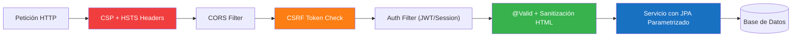

## 52 — Seguridad Aplicada (OWASP Top 10)

### Propósito
Aplicar los controles del **OWASP Top 10** en aplicaciones Spring Boot 4.1.0 en producción: cabeceras HTTP endurecidas, prevención de inyección SQL, mitigación de XSS, gestión de CSRF (stateful vs stateless) y rate limiting. Este módulo **no** enseña Spring Security desde cero (ver módulos 13, 33, 34); asume que ya sabes autenticar y autorizar, y se enfoca en **hardening y defensa en profundidad**.

### Problema que resuelve
El 80% de las brechas en aplicaciones web reportadas por Verizon DBIR provienen de vulnerabilidades documentadas en OWASP Top 10:
- Un `@Query("SELECT u FROM User u WHERE u.name = '" + name + "'")` deja tu base de datos expuesta a `' OR '1'='1`.
- Un comentario de blog renderizado con `[[${comment}]]` sin sanitización ejecuta `<script>fetch('/api/steal')</script>` en cada visitante (XSS).
- Un endpoint `/api/orders/{id}` sin verificar ownership permite a un atacante leer facturas ajenas (IDOR).
- Un login sin rate limiting recibe 10.000 intentos por segundo hasta romper una contraseña débil.
- Falta de `Content-Security-Policy` deja pasar scripts inyectados vía anuncios de terceros.

Las auditorías **PCI-DSS**, **ISO 27001** y **SOC 2** rechazan sistemas que no evidencien estos controles.

### Cómo lo resuelve
Spring Security 6/7 (embebido en Spring Boot 4.1.0) expone una API declarativa sobre `HttpSecurity` que permite activar cada control OWASP como una línea de configuración:
1. **Cabeceras** — `.headers()` inyecta CSP, HSTS, `X-Frame-Options`, `Referrer-Policy` en cada respuesta.
2. **SQLi** — JPA con parámetros vinculados (`:param`) impide concatenación; se prohíbe `String.format` en `@Query`.
3. **XSS** — Thymeleaf hace *output encoding* por defecto (`th:text`); para HTML rico se usa **OWASP Java HTML Sanitizer**.
4. **CSRF** — Se activa con `csrf()` cuando hay sesiones; se desactiva **solo** en APIs stateless con JWT (donde no hay cookie de sesión que robar).
5. **Rate limiting** — `Bucket4j` (in-process) o Spring Cloud Gateway (Módulo 47) con Redis limitan intentos por IP/usuario.
6. **Validación** — `@Valid` + Jakarta Validation rechaza payloads maliciosos antes de tocar el servicio.

### Por qué aprenderlo
Empresas reguladas (bancos, fintech, salud, retail que toca tarjetas) **exigen evidencia** de estos controles en auditorías. Un solo hallazgo de SQLi en un pentest bloquea la certificación PCI-DSS y detiene el negocio. Los equipos que dominan hardening OWASP son los que aprueban revisiones de **DevSecOps** y se promueven a Tech Lead / Security Champion.



---

### Glosario Básico

#### `CSP` (Content-Security-Policy)
Cabecera HTTP que le dice al navegador qué orígenes puede cargar (`script-src 'self'`). Bloquea scripts inline maliciosos.

#### `HSTS` (HTTP Strict Transport Security)
Cabecera que fuerza al navegador a usar solo HTTPS por N segundos. Previene downgrade attacks.

#### `CSRF Token`
Valor único de un solo uso incrustado en formularios. El servidor exige que la petición POST lo contenga para probar que viene de una página legítima.

#### `SameSite` (Cookie attribute)
`SameSite=Strict|Lax` impide que el navegador envíe la cookie de sesión en peticiones cross-origin, matando la mayoría de CSRF.

#### `XSS` (Cross-Site Scripting)
Inyección de JavaScript en una página que se ejecuta en el navegador de otro usuario. Roba cookies, tokens, teclas.

#### `SQL Injection`
Alteración de una query concatenando SQL en un parámetro (`'; DROP TABLE users;--`).

#### `HttpSecurity.headers()`
API fluida de Spring Security para configurar cabeceras de seguridad de manera declarativa.

#### `IDOR` (Insecure Direct Object Reference)
Un endpoint acepta `id=42` sin verificar que el usuario autenticado sea dueño del recurso 42.

---

### Conceptos

#### 1. Security Headers con `HttpSecurity.headers()`
- **Qué es** — Configuración declarativa de cabeceras de defensa: CSP (qué scripts se cargan), HSTS (forzar HTTPS), `X-Frame-Options` (anti-clickjacking), `Referrer-Policy` (privacidad).
- **Por qué importa** — Es la **primera línea de defensa** del navegador. Sin CSP, un XSS almacenado se ejecuta libremente.
- **Código**:
  ```java
  @Configuration
  @EnableWebSecurity
  @Slf4j
  public class SecurityHeadersConfig {

      @Bean
      SecurityFilterChain filterChain(HttpSecurity http) throws Exception {
          http
              .headers(headers -> headers
                  // Content-Security-Policy: solo scripts de nuestro dominio
                  .contentSecurityPolicy(csp -> csp.policyDirectives(
                      "default-src 'self'; " +
                      "script-src 'self' https://cdn.trusted.com; " +
                      "style-src 'self' 'unsafe-inline'; " +
                      "img-src 'self' data:; " +
                      "frame-ancestors 'none'"))
                  // HSTS: forzar HTTPS por 1 año
                  .httpStrictTransportSecurity(hsts -> hsts
                      .includeSubDomains(true)
                      .maxAgeInSeconds(31_536_000))
                  // Anti-clickjacking: no permitir iframes
                  .frameOptions(frame -> frame.deny())
                  // Ocultar referrer al salir del sitio
                  .referrerPolicy(ref -> ref.policy(
                      ReferrerPolicy.STRICT_ORIGIN_WHEN_CROSS_ORIGIN)))
              .authorizeHttpRequests(a -> a.anyRequest().authenticated());
          log.info("Security headers configured: CSP, HSTS, X-Frame-Options");
          return http.build();
      }
  }
  ```

#### 2. Prevención de SQL Injection
- **Qué es** — Nunca concatenar strings en queries. Usar siempre **parámetros vinculados** de JPA/JDBC.
- **Código malo** (vulnerable):
  ```java
  // NUNCA hagas esto: concatenar input del usuario en SQL nativo
  @Query(value = "SELECT * FROM users WHERE email = '" + "?" + "'", nativeQuery = true)
  User findByEmailBad(String email); // atacante envía: ' OR '1'='1
  // Peor aún: String.format("SELECT ... WHERE name = '%s'", name)
  ```
- **Código bueno** (seguro):
  ```java
  public interface UserRepository extends JpaRepository<User, Long> {
      // JPQL con parámetro vinculado :email — Hibernate escapa automáticamente
      @Query("SELECT u FROM User u WHERE u.email = :email")
      Optional<User> findByEmail(@Param("email") String email);
  }
  ```
  Regla del linter: prohibir `String.format`, `+`, `concat` dentro de `@Query`.

#### 3. XSS: Sanitización y Output Encoding
- **Qué es** — Filtrar HTML entrante y escapar salida.
- **Código** (sanitización con OWASP Java HTML Sanitizer):
  ```java
  @Service
  @Slf4j
  public class CommentSanitizer {
      private static final PolicyFactory POLICY = Sanitizers.FORMATTING
          .and(Sanitizers.LINKS)
          .and(Sanitizers.BLOCKS);

      public String clean(String userHtml) {
          String safe = POLICY.sanitize(userHtml);
          log.debug("Sanitized comment: {} chars removed", userHtml.length() - safe.length());
          return safe;
      }
  }
  ```
  En Thymeleaf usa `th:text="${comment}"` (escapa) **nunca** `th:utext` con input de usuario.

#### 4. CSRF: Stateful vs Stateless
- **Qué es** — Token único que prueba que un POST viene de tu formulario, no de un sitio malicioso.
- **Cuándo activarlo**: aplicaciones con **sesiones + cookies** (Thymeleaf, SSR).
- **Cuándo desactivarlo**: APIs **stateless con JWT en header** `Authorization: Bearer` (no hay cookie que robar).
- **Código**:
  ```java
  // App con sesiones — CSRF ON con patrón double-submit cookie
  http.csrf(csrf -> csrf
      .csrfTokenRepository(CookieCsrfTokenRepository.withHttpOnlyFalse()));

  // API stateless con JWT — CSRF OFF justificado
  http.csrf(csrf -> csrf.disable())
      .sessionManagement(s -> s.sessionCreationPolicy(SessionCreationPolicy.STATELESS));
  ```

#### 5. Rate Limiting y Fuerza Bruta
- **Qué es** — Limitar intentos por IP/usuario para bloquear brute force en `/login` y scraping.
- **Código** con Bucket4j:
  ```java
  @Component
  @Slf4j
  public class LoginRateLimiter {
      private final Map<String, Bucket> buckets = new ConcurrentHashMap<>();

      public boolean tryConsume(String ip) {
          Bucket bucket = buckets.computeIfAbsent(ip, k -> Bucket.builder()
              .addLimit(Bandwidth.classic(5, Refill.intervally(5, Duration.ofMinutes(1))))
              .build());
          boolean allowed = bucket.tryConsume(1);
          if (!allowed) log.warn("Rate limit hit for IP {}", ip);
          return allowed;
      }
  }
  ```
  Para tráfico distribuido, delegar en Spring Cloud Gateway + Redis (Módulo 47).

---

### Edge Cases y Errores Comunes

| Error | Causa | Solución |
|-------|-------|----------|
| CSP demasiado restrictiva bloquea CSS/JS legítimos | `default-src 'self'` sin whitelistear CDN | Empieza en modo `Content-Security-Policy-Report-Only`, revisa reportes, luego endurece. |
| CORS con `allowedOrigins: "*"` + `allowCredentials: true` | Combinación prohibida por el navegador; expone cookies | Lista explícita de orígenes: `.allowedOrigins("https://app.tuempresa.com")`. |
| JWT aceptado sin verificar firma | Se decodifica con `Base64` en vez de validar con clave pública | Usar `JwtDecoder` de Spring Security con JWKS del Authorization Server. |
| IDOR: `/api/orders/{id}` devuelve cualquier orden | Falta verificar `order.userId == auth.userId` | Usar `@PreAuthorize("@orderSecurity.isOwner(#id, principal)")`. |
| CSRF desactivado en app con sesiones | Copiado de tutorial de API stateless | Reactivar CSRF; solo desactivar si es 100% stateless con JWT en header. |

---

### Ejercicios
1. Configura `Content-Security-Policy` en modo report-only y captura violaciones en un endpoint `/csp-report`.
2. Escribe un endpoint vulnerable a SQLi con `String.format` y demuéstralo con Postman enviando `' OR '1'='1`. Luego refactorízalo con `:param`.
3. Guarda un comentario con `<script>alert(1)</script>`, renderízalo con `th:utext` (vulnerable) y luego con OWASP Java HTML Sanitizer.
4. Audita el proyecto con **OWASP ZAP** en modo automated scan contra `http://localhost:8080` y corrige los hallazgos High/Medium.
5. Implementa rate limiting con Bucket4j en `/api/auth/login`: 5 intentos por minuto por IP; devuelve HTTP 429 al superar.

### Cómo ejecutar
```bash
cd 52-seguridad
mvn spring-boot:run

# Verificar cabeceras
curl -I http://localhost:8080/api/public
# Debe mostrar: Content-Security-Policy, Strict-Transport-Security, X-Frame-Options

# Escaneo OWASP ZAP (Docker)
docker run -t owasp/zap2docker-stable zap-baseline.py -t http://host.docker.internal:8080
```

### Archivos del Proyecto
| Archivo | Propósito |
|---------|-----------|
| `config/SecurityHeadersConfig.java` | CSP, HSTS, X-Frame-Options, Referrer-Policy vía `HttpSecurity.headers()`. |
| `config/CsrfConfig.java` | Activación de CSRF con `CookieCsrfTokenRepository` (patrón double-submit). |
| `service/CommentSanitizer.java` | Sanitización HTML con OWASP Java HTML Sanitizer. |
| `security/LoginRateLimiter.java` | Rate limiting in-process con Bucket4j para prevenir brute force. |
| `security/OrderOwnershipEvaluator.java` | Evaluador para `@PreAuthorize` que previene IDOR. |
| `repository/UserRepository.java` | Ejemplos de `@Query` parametrizado (anti-SQLi). |
| `controller/AuthController.java` | Endpoint `/login` protegido con rate limiter. |
| `application.yml` | Configuración de HTTPS, propiedades CSP y clave JWKS. |
