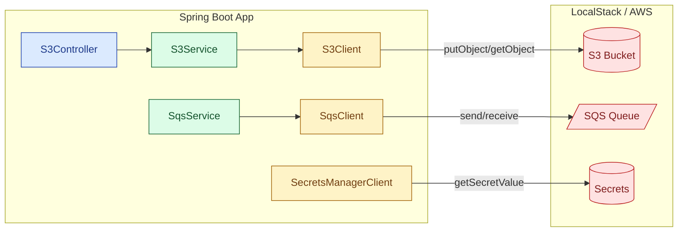

# Módulo 53 — Cloud AWS (S3 + SQS + Secrets Manager)

## Propósito
Integrar una aplicación Spring Boot 4.1.0 con servicios AWS usando el **AWS SDK v2** directamente
(sin `spring-cloud-aws`, que aún no está publicado para Boot 4.x — mismo problema documentado
para Spring Cloud Config en el módulo 29).

## Problema que resuelve
Casi toda app "de la nube" necesita:
- **Object storage** (S3) para archivos que no caben en la base de datos (PDFs, imágenes, backups).
- **Colas de mensajes** (SQS) para desacoplar productores y consumidores.
- **Secrets Manager** para NO hardcodear passwords en el repo.

Hacer esto sin el SDK oficial es reinventar la rueda; hacerlo con `spring-cloud-aws` no es viable
hoy en Boot 4. La solución: **AWS SDK v2 + `@Configuration` con `@Bean` para cada cliente**.

## Cómo lo resuelve este módulo
- `AwsConfig` construye `S3Client`, `SqsClient` y `SecretsManagerClient` apuntando a **LocalStack**
  (`http://localhost:4566`) con credenciales dummy (`test/test`).
- `S3Service` expone `upload(key, bytes)` y `download(key)`.
- `SqsService` expone `sendMessage(queueUrl, body)` y `receiveMessages(queueUrl)`.
- `S3Controller` REST: `POST /api/s3/{key}` sube y `GET /api/s3/{key}` descarga.
- En producción se elimina `endpointOverride` y `credentialsProvider` — el SDK usa `DefaultCredentialsProvider`
  (variables de entorno, `~/.aws/credentials`, o IAM role del EC2/ECS/EKS).

## Diagrama



## Glosario Básico
| Término | Definición |
|---|---|
| **S3** | Simple Storage Service — object storage por clave. Cada objeto es una "caja" identificada por su `key` dentro de un `bucket`. |
| **SQS** | Simple Queue Service — cola de mensajes gestionada por AWS. |
| **Secrets Manager** | Servicio que guarda secretos cifrados con rotación automática. |
| **LocalStack** | Emulador local de AWS (Docker). Escucha en `:4566` y simula S3/SQS/etc. |
| **Endpoint override** | URL a la que el SDK envía las requests (LocalStack) — en producción se OMITE y el SDK usa el endpoint oficial de AWS. |
| **DefaultCredentialsProvider** | Cadena de resolución de credenciales del SDK v2: env vars → perfil `~/.aws/credentials` → IAM role. |
| **Builder pattern** | Estilo `.builder().field(x).build()` que reemplazó los constructores gigantes del SDK v1. |

## Conceptos

### S3Client (AWS SDK v2)
- **Qué es:** el cliente sincrónico para S3.
- **Por qué importa:** subir/bajar archivos a S3 es la operación de nube más común en cualquier app enterprise.
- **Código:** ver `AwsConfig.s3Client()` y `S3Service`.
- **Analogía:** un empleado de bodega que guarda y recupera cajas por etiqueta.
- **Casos empresariales:** subida de facturas PDF, hosting de imágenes de producto, backups de base de datos, exportes de reportes.

### SqsClient
- **Qué es:** cliente para colas SQS.
- **Por qué importa:** desacopla el productor del consumidor y da retries + dead-letter queues gratis.
- **Analogía:** buzón compartido — el que deposita no necesita saber quién retira.
- **Casos empresariales:** procesar pagos de forma asincrónica, notificaciones diferidas, integraciones B2B, event-driven architectures.

### SecretsManagerClient
- **Qué es:** cliente para leer secretos cifrados.
- **Por qué importa:** eliminar contraseñas hardcodeadas y rotarlas automáticamente.
- **Analogía:** caja fuerte biométrica con log de accesos.
- **Casos empresariales:** DB passwords, API keys de terceros (Stripe, SendGrid), certificados TLS.

## Antes vs Ahora

### AWS SDK v1 (2015) vs SDK v2 (2018+)
| Aspecto | ANTES (SDK v1) | AHORA (SDK v2) |
|---|---|---|
| **Package raíz** | `com.amazonaws.*` | `software.amazon.awssdk.*` |
| **Construcción** | `AmazonS3ClientBuilder.standard()...build()` | `S3Client.builder()...build()` (uniforme para todos los servicios) |
| **Requests** | Overloads: `s3.putObject(bucket, key, content)` | Objetos tipados: `PutObjectRequest.builder().bucket(b).key(k).build()` |
| **Bodies** | `InputStream + ObjectMetadata` | `RequestBody.fromBytes/fromString/fromFile` |
| **Credenciales** | `BasicAWSCredentials` + `AWSStaticCredentialsProvider` | `AwsBasicCredentials.create(...)` + `StaticCredentialsProvider.create(...)` |
| **Región** | `Regions.US_EAST_1` (enum) | `Region.US_EAST_1` (constantes tipadas) |
| **Getters** | `msg.getBody()` | `msg.body()` (estilo record) |
| **Async** | Cliente async separado (`AmazonS3Async`) con futures crudos | `S3AsyncClient` con `CompletableFuture` nativo |

### Spring Cloud AWS vs SDK directo
| Aspecto | Spring Cloud AWS (starter) | SDK v2 directo (este módulo) |
|---|---|---|
| **Autoconfig** | `spring-cloud-aws-starter-s3` → beans automáticos | `@Bean` manuales en `AwsConfig` |
| **Boot 4 compat** | Aún NO publicado para Boot 4.x | Compatible (es solo el SDK) |
| **Boilerplate** | Menos | Un poco más |
| **Control** | Menor (magia de autoconfig) | Total |

### Java 8 vs Java 21 (aplicado al módulo)
| Aspecto | Java 8 | Java 21 |
|---|---|---|
| **Try-with-resources** | Existe | Igual (nada cambia) |
| **var** | No existe | `var request = PutObjectRequest.builder()...build();` (opcional; en este módulo NO se usa para mayor claridad) |
| **Records** | No | Útiles para DTOs (no aplica al SDK, sus tipos son builder-based) |

## FAQ del Alumno

**¿Por qué no usar `spring-cloud-aws`?**
Porque no está publicado para Spring Boot 4.1.0 al día de hoy (mismo problema que Spring Cloud Config
en el módulo 29). El SDK v2 directo funciona perfecto y es lo que `spring-cloud-aws` usa por debajo.

**¿Necesito una cuenta AWS para correr este módulo?**
No. LocalStack emula S3/SQS/Secrets Manager en tu máquina. `docker compose up -d` y listo.

**¿Y para producción, cómo cambio las credenciales?**
Elimina `.endpointOverride(...)` y `.credentialsProvider(...)` en `AwsConfig`. El SDK usará
`DefaultCredentialsProvider` que resuelve en este orden:
1. Variables de entorno `AWS_ACCESS_KEY_ID` / `AWS_SECRET_ACCESS_KEY`.
2. Perfil `~/.aws/credentials`.
3. IAM role del EC2/ECS/EKS/Lambda (lo mejor: nunca ves credenciales en texto).

**¿Por qué `forcePathStyle(true)` en el S3Client?**
LocalStack no resuelve el DNS virtual `bucket.localhost` — necesita path-style
(`http://localhost:4566/bucket/key`). En producción con AWS real, dejarlo en `false` (default).

**¿El test `contextLoads` requiere LocalStack corriendo?**
No. Los clientes AWS SDK v2 son "lazy": no abren la conexión hasta que se llama a un método.
El contexto arranca aunque `:4566` esté cerrado.

**¿Puedo subir archivos grandes con este `upload`?**
Sí, hasta unos ~100 MB sin problemas. Para archivos > 100 MB, usar `S3TransferManager` (multipart upload).

**¿Qué versión del SDK usar?**
La `2.30.0` es estable con JDK 21. Cada 2-3 semanas sale una nueva minor — subir cuando haya un CVE
o feature necesaria.

## Ejercicios
1. Añadir un endpoint `DELETE /api/s3/{key}` que borre el objeto.
2. Crear `SecretsService` con `getSecret(String name)` y un endpoint `GET /api/secrets/{name}`.
3. Escribir un `@Scheduled` que cada 30s haga `receiveMessages` y logee cada mensaje.
4. Cambiar `S3Service.upload` para recibir `InputStream` en vez de `byte[]` (para archivos grandes).
5. Configurar dos perfiles (`local` con LocalStack, `prod` sin `endpointOverride`) con `@Profile`.

## Cómo ejecutar

### 1) Levantar LocalStack (opcional — solo si vas a hacer requests reales)
```bash
docker compose up -d
# Crear el bucket que usa el controller
docker exec -it localstack-53 awslocal s3 mb s3://demo-bucket
```

### 2) Build
```bash
# Git Bash
./build.sh
# PowerShell
.\build.ps1
```

### 3) Ejecutar
```bash
java -jar target/cloud-aws-1.0.0.jar
# o para desarrollo:
../apache-maven-3.9.16/bin/mvn spring-boot:run
```

### 4) Probar
```bash
# Subir bytes
curl -X POST http://localhost:8080/api/s3/hola.txt \
     -H "Content-Type: application/octet-stream" \
     --data-binary "hola desde curl"

# Descargar
curl http://localhost:8080/api/s3/hola.txt
```

### 5) Correr los tests
```bash
../apache-maven-3.9.16/bin/mvn test
```

## Archivos del Proyecto

| Archivo | Propósito |
|---|---|
| `pom.xml` | Coordenadas Maven + AWS SDK v2 (s3/sqs/secretsmanager 2.30.0). |
| `build.sh` / `build.ps1` | Build con toolchain portable (JDK 21 + Maven 3.9.16). |
| `docker-compose.yml` | LocalStack con S3/SQS/SecretsManager en :4566. |
| `src/main/resources/application.yml` | Config AWS (endpoint, región, credenciales de prueba, bucket). Sin `spring.jackson:` (rompe Boot 4). |
| `src/main/java/.../CloudAwsApplication.java` | Main con `@SpringBootApplication`. |
| `src/main/java/.../config/AwsConfig.java` | `@Bean` para S3Client / SqsClient / SecretsManagerClient. |
| `src/main/java/.../service/S3Service.java` | `upload(key,bytes)` + `download(key)`. |
| `src/main/java/.../service/SqsService.java` | `sendMessage(url,body)` + `receiveMessages(url)`. |
| `src/main/java/.../controller/S3Controller.java` | REST `POST /api/s3/{key}` + `GET /api/s3/{key}`. |
| `src/test/java/.../CloudAwsApplicationTests.java` | `contextLoads` — verifica que los 3 beans AWS se construyen. |
| `src/test/java/.../service/S3ServiceTest.java` | Unitario: mockea `S3Client`, verifica que `upload` llama `putObject`. |
| `src/test/java/.../controller/S3ControllerTest.java` | MockMvc standalone con `S3Service` mockeado. |

## Artefacto
`target/cloud-aws-1.0.0.jar`
