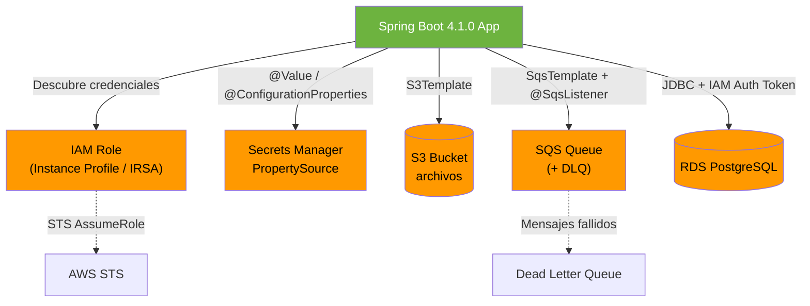

## 53 — Spring Cloud AWS

### Propósito
Integrar aplicaciones Spring Boot 4.1.0 con los servicios gestionados de **Amazon Web Services** (S3, SQS, SNS, Secrets Manager, RDS) usando el proyecto **Spring Cloud AWS** (`io.awspring.cloud`), evitando escribir código repetitivo del SDK oficial y aprovechando la autoconfiguración, plantillas de alto nivel y las anotaciones idiomáticas de Spring.

### Problema que resuelve
El **AWS SDK for Java v2** oficial es potente pero extremadamente verboso:
- Debes crear a mano los `S3Client`, `SqsAsyncClient`, `SecretsManagerClient` con builders llenos de credenciales, región, timeouts y reintentos.
- La serialización JSON de mensajes SQS es manual (payload como `String`).
- Consumir una cola SQS obliga a implementar un bucle `receiveMessage` + `deleteMessage` con manejo de visibility timeout, backoff y errores.
- Cargar secretos desde **AWS Secrets Manager** requiere código de arranque personalizado antes de que Spring resuelva `@Value`.
- Rotar credenciales de RDS a mano suele terminar con contraseñas hardcodeadas en `application.properties` (anti-patrón severo).

### Cómo lo resuelve
**Spring Cloud AWS** (mantenido por la comunidad AWSpring bajo el groupId `io.awspring.cloud`) provee starters con autoconfiguración:
1. Detecta credenciales automáticamente vía la `DefaultCredentialsProviderChain` (variables de entorno → IAM Role de EC2/ECS/EKS → perfil `~/.aws/credentials`).
2. Expone plantillas de alto nivel: **`S3Template`**, **`SqsTemplate`**, **`SnsTemplate`** que ocultan el boilerplate del SDK.
3. Provee la anotación **`@SqsListener`** (similar a `@KafkaListener`) para consumir colas de forma declarativa, con conversión JSON automática vía Jackson.
4. Integra **Secrets Manager** y **Parameter Store** como `PropertySource`, resueltos con `spring.config.import=aws-secretsmanager:` antes de que Spring cree beans.
5. Autoconfigura el `DataSource` de **RDS** con soporte opcional para autenticación IAM (tokens temporales de 15 minutos).

### Por qué aprenderlo
La mayoría de las empresas modernas (bancos, retail, SaaS, startups) despliegan sus microservicios Spring Boot sobre AWS (EC2, ECS, EKS, Lambda). Saber integrar S3 para archivos, SQS para mensajería asincrónica desacoplada, y Secrets Manager para credenciales rotativas es un **skill obligatorio** en cualquier posición Senior de backend Java. Dominar `spring-cloud-aws` significa escribir menos código, más seguro y con mejores prácticas Cloud-Native.



---

### Glosario Básico

#### `IAM Role`
Identidad de AWS con permisos (políticas JSON). No tiene contraseña ni claves permanentes: asume credenciales temporales vía STS.

#### `Instance Profile`
Contenedor que "pega" un IAM Role a una instancia EC2. Cualquier proceso corriendo en esa EC2 obtiene credenciales automáticamente desde el metadata endpoint `169.254.169.254`.

#### `IRSA` (IAM Roles for Service Accounts)
Equivalente al Instance Profile pero para Kubernetes (EKS). Asocia un IAM Role a una `ServiceAccount` de un Pod específico, evitando compartir credenciales entre pods.

#### `S3Template`
Bean autoconfigurado de Spring Cloud AWS que envuelve al `S3Client` del SDK. Ofrece métodos como `upload`, `download`, `createSignedGetURL`.

#### `SqsTemplate`
Bean para producir mensajes hacia SQS. Serializa POJOs a JSON automáticamente con Jackson.

#### `Secrets Manager`
Servicio AWS que almacena secretos (contraseñas de BD, API keys), los cifra con KMS y los rota automáticamente cada N días.

#### `VPC Endpoints`
Túneles privados que permiten a tu app dentro de una VPC hablar con S3/SQS **sin salir a internet**, evitando costes de NAT Gateway y aumentando seguridad.

---

### Conceptos

#### 1. Autenticación sin credenciales hardcodeadas
- **Qué es** — La `DefaultCredentialsProviderChain` busca credenciales en este orden: variables de entorno → propiedades del sistema → archivo `~/.aws/credentials` → **IAM Role** de EC2/ECS/EKS. **Nunca** hardcodees `aws.accessKey` en el `.properties`.
- **Código**:
  ```xml
  <dependency>
      <groupId>io.awspring.cloud</groupId>
      <artifactId>spring-cloud-aws-starter</artifactId>
      <version>3.4.0</version>
  </dependency>
  ```
  ```yaml
  spring:
    cloud:
      aws:
        region:
          static: us-east-1
        # NO configures credentials aquí en producción: usa IAM Role
  ```

#### 2. S3: subida, descarga y presigned URLs
- **Qué es** — `S3Template` sube archivos, los descarga como `InputStream` y genera URLs firmadas temporales para que un cliente descargue directo desde S3 sin pasar por tu backend.
- **Código**:
  ```java
  @Service
  @Slf4j
  @RequiredArgsConstructor
  public class FileStorageService {

      private final S3Template s3Template;

      public void uploadInvoice(String key, InputStream body) {
          s3Template.upload("invoices-bucket", key, body);
          log.info("Uploaded invoice to S3: {}", key);
      }

      public URL generateDownloadLink(String key) {
          return s3Template.createSignedGetURL(
              "invoices-bucket", key, Duration.ofMinutes(15));
      }
  }
  ```

#### 3. SQS: `@SqsListener` (consumer) y `SqsTemplate` (producer) con DLQ
- **Qué es** — Publica y consume mensajes JSON de forma declarativa. Los mensajes que fallan N veces se envían a una **Dead Letter Queue** para inspección manual.
- **Código**:
  ```xml
  <dependency>
      <groupId>io.awspring.cloud</groupId>
      <artifactId>spring-cloud-aws-starter-sqs</artifactId>
      <version>3.4.0</version>
  </dependency>
  ```
  ```java
  @Service
  @Slf4j
  @RequiredArgsConstructor
  public class OrderProducer {

      private final SqsTemplate sqsTemplate;

      public void publish(OrderEvent event) {
          sqsTemplate.send("orders-queue", event);
          log.info("Published order {} to SQS", event.orderId());
      }
  }

  @Component
  @Slf4j
  public class OrderConsumer {

      @SqsListener("orders-queue")
      public void handle(OrderEvent event) {
          log.info("Processing order {}", event.orderId());
          // Si lanza excepción -> reintenta hasta maxReceiveCount, luego DLQ
      }
  }
  ```

#### 4. Secrets Manager como `PropertySource`
- **Qué es** — Cargas secretos (ej: `db/prod/password`) como propiedades de Spring Boot antes de que se creen los beans, resueltos con `@Value` o `@ConfigurationProperties`.
- **Código**:
  ```xml
  <dependency>
      <groupId>io.awspring.cloud</groupId>
      <artifactId>spring-cloud-aws-starter-secrets-manager</artifactId>
      <version>3.4.0</version>
  </dependency>
  ```
  ```yaml
  spring:
    config:
      import: "aws-secretsmanager:/prod/myapp/db"
  ```
  ```java
  @Service
  @Slf4j
  @RequiredArgsConstructor
  public class DbConnector {
      @Value("${username}") private String user;
      @Value("${password}") private String pass;
  }
  ```

#### 5. RDS con autenticación IAM o rotación de Secrets
- **Qué es** — En lugar de una contraseña estática, RDS puede aceptar un **token IAM temporal** (válido 15 min). Alternativamente, Secrets Manager rota la contraseña cada N días y la app la relee automáticamente.
- **Código** (IAM Auth):
  ```yaml
  spring:
    datasource:
      url: jdbc:postgresql://mydb.xyz.us-east-1.rds.amazonaws.com:5432/app?sslmode=require
      username: iam_app_user
      # password se genera con el SDK: RdsUtilities.generateAuthenticationToken(...)
  ```
  ```java
  @Bean
  DataSource dataSource(RdsUtilities rds) {
      String token = rds.generateAuthenticationToken(builder -> builder
          .hostname("mydb.xyz.us-east-1.rds.amazonaws.com")
          .port(5432).username("iam_app_user"));
      // Configurar HikariCP con el token como password
      // ...
  }
  ```

---

### Edge Cases y Errores Comunes

| Error | Causa | Solución |
|-------|-------|----------|
| `SdkClientException: Unable to load region` | No definiste `spring.cloud.aws.region.static` ni la variable `AWS_REGION`. | Setear la región explícitamente en `application.yml` o vía env `AWS_REGION=us-east-1`. |
| Credenciales expiradas (`ExpiredTokenException`) | El IAM Role rotó las credenciales STS pero tu cliente cacheó las antiguas. | Usar `DefaultCredentialsProvider` (refresca solo). No cachear el `S3Client` fuera del contenedor Spring. |
| DLQ nunca recibe mensajes fallidos | Olvidaste asociar la Redrive Policy en la cola SQS principal, o `maxReceiveCount` es demasiado alto. | Configurar en la cola: `RedrivePolicy` con `deadLetterTargetArn` y `maxReceiveCount: 3`. |
| Timeouts silenciosos sin reintentos | El SDK por defecto reintenta 3 veces, pero tu `apiCallTimeout` es menor que `apiCallAttemptTimeout * 3`. | Ajustar `spring.cloud.aws.sqs.listener.acknowledgement-mode` y timeouts del `ClientOverrideConfiguration`. |
| Factura de S3 explota por `ListObjectsV2` | Cada `list()` en un bucket con 10M objetos cuesta y satura. | Nunca listes buckets grandes: usa prefijos (`prefix/`), S3 Inventory, o índices en DynamoDB. |

---

### Ejercicios
1. Crea un Spring Boot 4.1.0 con `spring-cloud-aws-starter-s3` y sube un archivo local a un bucket usando `S3Template`. Genera un presigned URL válido por 5 minutos.
2. Levanta **LocalStack** en Docker (`localstack/localstack`) y configura el endpoint override para que S3 apunte a `http://localhost:4566`. Repite el ejercicio 1 sin AWS real.
3. Crea dos colas SQS (`orders-queue` + `orders-dlq`) con RedrivePolicy y `maxReceiveCount=3`. Implementa un `@SqsListener` que falle si el `orderId` es negativo, y verifica que el mensaje termina en la DLQ.
4. Almacena un secreto `/dev/myapp/api-key` en Secrets Manager (o LocalStack) y léelo con `@Value` en un controller `/whoami`.
5. Publica un `OrderEvent` con `SqsTemplate` que un consumidor deserialice a POJO usando Jackson (verifica que `contentType=application/json` viaja en los atributos del mensaje).

### Cómo ejecutar
Para desarrollo local, usa **LocalStack** (emulador de AWS gratis):
```bash
docker run --rm -it -p 4566:4566 localstack/localstack

# Crear recursos (aws-cli apuntando a LocalStack)
aws --endpoint-url=http://localhost:4566 s3 mb s3://invoices-bucket
aws --endpoint-url=http://localhost:4566 sqs create-queue --queue-name orders-queue

cd 53-cloud-aws
mvn spring-boot:run
```
```yaml
# application-local.yml — apuntando a LocalStack
spring:
  cloud:
    aws:
      region.static: us-east-1
      credentials:
        access-key: test
        secret-key: test
      s3.endpoint: http://localhost:4566
      sqs.endpoint: http://localhost:4566
```

### Archivos del Proyecto
| Archivo | Propósito |
|---------|-----------|
| `pom.xml` | Dependencias `io.awspring.cloud:spring-cloud-aws-starter-s3/-sqs/-secrets-manager` v3.4.0. |
| `application.yml` | Región AWS, endpoints (LocalStack en dev), configuración de listeners SQS. |
| `service/FileStorageService.java` | Subida/descarga a S3 y generación de presigned URLs con `S3Template`. |
| `service/OrderProducer.java` | Publicación de eventos JSON a SQS con `SqsTemplate`. |
| `listener/OrderConsumer.java` | Consumidor declarativo con `@SqsListener` y manejo hacia DLQ. |
| `config/AwsSecretsConfig.java` | Lectura de secretos desde Secrets Manager vía `spring.config.import`. |
| `config/RdsIamAuthConfig.java` | `DataSource` con token IAM temporal para RDS. |
