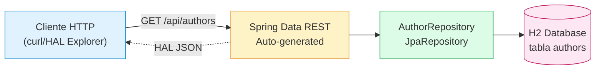

## 54 — Spring Data REST

### Proposito
Exponer repositorios JPA como endpoints REST HAL/HATEOAS de forma **automatica**, sin escribir Controllers ni Services. Aprender cuando conviene y cuando NO.

### Problema que resuelve
En un CRUD tipico repites el mismo patron para cada entidad: `Controller` que llama `Service` que llama `Repository`. Multiplicado por 10-20 entidades es cientos de lineas de boilerplate identico. Ademas hay que agregar paginacion, links, HAL, HATEOAS a mano.

### Como lo resuelve
`spring-boot-starter-data-rest` toma cada `@RepositoryRestResource` y publica automaticamente:
- `GET/POST/PUT/PATCH/DELETE` en la URL configurada.
- Respuestas en formato **HAL** con `_embedded`, `_links.self`, paginacion.
- Sub-recursos para relaciones (`/books/1/author`).
- HAL Explorer para navegar la API desde el browser.

### Por que aprenderlo
- Prototipos, admin panels internos, back-office: entrega un API completo en 5 minutos.
- Entender HAL/HATEOAS es clave para APIs REST maduras.
- Saber sus **trade-offs** evita malas decisiones en APIs publicas.



### Glosario Basico
| Termino | Significado |
|---|---|
| **HAL** | Hypertext Application Language. Formato JSON estandar para incluir enlaces (`_links`) y colecciones embebidas (`_embedded`). |
| **HATEOAS** | Hypermedia As The Engine Of Application State. Cada respuesta contiene enlaces a acciones siguientes. |
| **`@RepositoryRestResource`** | Marca un repositorio JPA para exposicion REST. Configura path y nombre de coleccion. |
| **`base-path`** | Prefijo comun para todos los endpoints (`/api`). |
| **`_embedded`** | En HAL, contiene la coleccion real de recursos. |
| **`_links.self`** | Enlace canonico al propio recurso. |

### Conceptos

#### 1. `@RepositoryRestResource`
- **Que es**: anotacion sobre una interface `JpaRepository` que instruye a Spring Data REST para publicarla como recurso REST.
- **Por que importa**: sin ella, Spring Data REST usa el nombre plural en minusculas del tipo (`/authors`, `/books`). Con ella controlas `path`, `collectionResourceRel`, `itemResourceRel`, y puedes ocultar (`exported=false`).
- **Codigo**:
```java
@RepositoryRestResource(path = "authors", collectionResourceRel = "authors")
public interface AuthorRepository extends JpaRepository<Author, Long> { }
```
- **Analogia**: es como pedir que la fachada del edificio muestre un letrero con el nombre exacto de tu tienda. Sin letrero, el arquitecto (Spring) inventa uno.
- **Casos empresariales**: back-office interno, generacion rapida de admin API, prototipos para validar dominio antes de escribir el API definitivo.

#### 2. HAL + HATEOAS
- **Que es**: cada respuesta trae metadata de navegacion. Un GET a `/api/authors/1` devuelve:
```json
{
  "name": "Martin Fowler",
  "_links": {
    "self":   {"href": "http://localhost:8080/api/authors/1"},
    "author": {"href": "http://localhost:8080/api/authors/1"}
  }
}
```
- **Por que importa**: el cliente no necesita construir URLs; las sigue como enlaces en una web.
- **Analogia**: navegar Wikipedia clickeando enlaces vs memorizar URLs.

#### 3. `base-path`
- Sin configurar, expone en la raiz (`/authors`). Con `spring.data.rest.base-path: /api` todos los recursos quedan bajo `/api/*`, dejando la raiz libre para tus propios `@RestController`.

### Antes vs Ahora

| Tema | Antes (CRUD manual) | Ahora (Spring Data REST) |
|---|---|---|
| Endpoints | Escribes `AuthorController` con 5 metodos | 0 lineas, generado |
| Paginacion | `Pageable` + `PagedModel` manual | Automatico con `page`, `size`, `sort` |
| HAL/HATEOAS | Configuras `spring-hateoas` a mano | Nativo |
| Relaciones | Endpoint especifico `/books/{id}/author` | Auto-expuesto como sub-recurso |
| Sintaxis Java | POJO clasico con getters/setters | Igual (JPA aun exige mutabilidad, no records) |

### FAQ del Alumno

- **¿Que es HAL?** Es un formato JSON estandar que agrega `_links` y `_embedded` para que el cliente pueda navegar la API sin conocer URLs a priori.
- **¿Por que `_embedded.authors` y no `authors` directo?** Porque HAL separa metadata (links) de datos (embedded), y una coleccion es "datos embebidos" en la respuesta paginada.
- **¿Puedo esconder un repositorio?** Si: `@RepositoryRestResource(exported = false)`.
- **¿Como agrego validacion?** Con `@Valid` en un `RepositoryEventHandler` o usando `Validator` beans (`beforeCreateAuthorValidator`).
- **¿Es seguro para produccion?** Para APIs internas si. Para APIs publicas mejor NO: mezcla capas (expone entidades JPA) y es dificil versionar. Usa `@RestController` explicito.
- **¿Puedo cambiar el JSON?** Con `Projection` interfaces (`@Projection`), o con eventos, o con `@JsonIgnore` en campos.
- **¿Por que `spring.jackson` no aparece en el yml?** MEMORY.md 2026-07-12: en Boot 4 configurar `spring.jackson.*` rompe `JacksonAutoConfiguration`. Los defaults son correctos.

### Trade-off (cuando SI y cuando NO)
- **SI** — prototipos rapidos, admin panels internos, herramientas de back-office donde el consumidor es el propio equipo.
- **NO** — APIs publicas o de terceros: acopla el JSON al modelo JPA, dificulta versionar y evolucionar el dominio sin romper clientes. Preferir `@RestController` + DTOs.

### Ejercicios
1. Expon un `PublisherRepository` bajo `/api/publishers`.
2. Oculta `BookRepository` con `exported=false` y verifica que 404.
3. Crea una `AuthorProjection` que exponga solo `name` en mayusculas.
4. Agrega un `RepositoryEventHandler` que valide que `name` no este vacio.

### Como ejecutar

```bash
# Build (Git Bash)
./build.sh

# Build (PowerShell)
./build.ps1

# Ejecutar
java -jar target/spring-data-rest-1.0.0.jar

# Probar
curl http://localhost:8080/api/authors
curl http://localhost:8080/api/authors/1
curl -X POST http://localhost:8080/api/authors \
     -H "Content-Type: application/json" \
     -d '{"name":"Kent Beck"}'
```

### Archivos del Proyecto

| Archivo | Proposito |
|---|---|
| `pom.xml` | Dependencias Boot 4.1.0: web, data-jpa, data-rest, h2, test. |
| `application.yml` | Configura H2, JPA, `spring.data.rest.base-path=/api`. Sin `spring.jackson`. |
| `data.sql` | Semilla: 2 authors + 2 books. |
| `SpringDataRestApplication.java` | Entry point (`@SpringBootApplication`). |
| `domain/Author.java` | Entidad `@Entity` tabla `authors`. |
| `domain/Book.java` | Entidad con `@ManyToOne Author`. |
| `repository/AuthorRepository.java` | `JpaRepository` + `@RepositoryRestResource(path="authors")`. |
| `repository/BookRepository.java` | Igual para libros. |
| `SpringDataRestApplicationTests.java` | `contextLoads`. |
| `AuthorRestIntegrationTest.java` | Test integracion con `RestClient` + `@LocalServerPort`: GET coleccion, GET item, POST. |
| `build.sh` / `build.ps1` | Toolchain portable (JDK 21 + Maven 3.9.16). |
