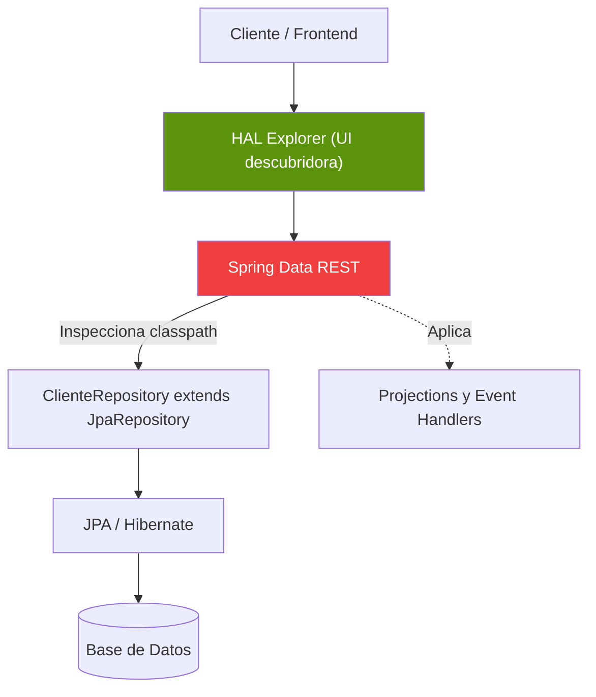

## 54 — Spring Data REST

### Propósito
Exponer automáticamente tus repositorios de Spring Data JPA como una API REST completa (con paginación, ordenamiento, HAL y HATEOAS) **sin escribir un solo `@RestController`**. Spring Boot 4.1.0 + Spring Data REST leen tus interfaces `JpaRepository` y generan los endpoints `GET/POST/PUT/PATCH/DELETE` al vuelo.

### Problema que resuelve
Estás construyendo un back-office para 30 entidades (`Cliente`, `Producto`, `Proveedor`, `Bodega`, `Categoría`...). Cada una necesita un CRUD REST completo.
- Escribir 30 `@RestController` idénticos es aburrido y propenso a errores de copia-pega.
- Cada endpoint necesita paginación, ordenamiento y búsqueda: 30 x 4 endpoints = 120 métodos casi iguales.
- El equipo de front-end pide una API "descubrible" donde puedan navegar los recursos sin leer documentación.

### Cómo lo resuelve
**Spring Data REST (SDR)** inspecciona el classpath, encuentra tus `JpaRepository<T, ID>` y publica cada uno como un recurso REST bajo `/nombreEntidad`.
1. `@RepositoryRestResource` permite renombrar rutas y controlar la exposición.
2. Genera automáticamente respuestas en formato **HAL** (`application/hal+json`) con enlaces `_links` para navegación HATEOAS.
3. Integra validación (`@Valid`) y eventos del ciclo de vida (`@RepositoryEventHandler`) para lógica de negocio.
4. Se acopla con el HAL Explorer, una UI web interactiva que actúa como Postman auto-generado.

### Por qué aprenderlo
Es la herramienta más rápida del ecosistema Spring para prototipos, MVPs, back-offices internos y admin panels. Lo que te toma 3 días con `@RestController` explícito, SDR lo hace en 30 minutos.
**Trade-off importante**: es genial para prototipos y APIs internas, pero para **APIs públicas versionadas** prefiere siempre `@RestController` explícito — SDR acopla tu modelo de dominio a tu contrato REST, y eso rompe consumidores externos cuando refactorizas entidades.



---

### Glosario Básico

#### `HAL` (Hypertext Application Language)
Formato JSON estandarizado que envuelve cada recurso con un bloque `_links` (enlaces a sí mismo, a colecciones relacionadas) y `_embedded` (recursos incrustados).

#### `HATEOAS`
"Hypermedia as the Engine of Application State". Principio REST donde el servidor devuelve **enlaces navegables**, no solo datos. El cliente descubre qué puede hacer siguiendo `_links`.

#### `@RepositoryRestResource`
Anotación en la interfaz del repositorio que controla la exposición REST: renombra la ruta, cambia el nombre de la colección o desactiva por completo el recurso.

#### `Projection`
Interfaz que expone un subconjunto (o proyección enriquecida) de una entidad. Evita filtrar datos sensibles y previene payloads gigantes.

#### `ExcerptProjection`
Projection que se aplica **por defecto** al listar recursos en colecciones. Ideal para vistas de tabla.

#### `RepositoryEventHandler`
Componente que engancha lógica en los eventos del ciclo de vida del recurso (`beforeCreate`, `afterSave`, `beforeDelete`), sin ensuciar el repositorio.

---

### Conceptos

#### 1. Configuración básica y HAL Explorer
- **Qué es** — Con solo dos dependencias, obtienes un CRUD REST completo y una UI para explorarlo.
- **Código**:
  ```xml
  <dependency>
      <groupId>org.springframework.boot</groupId>
      <artifactId>spring-boot-starter-data-rest</artifactId>
  </dependency>
  <dependency>
      <groupId>org.springframework.data</groupId>
      <artifactId>spring-data-rest-hal-explorer</artifactId>
  </dependency>
  ```
  ```yaml
  spring:
    data:
      rest:
        base-path: /api      # Todo cuelga de /api
        default-page-size: 20
        max-page-size: 100
  ```
  Ahora navega a `http://localhost:8080/api` y verás HAL Explorer descubriendo todos tus repositorios.

#### 2. Renombrar rutas con `@RepositoryRestResource`
- **Qué es** — Por defecto, `ProductRepository` se expone como `/products`. Puedes renombrarlo, cambiar el nombre del recurso HAL, o incluso ocultarlo.
- **Código**:
  ```java
  @RepositoryRestResource(
      path = "catalog-items",           // URL: /api/catalog-items
      collectionResourceRel = "items"   // Nombre en _embedded
  )
  public interface ProductRepository extends JpaRepository<Product, Long> {
      Page<Product> findByCategory(@Param("category") String category, Pageable pageable);
  }
  ```
  El método `findByCategory` se expone automáticamente en `/api/catalog-items/search/findByCategory?category=drinks`.

#### 3. Projections para respuestas seguras
- **Qué es** — Nunca expongas la entidad completa: usa `@Projection` para filtrar campos y componer vistas.
- **Código**:
  ```java
  @Projection(name = "summary", types = { Product.class })
  public interface ProductSummary {
      String getName();
      BigDecimal getPrice();
      // Excluye createdAt, internalCost, supplierNotes, etc.
  }
  ```
  Consumo: `GET /api/catalog-items/1?projection=summary`.
  Con `excerptProjection = ProductSummary.class` en `@RepositoryRestResource`, se aplica por defecto en listados.

#### 4. Ocultar métodos y campos sensibles
- **Qué es** — SDR expone TODO por defecto. Debes ser explícito al ocultar operaciones peligrosas o campos privados.
- **Código**:
  ```java
  @RepositoryRestResource
  public interface UserRepository extends JpaRepository<User, Long> {

      @Override
      @RestResource(exported = false)   // Nadie puede borrar usuarios vía REST
      void deleteById(Long id);
  }

  @Entity
  public class User {
      private String email;

      @JsonIgnore                        // Nunca serializar la contraseña
      private String passwordHash;
  }
  ```

#### 5. Event Handlers para validación y auditoría
- **Qué es** — Enganchar lógica antes/después de create, save o delete sin escribir un controller.
- **Código**:
  ```java
  @Component
  @RepositoryEventHandler
  @Slf4j
  @RequiredArgsConstructor
  public class ProductEventHandler {

      private final AuditService auditService;

      @HandleBeforeCreate
      public void beforeCreate(Product product) {
          log.info("Validating new product: {}", product.getName());
          if (product.getPrice().signum() <= 0) {
              throw new IllegalArgumentException("Price must be positive");
          }
          product.setCreatedAt(Instant.now());
      }

      @HandleAfterSave
      public void afterSave(Product product) {
          auditService.record("PRODUCT_SAVED", product.getId());
      }
  }
  ```

---

### Edge Cases y Errores Comunes

| Error | Causa | Solución |
|-------|-------|----------|
| Contraseñas filtradas en el JSON | La entidad `User` tiene `passwordHash` y SDR lo expone automáticamente. | Marca el campo con `@JsonIgnore` **y** cubre con tests. Nunca confíes solo en la memoria del developer. |
| N+1 queries en projections con relaciones | Una projection `OrderDetail` con `getCustomer().getName()` dispara una query por cada order del listado. | Usa `@EntityGraph` en el método del repositorio o proyecciones basadas en DTO (`@Value("#{target...}")`) que hagan JOIN FETCH. |
| Versionar la API es doloroso | SDR acopla el esquema de la entidad con el contrato REST. Renombrar una columna rompe consumidores. | **No uses SDR para APIs públicas.** Para uso interno o prototipos está bien; para v1/v2 públicas, usa `@RestController` explícito. |
| CORS bloquea el frontend | El HAL Explorer y tu SPA fallan por política de origen. | Configura `@CrossOrigin` en el repositorio o un `CorsConfigurationSource` global; SDR respeta ambos. |

---

### Ejercicios
1. Crea un proyecto Spring Boot 4.1.0 con `spring-boot-starter-data-rest`, `spring-boot-starter-data-jpa`, `h2` y `spring-data-rest-hal-explorer`.
2. Define las entidades `Product` y `Category` con relación `@ManyToOne`, y sus repositorios `JpaRepository`.
3. Renombra `ProductRepository` a `/api/catalog-items` con `collectionResourceRel = "items"` y agrega un método `findByCategoryName`.
4. Crea una `@Projection` llamada `ProductSummary` que exponga solo `name`, `price` y `categoryName`, y aplícala como `excerptProjection`.
5. Implementa un `@RepositoryEventHandler` con `@HandleBeforeCreate` que rechace productos con precio negativo y registre un log con `@Slf4j`.

### Cómo ejecutar
```bash
cd 54-spring-data-rest
mvn spring-boot:run

# Navegar el HAL Explorer
open http://localhost:8080/api

# Crear un producto vía curl
curl -X POST http://localhost:8080/api/catalog-items \
     -H "Content-Type: application/json" \
     -d '{"name":"Coca-Cola","price":1500}'

# Listar con projection
curl "http://localhost:8080/api/catalog-items?projection=summary&size=5"
```

### Archivos del Proyecto
| Archivo | Propósito |
|---------|-----------|
| `pom.xml` | Dependencias Spring Boot 4.1.0 (data-rest, data-jpa, hal-explorer, h2). |
| `application.yml` | `base-path`, tamaño de página y configuración H2. |
| `domain/Product.java` | Entidad con `@JsonIgnore` en campos sensibles. |
| `domain/Category.java` | Entidad relacionada `@ManyToOne`. |
| `repository/ProductRepository.java` | Repositorio con `@RepositoryRestResource(path, collectionResourceRel, excerptProjection)`. |
| `repository/UserRepository.java` | Ejemplo de `@RestResource(exported = false)` para bloquear DELETE. |
| `projection/ProductSummary.java` | `@Projection` para listados seguros. |
| `event/ProductEventHandler.java` | `@RepositoryEventHandler` con validación y auditoría vía `@Slf4j`. |
