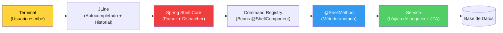

## 55 — Spring Shell

### Propósito
Aprender a construir **CLIs interactivas** (Command Line Interfaces) potentes con Spring Boot, aprovechando todo el ecosistema (inyección de dependencias, transacciones, JPA, seguridad) pero sin exponer HTTP: la interfaz de usuario es la **terminal**.

### Problema que resuelve
No todo lo que hace tu empresa debe ser una REST API. Existen tareas que viven mejor en la línea de comandos:
- Herramientas de **administración** internas (crear tenants, resetear contraseñas, promover un usuario a admin).
- **Scripts de mantenimiento** ejecutados por el equipo de operaciones (limpiar tablas, reindexar Elasticsearch, migrar datos).
- **Operaciones DevOps**: purgar caches, forzar un failover, publicar un mensaje de prueba en Kafka.
- Utilidades para **desarrolladores** que hoy son scripts sueltos en Bash/PowerShell y que nadie mantiene.

Levantar un endpoint HTTP + un frontend + un login solo para que el DBA borre 3 filas es sobreingeniería. Un script Bash suelto no tiene acceso al `ApplicationContext`, ni a los servicios, ni a las transacciones JPA.

### Cómo lo resuelve
**Spring Shell** convierte tu aplicación Spring Boot en una consola interactiva:
1. Al arrancar, en lugar de escuchar en un puerto, presenta un **prompt** (`shell:>`).
2. Registra automáticamente todos los beans anotados con `@ShellComponent` y sus métodos `@ShellMethod` como **comandos**.
3. Provee **autocompletado** con TAB, **historial** con flechas, **ayuda** con `help`, todo gratis vía **JLine**.
4. Permite construir TUIs (Text UIs) con tablas coloreadas, spinners, selectores y prompts vía `ComponentFlow`.
5. Puede ejecutarse en modo **interactivo** (REPL) o **no interactivo** (scripting) pasando los comandos como argumentos.

### Por qué aprenderlo
Las CLIs son ubicuas en la industria: `kubectl`, `docker`, `git`, `aws`, `gh`, `terraform`, `mvn`, `psql`. Cada empresa madura acaba construyendo su propio CLI interno (`acme-cli deploy`, `acme-cli tenant create`). Saber diseñar una CLI decente — con ayuda, autocompletado, validaciones y salidas legibles — es una habilidad que usarás **toda tu carrera** y que diferencia a un desarrollador de un desarrollador senior.



---

### Glosario Básico

#### `@ShellComponent`
Especialización de `@Component`. Marca la clase como contenedora de comandos para que Spring Shell la escanee.

#### `@ShellMethod`
Anota un método público y lo publica como comando. El atributo `key` define el nombre visible; `value` es la descripción que aparece en `help`.

#### `@ShellOption`
Marca un parámetro del método como opción de la CLI. Permite definir alias (`--name` / `-n`), valor por defecto, ayuda y aridad (cuántos valores acepta).

#### `PromptProvider`
Bean que produce el prompt (`shell:>`). Se puede personalizar con colores ANSI, mostrar el usuario logueado, el entorno actual (`dev`, `prod`) o un icono según el estado.

#### `Availability`
Mecanismo para **habilitar/deshabilitar** un comando en tiempo de ejecución. Ej: el comando `commit` solo está disponible después de que el usuario ejecutó `init`.

#### `Interactive vs Non-interactive`
- **Interactive (REPL)**: el usuario abre la shell y escribe comandos uno a uno.
- **Non-interactive (scripting)**: se pasa el comando como argumento (`java -jar app.jar user list`) o se ejecuta un archivo con `@script.txt`. Ideal para pipelines CI/CD y cron.

---

### Conceptos

#### 1. Comando básico con `@ShellMethod`
- **Qué es** — Un método público de un `@ShellComponent`. Sus parámetros se convierten en argumentos del comando.
- **Código**:
  ```java
  @Slf4j
  @ShellComponent
  @RequiredArgsConstructor
  public class UserCommands {

      private final UserService userService;

      @ShellMethod(key = "user create", value = "Crea un nuevo usuario en la base de datos")
      public String createUser(String email, String fullName) {
          log.info("Creating user email={}", email);
          User created = userService.create(email, fullName);
          return "Usuario creado con id=" + created.getId();
      }
  }
  ```
  En la terminal: `shell:> user create juan@acme.cl "Juan Pérez"`.

#### 2. `@ShellOption` con defaults, help y aridad
- **Qué es** — Refina cómo se declara un parámetro: valor por defecto, ayuda visible en `help`, y aridad (cuántos tokens consume).
- **Código**:
  ```java
  @ShellMethod(key = "user list", value = "Lista usuarios paginados")
  public String listUsers(
          @ShellOption(value = {"--page", "-p"}, defaultValue = "0",
                       help = "Número de página (base 0)") int page,
          @ShellOption(value = {"--size", "-s"}, defaultValue = "10",
                       help = "Tamaño de página") int size,
          @ShellOption(value = "--roles", arity = 2,
                       defaultValue = ShellOption.NULL,
                       help = "Filtra por 2 roles") String[] roles) {
      return userService.list(page, size, roles).toString();
  }
  ```
  Uso: `user list -p 1 --size 20 --roles ADMIN USER`.

#### 3. `Availability` — habilitar comandos según estado
- **Qué es** — El método `xxxAvailability()` devuelve `Availability.available()` o `Availability.unavailable("razón")`. Spring Shell lo llama antes de cada ejecución.
- **Por qué importa** — En un CLI tipo Git no puedes hacer `commit` sin haber hecho `init`. Modela flujos con estado.
- **Código**:
  ```java
  @ShellComponent
  @RequiredArgsConstructor
  public class RepoCommands {

      private final RepoState state;

      @ShellMethod(key = "init", value = "Inicializa el repositorio")
      public String init() {
          state.markInitialized();
          return "Repositorio inicializado";
      }

      @ShellMethod(key = "commit", value = "Registra un commit")
      public String commit(String message) {
          return "Commit: " + message;
      }

      // Convención: nombreDelComando + "Availability"
      public Availability commitAvailability() {
          return state.isInitialized()
                  ? Availability.available()
                  : Availability.unavailable("primero debes ejecutar 'init'");
      }
  }
  ```

#### 4. `PromptProvider` — prompt con contexto y colores
- **Qué es** — Bean que define cómo se ve el prompt. Se usa `AttributedString` para colorear con ANSI.
- **Código**:
  ```java
  @Configuration
  @RequiredArgsConstructor
  public class ShellPromptConfig {

      private final SessionContext session;

      @Bean
      public PromptProvider promptProvider() {
          return () -> new AttributedString(
              "acme (" + session.getEnvironment() + ") > ",
              AttributedStyle.DEFAULT.foreground(AttributedStyle.GREEN)
          );
      }
  }
  ```

#### 5. Componentes interactivos con `ComponentFlow`
- **Qué es** — API para preguntar al usuario input de texto, single-select, multi-select, confirmaciones, mostrar tablas y spinners. Ideal para wizards.
- **Código**:
  ```java
  @ShellComponent
  @RequiredArgsConstructor
  public class WizardCommands {

      private final ComponentFlow.Builder flowBuilder;

      @ShellMethod(key = "user wizard", value = "Wizard interactivo para crear un usuario")
      public void wizard() {
          ComponentFlow flow = flowBuilder.clone().reset()
              .withStringInput("email").name("Email").and()
              .withSingleItemSelector("role").name("Rol")
                  .selectItems(Map.of("Admin", "ADMIN", "User", "USER")).and()
              .withConfirmationInput("confirm").name("¿Confirmar?").and()
              .build();

          ComponentFlow.ComponentFlowResult result = flow.run();
          String email = result.getContext().get("email", String.class);
          String role  = result.getContext().get("role",  String.class);
          log.info("Wizard result email={} role={}", email, role);
      }
  }
  ```

---

### Edge Cases

| Caso | Causa | Solución |
|------|-------|----------|
| Nombre de comando reservado (`help`, `exit`, `quit`, `clear`) | Spring Shell registra comandos built-in con esos nombres | Renombra tu comando (`app-help`) o desactiva el built-in vía `spring.shell.command.help.enabled=false`. |
| Argumentos con espacios | La shell parte por espacios | El usuario debe usar comillas: `user create "Juan Pérez"`. En scripting bash escápalas: `"\"Juan Pérez\""`. |
| Colores ANSI no soportados en `cmd.exe` Windows | Terminales antiguas no interpretan escapes | Usa Windows Terminal / PowerShell 7 o desactiva colores con `spring.shell.interactive.enabled` + `--spring.shell.color=NEVER`. |
| Modo no interactivo (CI/CD) muestra el prompt | Corriste el jar sin argumentos en un pipeline | Pasa el comando como args: `java -jar app.jar user list` o usa `@script.txt` para lote. Detecta con `InteractiveShellApplicationRunner.DISABLED_MODE`. |

---

### Ejercicios
Construye un CLI `acme-admin` que administre usuarios contra una base H2:
1. Comando `user create <email> <fullName>` que persista vía `UserRepository` (JPA) dentro de `@Transactional`.
2. Comando `user list --page --size` que imprima los usuarios usando `TableBuilder` de Spring Shell (tabla con bordes).
3. Comando `user promote <id>` con `Availability` que solo esté disponible si existe al menos un usuario en la BD.
4. `PromptProvider` que muestre en rojo el prompt cuando el perfil activo sea `prod` y en verde cuando sea `dev`.
5. Wizard `user wizard` con `ComponentFlow` que pida email, rol (single-select ADMIN/USER) y confirmación antes de guardar.

### Cómo ejecutar
```bash
cd 55-spring-shell
mvn spring-boot:run
# Se abre la shell interactiva
shell:> help
shell:> user create juan@acme.cl "Juan Perez"
shell:> user list --page 0 --size 10
shell:> exit

# Modo no interactivo (scripting) — ideal para CI/CD y cron
java -jar target/spring-shell-app.jar user list --page 0

# Ejecutar un archivo de comandos por lotes
java -jar target/spring-shell-app.jar @commands.txt
```

### Archivos del Proyecto
| Archivo | Propósito |
|---------|-----------|
| `pom.xml` | Dependencias: `spring-shell-starter` 3.x sobre Spring Boot 4.1.0 y `spring-boot-starter-data-jpa`. |
| `SpringShellApplication.java` | Clase `@SpringBootApplication` (sin `starter-web`: no levanta Tomcat). |
| `command/UserCommands.java` | Comandos `user create`, `user list`, `user promote` con `@ShellMethod` y `@ShellOption`. |
| `command/RepoCommands.java` | Ejemplo de `Availability` (comando `commit` requiere `init` previo). |
| `command/WizardCommands.java` | Wizard interactivo con `ComponentFlow` (input, select, confirm). |
| `config/ShellPromptConfig.java` | Bean `PromptProvider` con colores ANSI según perfil (`dev` verde, `prod` rojo). |
| `config/SessionContext.java` | Bean de sesión que guarda el entorno activo y el estado del CLI. |
| `service/UserService.java` | Lógica de negocio con `@Transactional` y `@Slf4j`, inyección por constructor. |
| `repository/UserRepository.java` | `JpaRepository<User, Long>` para persistencia. |
| `domain/User.java` | Entidad JPA con id, email, fullName, role. |
| `resources/application.yml` | Configuración H2, `spring.shell.interactive.enabled`, deshabilitar built-ins. |
