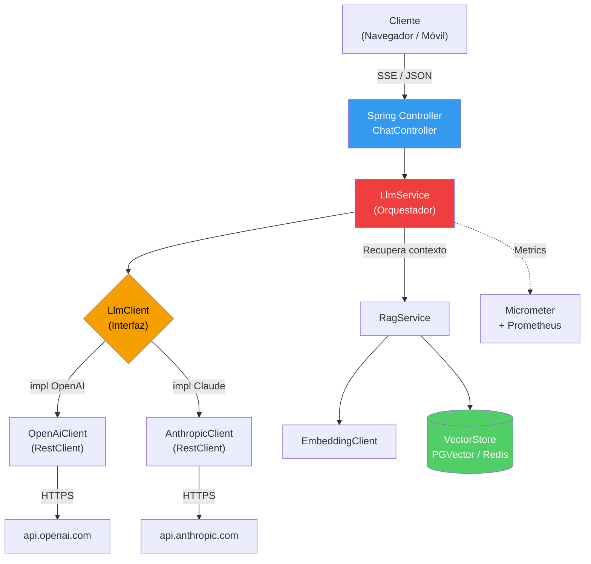

## 57 — Integración con LLMs (OpenAI / Claude)

### Propósito
Aprender los **patrones genéricos** para integrar cualquier Modelo de Lenguaje (LLM) dentro de una aplicación Spring Boot: consumir APIs REST de OpenAI o Anthropic Claude directamente con `RestClient`, implementar **streaming SSE** token-a-token, construir un pipeline básico de **RAG** (Retrieval-Augmented Generation) y aplicar **guardrails** de seguridad y costo.

> **Nota importante:** Este módulo enseña la integración *cruda* (a mano) para que entiendas qué pasa por debajo. El **Módulo 58 — Spring AI** profundiza en el framework oficial `spring-ai` que abstrae todo esto con `ChatClient`, `EmbeddingModel`, `VectorStore` y auto-configuración de vendors. Aquí construimos primero los cimientos.

### Problema que resuelve
Tu producto necesita un asistente inteligente (chatbot, resumen de contratos, búsqueda semántica en un manual PDF). Enfrentas cuatro dolores:
- **Acoplamiento a un vendor**: si cableas `openai.com/v1/chat/completions` en 15 clases, migrar a Claude o a un modelo local (Ollama) es una pesadilla.
- **Latencia**: una respuesta de GPT-4 puede tardar 20 segundos. Sin streaming, el usuario ve una pantalla en blanco y abandona.
- **Costos**: cada token cuesta dinero. Sin métricas ni límites, un bug puede quemar USD 10.000 en una noche.
- **Alucinaciones**: el LLM inventa datos si le preguntas por información privada de tu empresa. Necesitas RAG para anclarlo a documentos reales.

### Cómo lo resuelve
Spring Boot 4.1 te da todos los ingredientes para armar tu propia capa de integración robusta:
1. **`RestClient`** (síncrono, moderno, reemplazo de `RestTemplate`) o **`WebClient`** (reactivo) para llamar las APIs REST de OpenAI/Anthropic.
2. **`Resilience4j`** para retries con **backoff exponencial** ante `429 Too Many Requests` y circuit breaker ante caídas del proveedor.
3. **SSE (Server-Sent Events)** vía `Flux<String>` (WebFlux) o `SseEmitter` (MVC) para reenviar los tokens al navegador conforme llegan.
4. **Interfaz propia `LlmClient`** que abstrae al vendor: hoy OpenAI, mañana Claude, sin tocar los controllers.
5. **Prompt management**: templates versionados en `resources/prompts/*.txt` con placeholders (`{context}`, `{question}`).
6. **`Micrometer`** para exponer métricas de tokens consumidos y costo estimado a Prometheus.

### Por qué aprenderlo
Los LLMs ya son un ciudadano de primera clase en el stack empresarial. En 2026 casi todo proyecto Spring nuevo incluye al menos una de estas capacidades:
- **Asistentes internos** para soporte, RRHH, ventas.
- **RAG corporativo** sobre PDFs, Confluence, tickets de Jira.
- **Moderación** de contenido generado por usuarios.
- **Agents** que ejecutan acciones (crear ticket, enviar email) vía Function Calling.

Sin dominar estos patrones, tu integración será frágil, cara y difícil de auditar.



---

### Glosario Básico

#### `LLM` (Large Language Model)
Modelo estadístico entrenado sobre trillones de tokens (GPT-4, Claude 3.5, Llama 3). Recibe texto y predice el siguiente token.

#### `Token`
La unidad mínima que consume el modelo (aprox. ¾ de palabra en inglés). **Se paga por token de entrada y de salida**. Ej: GPT-4o cuesta ~USD 5 por millón de tokens de input.

#### `Prompt`
El texto que le envías al LLM. Puede ser un `user prompt` (pregunta del usuario) o combinarse con otros roles.

#### `System Prompt`
Instrucciones de rol que fijan el comportamiento del modelo (`"Eres un asistente médico que nunca da diagnósticos definitivos"`). Se envía como el primer mensaje con `role: system`.

#### `Function Calling` / `Tools`
El modelo devuelve un JSON estructurado indicando que quiere ejecutar una función Java (ej: `getInvoiceById(123)`). Tu app la ejecuta y le devuelve el resultado.

#### `RAG` (Retrieval-Augmented Generation)
Antes de preguntarle al LLM, buscas fragmentos relevantes en tu base de conocimiento y los inyectas en el prompt como contexto. Reduce alucinaciones.

#### `Embedding`
Vector numérico (ej: 1536 dimensiones en `text-embedding-3-small`) que representa el significado semántico de un texto. Textos parecidos → vectores cercanos.

#### `VectorStore`
Base de datos especializada en búsqueda por similitud coseno sobre embeddings (PGVector, Redis Stack, Qdrant, Milvus).

#### `Streaming SSE`
El servidor envía la respuesta chunk a chunk usando `text/event-stream`. El cliente pinta cada token en cuanto llega.

#### `Temperature`
Parámetro `0.0`–`2.0` que controla la aleatoriedad. `0.0` = determinista (bueno para SQL, JSON). `1.0` = creativo (bueno para copywriting).

#### `Top-p` (nucleus sampling)
Alternativa a temperature: el modelo solo considera los tokens cuya probabilidad acumulada supera `p`. `0.9` es típico.

---

### Conceptos

#### 1. Cliente HTTP con `RestClient` para OpenAI/Claude
- **Qué es** — La capa base: llamar a `https://api.openai.com/v1/chat/completions` con la key en el header `Authorization: Bearer sk-...`, timeout, retries y logging de tokens.
- **Por qué importa** — Sin `RestClient`, terminas usando `HttpURLConnection` a mano o mezclando `WebClient` reactivo donde no lo necesitas. `RestClient` (Spring 6.1+) es la API síncrona, fluida y moderna recomendada.
- **Código**:
  ```java
  @Configuration
  public class LlmClientConfig {

      @Bean
      RestClient openAiRestClient(@Value("${openai.api-key}") final String apiKey) {
          // El RestClient se construye una sola vez y es thread-safe
          return RestClient.builder()
                  .baseUrl("https://api.openai.com/v1")
                  .defaultHeader("Authorization", "Bearer " + apiKey)
                  .defaultHeader("Content-Type", "application/json")
                  .requestFactory(new JdkClientHttpRequestFactory()) // HTTP/2 nativo
                  .build();
          // NUNCA hardcodees la key: siempre por env var o Secrets Manager
      }
  }

  @Service
  @Slf4j
  @RequiredArgsConstructor
  public class OpenAiClient implements LlmClient {

      private final RestClient openAiRestClient;

      @Override
      @Retry(name = "llm", fallbackMethod = "fallback") // Resilience4j
      public ChatResponse chat(final ChatRequest request) {
          log.info("Sending prompt with {} messages", request.messages().size());
          final var response = openAiRestClient.post()
                  .uri("/chat/completions")
                  .body(request)
                  .retrieve()
                  .body(ChatResponse.class);
          log.info("Tokens used: prompt={}, completion={}",
                   response.usage().promptTokens(), response.usage().completionTokens());
          return response;
      }

      private ChatResponse fallback(final ChatRequest request, final Throwable ex) {
          log.error("LLM call failed after retries", ex);
          return ChatResponse.degraded("Servicio temporalmente no disponible");
      }
  }
  ```
- **Analogía** — `RestClient` es el "teléfono de línea directa" a OpenAI. Marcas una vez la configuración (el baseUrl y la key) y luego solo levantas y hablas.
- **Casos empresariales** — Consumo de IA en microservicios de atención al cliente, generación de descripciones de productos e-commerce, resumen automático de tickets.

#### 2. Streaming SSE (respuesta token-a-token)
- **Qué es** — En vez de esperar los 20 segundos que tarda la respuesta completa, abres una conexión `text/event-stream` y reenvías cada token que OpenAI te va mandando.
- **Por qué importa** — UX: el usuario ve palabras aparecer como en ChatGPT. Sin esto, un chatbot se siente muerto.
- **Código**:
  ```java
  @RestController
  @RequestMapping("/api/chat")
  @RequiredArgsConstructor
  @Slf4j
  public class ChatStreamController {

      private final LlmStreamService streamService;

      // MediaType SSE: el navegador entiende que debe leer stream, no esperar body completo
      @PostMapping(value = "/stream", produces = MediaType.TEXT_EVENT_STREAM_VALUE)
      public Flux<String> stream(@Valid @RequestBody final ChatRequestDto dto) {
          return streamService.streamChat(dto.message())
                  .doOnNext(chunk -> log.debug("chunk: {}", chunk))
                  .doOnError(err -> log.error("stream error", err));
      }
  }

  // El service abre la conexión con "stream": true en el body y parsea líneas "data: {...}"
  // Cada línea es un delta con un token nuevo. Al llegar "data: [DONE]" se cierra el Flux.
  ```
- **Analogía** — Es como ver una traducción simultánea en vivo vs. esperar el libro traducido.
- **Casos empresariales** — Chatbots B2C, asistentes de código en IDE, copilots internos.

#### 3. Patrón RAG básico (chunking + embeddings + búsqueda por similitud)
- **Qué es** — Pipeline en 4 pasos: (1) partir el documento en chunks de ~500 tokens, (2) generar el embedding de cada chunk con `text-embedding-3-small`, (3) guardarlos en un `VectorStore`, (4) en la consulta, buscar los top-K chunks más similares y meterlos en el prompt como contexto.
- **Por qué importa** — Es la única forma de que el LLM responda sobre datos privados sin haberlos visto en su entrenamiento. Elimina el 90% de las alucinaciones.
- **Código**:
  ```java
  @Service
  @RequiredArgsConstructor
  @Slf4j
  public class RagService {

      private final EmbeddingClient embeddingClient;
      private final VectorStoreRepository vectorStore;
      private final LlmClient llmClient;

      public String answer(final String question) {
          // 1. Embedding de la pregunta
          final float[] queryVector = embeddingClient.embed(question);

          // 2. Búsqueda por similitud coseno (top 4 chunks)
          final List<DocumentChunk> context = vectorStore.findSimilar(queryVector, 4);
          log.info("Retrieved {} chunks for question", context.size());

          // 3. Construcción del prompt con contexto inyectado
          final String contextText = context.stream()
                  .map(DocumentChunk::text)
                  .collect(Collectors.joining("\n---\n"));

          final ChatRequest request = ChatRequest.builder()
                  .systemPrompt("Responde SOLO con la información del contexto. Si no está, di 'No lo sé'.")
                  .userPrompt("Contexto:\n" + contextText + "\n\nPregunta: " + question)
                  .temperature(0.0) // determinismo para respuestas factuales
                  .build();

          return llmClient.chat(request).content();
      }
  }
  ```
- **Analogía** — El LLM es un abogado brillante pero sin memoria del caso. RAG es entregarle el expediente relevante antes de preguntarle.
- **Casos empresariales** — "Pregúntale a tu manual de operaciones", búsqueda semántica sobre políticas internas, soporte L1 automatizado.

#### 4. Function Calling / Tools
- **Qué es** — Le describes al LLM (en JSON Schema) qué funciones Java puede invocar. El modelo, en vez de responder texto, responde `{"tool": "createTicket", "args": {"priority": "high"}}`. Tu código ejecuta la función y le devuelve el resultado.
- **Por qué importa** — Convierte al LLM en un **agente** que actúa. Sin esto, es solo un generador de texto.
- **Código**:
  ```java
  public record ToolDefinition(String name, String description, Map<String, Object> jsonSchema) {}

  @Service
  @RequiredArgsConstructor
  @Slf4j
  public class ToolExecutor {

      private final TicketService ticketService;

      // El LLM decide llamar esta tool. Devolvemos el resultado como mensaje "role: tool".
      public String execute(final String toolName, final Map<String, Object> args) {
          log.info("Executing tool {} with args {}", toolName, args);
          return switch (toolName) {
              case "createTicket" -> ticketService.create((String) args.get("title")).toString();
              case "searchOrder"  -> ticketService.search((String) args.get("orderId")).toString();
              default -> throw new IllegalArgumentException("Unknown tool: " + toolName);
          };
      }
  }
  ```
- **Analogía** — Le das al LLM un llavero con permisos limitados. Él elige cuál usar; tú controlas qué abre cada llave.
- **Casos empresariales** — Agentes de soporte que crean tickets, asistentes que consultan inventario, copilots que ejecutan queries SQL controladas.

#### 5. Guardrails: PII, moderación, límites de tokens, cost tracking
- **Qué es** — Capa de seguridad y observabilidad **obligatoria** en producción: (1) borrar PII antes de enviar al LLM, (2) llamar al endpoint `/moderations` para bloquear contenido tóxico, (3) truncar prompts que excedan el context window, (4) publicar métricas de costo.
- **Por qué importa** — Un bug puede filtrar datos sensibles a un tercero (GDPR/HIPAA) o quemar el presupuesto en horas.
- **Código**:
  ```java
  @Component
  @RequiredArgsConstructor
  @Slf4j
  public class LlmGuardrails {

      private final MeterRegistry meterRegistry;

      // Regex simplificada: en producción usa Microsoft Presidio o AWS Comprehend
      private static final Pattern PII_EMAIL = Pattern.compile("[\\w.+-]+@[\\w-]+\\.[\\w.-]+");
      private static final Pattern PII_RUT   = Pattern.compile("\\b\\d{7,8}-[\\dkK]\\b");

      public String scrub(final String input) {
          return PII_RUT.matcher(PII_EMAIL.matcher(input).replaceAll("[EMAIL]"))
                        .replaceAll("[RUT]");
      }

      public void trackCost(final String model, final int promptTokens, final int completionTokens) {
          // Precio estimado (ejemplo GPT-4o mini): input USD 0.15/M, output USD 0.60/M
          final double cost = (promptTokens * 0.15 + completionTokens * 0.60) / 1_000_000.0;
          meterRegistry.counter("llm.cost.usd", "model", model).increment(cost);
          meterRegistry.counter("llm.tokens", "model", model, "type", "prompt").increment(promptTokens);
          meterRegistry.counter("llm.tokens", "model", model, "type", "completion").increment(completionTokens);
          log.info("LLM call cost: USD {}", String.format("%.6f", cost));
      }
  }
  ```
- **Analogía** — Los guardrails son el cinturón de seguridad. Nadie los quiere hasta que hay un accidente.
- **Casos empresariales** — Salud (HIPAA), banca (PCI), gobierno (leyes de protección de datos).

---

### Edge Cases y Errores Comunes

| Error | Causa | Solución |
|-------|-------|----------|
| **`429 Too Many Requests`** | Superas el rate limit del proveedor (RPM/TPM). | `Resilience4j` con backoff exponencial (`1s, 2s, 4s, 8s` + jitter). Lee el header `Retry-After`. |
| **`Context length exceeded`** | Prompt + contexto RAG supera el máximo (ej: 128k tokens). | Trunca chunks menos relevantes, usa un modelo con ventana mayor o resume el historial con un LLM más barato. |
| **Alucinaciones** | El LLM inventa nombres, fechas, números. | Baja `temperature: 0.0`, usa RAG, agrega `"Si no sabes, di 'no lo sé'"` en el system prompt. |
| **Timeout en streaming** | El proxy/nginx cierra la conexión SSE a los 30s. | Configura `proxy_read_timeout 600s` en nginx y envía **keep-alive events** (`: ping\n\n`) cada 15s. |
| **API keys hardcodeadas** | La key aparece en Git y termina en GitHub public. | Usar env vars (`OPENAI_API_KEY`), AWS Secrets Manager o Vault. Configurar `git-secrets` como pre-commit hook. |

---

### Ejercicios
1. **Chat sync**: crea `POST /api/chat` que reciba `{"message": "..."}`, llame a OpenAI y devuelva la respuesta como JSON. Loguea tokens consumidos.
2. **Chat streaming**: transforma el endpoint anterior a `POST /api/chat/stream` con `produces = text/event-stream` y `Flux<String>`. Prueba con `curl -N`.
3. **RAG sobre un PDF**: usando Apache Tika, extrae texto de `manual.pdf`, chunkéalo cada 500 tokens, genera embeddings y guárdalos en PGVector. Crea `POST /api/rag/ask`.
4. **Tool calling**: define una tool `getWeather(city)` que devuelva un mock. Deja que el LLM decida cuándo llamarla en una conversación.
5. **Cost dashboard**: expón métricas de `llm.cost.usd` en `/actuator/prometheus` y arma un dashboard en Grafana con costo por hora y por modelo.

---

### Cómo ejecutar
```bash
# 1. Exporta tu API key (elige una)
export OPENAI_API_KEY=sk-...
# o bien
export ANTHROPIC_API_KEY=sk-ant-...

# 2. (Opcional) Levanta PGVector para el ejercicio de RAG
docker compose up -d pgvector

# 3. Ejecuta la aplicación
cd 57-ai-integration
mvn spring-boot:run

# 4. Prueba chat síncrono
curl -X POST http://localhost:8080/api/chat \
  -H "Content-Type: application/json" \
  -d '{"message":"Explícame RAG en una frase"}'

# 5. Prueba streaming SSE (verás tokens llegando en vivo)
curl -N -X POST http://localhost:8080/api/chat/stream \
  -H "Content-Type: application/json" \
  -d '{"message":"Cuéntame un chiste sobre Spring Boot"}'
```

> Recuerda: el **Módulo 58 — Spring AI** rehace todos estos ejemplos con el framework oficial `spring-ai-openai-spring-boot-starter`, `ChatClient`, `EmbeddingModel` y auto-configuración de `VectorStore`. Después de dominar la integración manual aquí, allá verás cuánto código te ahorra el framework.

---

### Archivos del Proyecto

| Archivo | Propósito |
|---------|-----------|
| `pom.xml` | Dependencias Spring Boot 4.1.0, Resilience4j, PGVector driver, Micrometer Prometheus. |
| `application.yml` | Config de `openai.api-key`, timeouts, modelo por defecto, perfiles dev/prod. |
| `config/LlmClientConfig.java` | Beans `RestClient` para OpenAI y Anthropic con timeouts e interceptors. |
| `client/LlmClient.java` | Interfaz genérica para desacoplar del vendor (`chat`, `embed`, `stream`). |
| `client/OpenAiClient.java` | Implementación de `LlmClient` para OpenAI con Retry + fallback. |
| `client/AnthropicClient.java` | Implementación alternativa para Claude (Messages API). |
| `controller/ChatController.java` | Endpoint síncrono `POST /api/chat`. |
| `controller/ChatStreamController.java` | Endpoint SSE `POST /api/chat/stream` con `Flux<String>`. |
| `controller/RagController.java` | Endpoint `POST /api/rag/ask` para preguntas sobre documentos indexados. |
| `service/LlmService.java` | Orquestador de prompts, aplica guardrails y publica métricas. |
| `service/RagService.java` | Pipeline RAG: embed → similarity search → prompt augmented. |
| `service/ToolExecutor.java` | Ejecuta funciones Java invocadas por Function Calling. |
| `service/EmbeddingClient.java` | Cliente para `/v1/embeddings` de OpenAI. |
| `repository/VectorStoreRepository.java` | Búsqueda por similitud coseno sobre PGVector. |
| `guardrails/LlmGuardrails.java` | PII scrubbing, moderación, tracking de tokens y costo con Micrometer. |
| `dto/ChatRequestDto.java` | DTO validado con `@NotBlank message`. |
| `dto/ChatResponse.java` | Record con `content`, `usage`, `model`. |
| `resources/prompts/rag-system.txt` | Template versionado del system prompt para RAG. |
