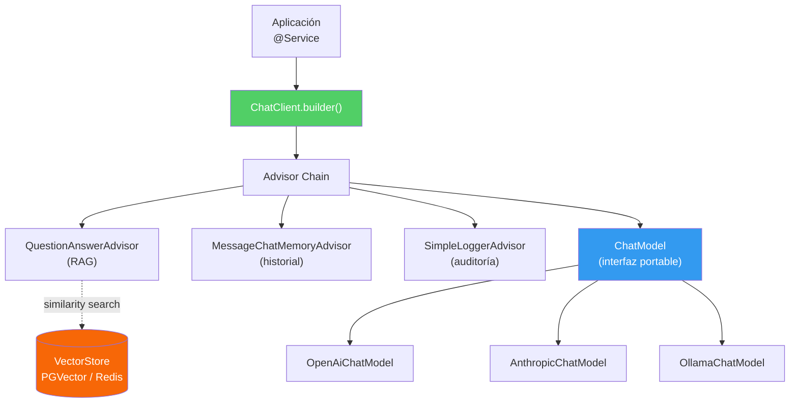

## 58 — Spring AI Framework

### Propósito
Aprender a construir aplicaciones de IA generativa sobre Spring Boot usando **Spring AI 1.x**, un framework oficial que proporciona **abstracciones portables** sobre múltiples proveedores de LLM (OpenAI, Anthropic Claude, Google Gemini, Ollama local) con auto-configuración estilo Spring, `ChatClient` fluent API, `VectorStore` para RAG y una cadena de `Advisor` interceptable.

### Problema que resuelve
En el Módulo 57 aprendiste a integrar un LLM **manualmente** (llamando `HttpClient` contra la API de OpenAI, parseando JSON a mano, gestionando reintentos). Ese enfoque tiene tres dolores serios:

1. **Acoplamiento al vendor**: Tu código depende del formato JSON de OpenAI. Si tu jefe decide migrar a Claude por costos, reescribes todo.
2. **RAG manual es doloroso**: Necesitas generar embeddings, guardarlos en una BD vectorial, buscar por similitud coseno, inyectar los chunks al prompt y controlar el token budget. Cientos de líneas de plumbing.
3. **Falta de cross-cutting concerns**: Memoria conversacional, logging estructurado de prompts, moderación, redacción de PII... todo se mezcla con la lógica de negocio.

### Cómo lo resuelve
**Spring AI 1.x** introduce un modelo de programación uniforme:
1. **`ChatClient` fluent API** → `chatClient.prompt().user("...").call().content()`. Idéntico código sirva contra OpenAI, Claude u Ollama.
2. **Starters por vendor** → `spring-ai-starter-model-openai`, `spring-ai-starter-model-anthropic`, `spring-ai-starter-model-ollama`. Cambias la dependencia y el `application.yml`; el código Java no cambia.
3. **`VectorStore` abstracto** → Una interfaz para PGVector, Redis, Chroma, Milvus. Cambias el backend sin tocar la lógica de RAG.
4. **`Advisor` chain** → Interceptores estilo Spring (similar a `HandlerInterceptor` de MVC) que envuelven cada llamada al modelo. `QuestionAnswerAdvisor` inyecta contexto de RAG, `MessageChatMemoryAdvisor` inyecta el historial, `SimpleLoggerAdvisor` audita prompt/respuesta.

### Por qué aprenderlo
Spring AI es el **estándar de facto** para IA generativa en el ecosistema JVM empresarial. Portabilidad entre modelos significa que puedes empezar prototipando barato con Ollama local, migrar a `gpt-4o-mini` para staging y a Claude Opus 4 para producción — **sin reescribir código**. Además, integra de forma nativa con Spring Boot Actuator, Micrometer (métricas de tokens) y Spring Security.



---

### Glosario Básico

#### `ChatClient`
API fluida de alto nivel. Es la puerta de entrada normal para tu código de negocio: `chatClient.prompt().system(...).user(...).call().content()`.

#### `ChatModel`
Interfaz de bajo nivel que representa **un** modelo concreto (`OpenAiChatModel`, `AnthropicChatModel`). `ChatClient` la envuelve. Normalmente no la usas directamente.

#### `EmbeddingModel`
Convierte texto en un vector de floats (típicamente 1536 dimensiones con OpenAI). Base de todo RAG.

#### `VectorStore`
Almacén de embeddings con búsqueda por similitud (coseno, dot product). Implementaciones: `PgVectorStore`, `RedisVectorStore`, `ChromaVectorStore`, `SimpleVectorStore` (in-memory para tests).

#### `Advisor`
Interceptor que envuelve la llamada al modelo. Puede modificar el prompt entrante, la respuesta saliente, o ambos. Similar a un `Filter` de Servlet.

#### `PromptTemplate`
Plantilla con placeholders `{variable}`. Se rellena antes de enviarla al modelo.

#### `StructuredOutput`
Mecanismo que instruye al LLM a devolver JSON parseable directamente a un POJO/`record` Java.

#### `ToolCallback` (Function Calling)
Método Java anotado `@Tool` que el LLM puede decidir invocar durante la generación. Spring AI serializa argumentos y ejecuta el método por ti.

#### `spring-ai-starter-model-*`
Starters de Spring Boot que auto-configuran el `ChatModel` y `EmbeddingModel` a partir de propiedades en `application.yml`.

---

### Conceptos

#### 1. `ChatClient` Fluent API
- **Qué es** — Una API estilo builder que reemplaza el HTTP manual del Módulo 57. Se obtiene inyectando un `ChatClient.Builder` auto-configurado.
- **Por qué importa** — El mismo bean `ChatClient` funciona contra cualquier `ChatModel`. Cambiar de OpenAI a Claude es cambiar el starter en `pom.xml`.
- **Código**:
  ```java
  @Service
  @Slf4j
  public class ChatService {

      private final ChatClient chatClient;

      // Constructor injection: Spring Boot auto-configura el Builder
      public ChatService(final ChatClient.Builder builder) {
          this.chatClient = builder
              .defaultSystem("Eres un asistente experto en Spring Boot. Responde en español.")
              .build();
      }

      public String ask(final String question) {
          log.info("Consulta recibida: {}", question);
          return chatClient.prompt()
              .user(question)
              .call()          // Llamada bloqueante; usa .stream() para reactive
              .content();      // Devuelve solo el texto (descarta metadata)
          }
  }
  ```

#### 2. `PromptTemplate` con Variables y System Prompts
- **Qué es** — Plantillas con placeholders `{var}` estilo Mustache/StringTemplate. Separan el "esqueleto" del prompt de los datos.
- **Por qué importa** — Evita concatenar strings a mano (fuente clásica de bugs y de **prompt injection**). Permite versionar los prompts como si fueran templates de Thymeleaf.
- **Código**:
  ```java
  public String summarize(final String language, final String rawText) {
      final String system = "Eres un traductor y resumidor profesional.";
      final String userTemplate = """
          Resume el siguiente texto en {language} en máximo 3 bullets:
          ---
          {text}
          """;
      return chatClient.prompt()
          .system(system)
          .user(u -> u.text(userTemplate)
                      .param("language", language)
                      .param("text", rawText))
          .call()
          .content();
  }
  ```

#### 3. Structured Output (Deserializar a POJO)
- **Qué es** — Le pides al `ChatClient` que devuelva una instancia de una clase Java. Spring AI inyecta un instructivo de esquema JSON al prompt y parsea la respuesta con Jackson.
- **Por qué importa** — Elimina el paso frágil de "hazme regex sobre el markdown". El resultado ya viene tipado y validable.
- **Código**:
  ```java
  public record Recipe(String title, List<String> ingredients, int minutes) {}

  public Recipe generateRecipe(final String ingredient) {
      return chatClient.prompt()
          .user("Dame una receta rápida usando " + ingredient)
          .call()
          .entity(Recipe.class);   // Spring AI inyecta el schema y parsea la respuesta
  }
  ```

#### 4. RAG con `VectorStore` + `QuestionAnswerAdvisor`
- **Qué es** — Retrieval-Augmented Generation. Antes de llamar al LLM, se hace `similaritySearch` en un `VectorStore` para recuperar los N chunks más relevantes y se inyectan como contexto.
- **Por qué importa** — Permite que el LLM responda sobre **tus** documentos (manuales internos, políticas, wiki de Confluence) sin haberlos visto durante el entrenamiento.
- **Código**:
  ```java
  @Configuration
  public class RagConfig {

      // Ingesta manual desde un archivo (típicamente lo harás en un @PostConstruct
      // o job batch programado)
      @Bean
      ApplicationRunner ingest(final VectorStore vectorStore) {
          return args -> {
              final List<Document> docs = List.of(
                  new Document("La política de vacaciones concede 15 días hábiles."),
                  new Document("Los reembolsos se procesan cada viernes.")
              );
              vectorStore.add(docs);   // Genera embeddings y persiste en PGVector
          };
      }
  }

  @Service
  public class DocsAssistant {
      private final ChatClient chatClient;

      public DocsAssistant(final ChatClient.Builder builder, final VectorStore vectorStore) {
          this.chatClient = builder
              .defaultAdvisors(new QuestionAnswerAdvisor(vectorStore,
                  SearchRequest.builder().topK(4).similarityThreshold(0.75).build()))
              .build();
      }

      public String answer(final String q) {
          return chatClient.prompt().user(q).call().content();
      }
  }
  ```

#### 5. Tools / Function Calling
- **Qué es** — Métodos Java anotados que el LLM decide invocar cuando el prompt lo requiere. Spring AI hace de intermediario: serializa el nombre + argumentos, ejecuta el método, e inyecta el resultado al contexto.
- **Por qué importa** — Convierte al LLM en un **orquestador**. En vez de decir "no sé la hora actual", el modelo llama a tu método `getCurrentTime()` y responde con dato real.
- **Código**:
  ```java
  @Service
  public class WeatherTools {

      @Tool(description = "Obtiene la temperatura actual en grados Celsius de una ciudad")
      public double currentTemperature(
          @ToolParam(description = "Nombre de la ciudad, ej: Santiago") final String city) {
          // Aquí llamarías a OpenWeatherMap; devuelvo un mock
          return 22.5;
      }
  }

  // Uso: registrando la instancia como tool en la llamada
  chatClient.prompt()
      .user("¿Debo llevar chaqueta a Santiago?")
      .tools(weatherTools)
      .call().content();
  ```

---

### Edge Cases y Errores Comunes

| Error | Causa | Solución |
|-------|-------|----------|
| `NoUniqueBeanDefinitionException` para `ChatModel` | Incluiste dos starters (openai + anthropic) sin cualificador. | Usa `@Qualifier("openAiChatModel")` al construir el `ChatClient`, o define un `@Primary` explícito. |
| Búsquedas RAG lentísimas (segundos) | `VectorStore` sin índice vectorial (PGVector sin `CREATE INDEX ... USING hnsw`). | Crea el índice HNSW o IVFFlat en la tabla `vector_store`. Sin índice, PostgreSQL hace scan secuencial. |
| Factura de OpenAI disparada por embeddings | Regeneras embeddings de los mismos documentos en cada arranque. | Cachea con `@Cacheable` sobre el hash del documento, o marca los docs como ya ingestados en una tabla auxiliar. |
| `context_length_exceeded` cuando usas `MessageChatMemoryAdvisor` | El historial creció más allá del límite de tokens del modelo. | Configura `.chatMemoryRetrieveSize(10)` o usa `MessageWindowChatMemory` con ventana deslizante para conservar solo los últimos N mensajes. |
| El modelo devuelve JSON mal formado al usar `.entity()` | Modelos pequeños (Ollama, gpt-3.5) ignoran las instrucciones de schema. | Usa `.responseFormat(ResponseFormat.JSON_OBJECT)` en OpenAI, o pasa a un modelo con soporte de **structured outputs** nativo (gpt-4o, Claude 3.5+). |

---

### Ejercicios
1. **Chatbot con memoria** — Construye un controlador `/chat` que reciba `sessionId` y mantenga la conversación usando `MessageChatMemoryAdvisor` respaldado por `InMemoryChatMemoryRepository`.
2. **RAG sobre docs internos** — Levanta PGVector con Docker Compose. Ingesta un PDF de política corporativa usando `TikaDocumentReader` + `TokenTextSplitter` y expón `/ask`.
3. **Multi-vendor swap** — Configura dos beans `ChatClient` cualificados (`@openai`, `@ollama`). Endpoint `/compare?q=...` que devuelva ambas respuestas lado a lado.
4. **Structured output tipado** — Endpoint `/extract` que recibe texto libre de un email y devuelve `record InvoiceData(String customer, BigDecimal total, LocalDate dueDate)`.
5. **Tool calling real** — Registra una `@Tool` que consulte tu propia base de datos H2 (`findOrderById`). Prueba: "¿Cuál es el estado del pedido 42?".

---

### Cómo ejecutar
```bash
cd 58-spring-ai

# 1. Exporta tu API key (nunca la commitees)
export SPRING_AI_OPENAI_API_KEY="sk-..."

# 2. (Solo para ejercicios RAG) Levanta PGVector
docker compose up -d pgvector

# 3. Corre la app
mvn spring-boot:run

# 4. Prueba el chat
curl -X POST http://localhost:8080/chat \
     -H "Content-Type: application/json" \
     -d '{"message":"¿Qué es Spring AI?"}'

# 5. Prueba RAG (después de la ingesta)
curl "http://localhost:8080/ask?q=Cuantos+dias+de+vacaciones+tengo"
```

`docker-compose.yml` incluye `pgvector/pgvector:pg17` expuesto en `5432` con extensión `vector` habilitada.

---

### Archivos del Proyecto

| Archivo | Propósito |
|---------|-----------|
| `pom.xml` | Dependencias: `spring-boot-starter-web` 4.1.0, `spring-ai-starter-model-openai` 1.x, `spring-ai-starter-vector-store-pgvector`, Lombok. |
| `application.yml` | Configuración `spring.ai.openai.*`, `spring.ai.vectorstore.pgvector.*` y `datasource` de PGVector. |
| `docker-compose.yml` | Contenedor `pgvector/pgvector:pg17` con extensión `vector` para RAG. |
| `config/ChatConfig.java` | Construye `ChatClient` con system prompt y `defaultAdvisors` (memoria + logger). |
| `config/RagIngestionRunner.java` | `ApplicationRunner` que carga documentos al `VectorStore` al arranque. |
| `controller/ChatController.java` | Endpoint `/chat` (conversacional con `sessionId`) y `/ask` (RAG). |
| `controller/ExtractionController.java` | Endpoint `/extract` que demuestra `.entity(InvoiceData.class)`. |
| `service/DocsAssistant.java` | Servicio que compone el prompt de RAG con `QuestionAnswerAdvisor`. |
| `service/WeatherTools.java` | Métodos `@Tool` invocables por el LLM (function calling). |
| `domain/InvoiceData.java` | `record` usado como target de structured output. |
| `dto/ChatRequest.java`, `dto/ChatResponse.java` | DTOs de la API REST. |
