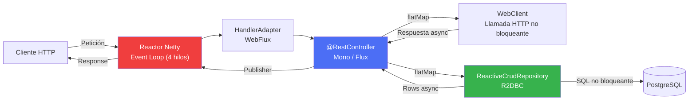

## 59 — Programación Reactiva (Spring WebFlux + Reactor)

### Propósito
Aprender a construir aplicaciones **no bloqueantes** con **Spring WebFlux** y **Project Reactor**, capaces de manejar decenas de miles de conexiones concurrentes usando pocos hilos, aprovechando el modelo de event loop de **Netty** y los tipos `Mono<T>` y `Flux<T>` como abstracciones de flujos asíncronos con **backpressure**.

### Problema que resuelve
El modelo tradicional de **Spring MVC + Tomcat** es *thread-per-request*: cada petición HTTP entrante ocupa un hilo del pool (típicamente 200 hilos por defecto) durante toda su duración.
- Si tu API tiene **10 000 conexiones simultáneas** (streaming, WebSockets, gateways, IoT), Tomcat colapsa: no hay hilos suficientes y las nuevas peticiones se encolan o son rechazadas.
- Si un endpoint llama a un servicio HTTP externo lento (2 segundos), el hilo queda **bloqueado durmiendo** esperando la respuesta. La CPU está al 5 % pero no puedes atender más clientes.
- Escalar verticalmente añadiendo hilos consume RAM (cada hilo ≈ 512 KB de stack) y provoca *context switching* excesivo.

### Cómo lo resuelve
**Spring WebFlux** reemplaza Tomcat por **Reactor Netty**, un servidor basado en **event loop** (unos pocos hilos, típicamente `2 × núcleos`) que multiplexa miles de conexiones.
1. Los controladores devuelven `Mono<T>` (0 o 1 elemento) o `Flux<T>` (0..N elementos) en lugar de valores directos.
2. Cuando una operación I/O comienza (llamada HTTP, query a BD), el hilo del event loop **NO se bloquea**: registra un callback y atiende otra petición.
3. Cuando la I/O termina, el resultado se emite por el `Publisher` y continúa la cadena reactiva (`.map`, `.flatMap`).
4. **Backpressure**: el `Subscriber` le indica al `Publisher` cuántos elementos puede procesar, evitando `OutOfMemoryError` en streams infinitos.
5. Para BD se usa **R2DBC** (Reactive Relational Database Connectivity), reemplazo no bloqueante de JDBC.

### Por qué aprenderlo
La programación reactiva es la base de:
- **API Gateways** (Spring Cloud Gateway, módulo 47) que proxyfican miles de peticiones.
- **Streaming de datos** en tiempo real (SSE, WebSockets, feeds financieros, telemetría IoT).
- **BFF (Backend For Frontend)** que agregan datos de múltiples microservicios en paralelo.
- Sistemas con **alta concurrencia y bajo throughput por request** (chats, notificaciones push, bolsas).



---

### Glosario Básico

#### `Mono<T>`
Publisher reactivo que emite **0 o 1 elemento** (o un error). Equivalente asíncrono a `Optional<T>` o `CompletableFuture<T>`. Ej: `Mono<User>` = "eventualmente habrá un `User`, ninguno, o un error".

#### `Flux<T>`
Publisher reactivo que emite **0 a N elementos** (o un error). Equivalente asíncrono a `Stream<T>`. Ej: `Flux<Order>` = "un stream de pedidos que llegarán con el tiempo".

#### `Publisher`
Interfaz de Reactive Streams. Fuente de datos que **emite** elementos cuando un `Subscriber` se conecta. `Mono` y `Flux` son `Publisher`.

#### `Subscriber`
Consumidor. Recibe `onNext(T)`, `onError(Throwable)`, `onComplete()`. Spring WebFlux lo maneja por ti.

#### `Subscription`
Contrato entre `Publisher` y `Subscriber`. El `Subscriber` llama `request(n)` para pedir `n` elementos → base del backpressure.

#### `Backpressure`
Mecanismo por el cual el consumidor le dice al productor "envíame solo lo que puedo procesar". Evita saturación de memoria.

#### `Scheduler`
Abstracción sobre hilos. Reactor incluye `Schedulers.boundedElastic()` (para I/O bloqueante puntual), `Schedulers.parallel()` (para CPU), `Schedulers.single()`, `Schedulers.immediate()`.

#### `Reactor Netty`
Servidor HTTP no bloqueante por defecto de WebFlux. Un event loop por núcleo. **NO usa Tomcat**.

#### `R2DBC`
API estándar Java para acceso reactivo a BD relacionales. Drivers: `r2dbc-postgresql`, `r2dbc-mysql`, `r2dbc-h2`.

#### `WebClient`
Cliente HTTP reactivo. Reemplaza `RestClient` / `RestTemplate` cuando necesitas no-bloqueo o streaming.

---

### Conceptos

#### 1. Fundamentos de `Mono` y `Flux`
- **Qué es** — Constructores de flujos y operadores para transformarlos.
- **Código**:
  ```java
  // Creación
  Mono<String> hello = Mono.just("hello");
  Mono<String> lazy = Mono.fromCallable(() -> repository.findById(1L)); // difiere ejecución
  Flux<Integer> numbers = Flux.range(1, 10);

  // Transformación
  Flux<String> upper = numbers.map(n -> "item-" + n);          // transformación síncrona
  Flux<User> users = ids.flatMap(id -> userService.findById(id)); // transformación asíncrona

  // Combinación
  Mono<UserProfile> profile = Mono.zip(
          userService.findUser(id),
          orderService.findOrders(id),
          (user, orders) -> new UserProfile(user, orders)); // ejecuta ambos en paralelo

  Flux<Event> allEvents = Flux.merge(fluxA, fluxB); // intercala emisiones
  ```
- **Regla clave**: `map` es síncrono, `flatMap` es asíncrono (aplana `Mono`/`Flux` anidados).

#### 2. Controladores WebFlux (`@RestController` y `RouterFunction`)
- **Qué es** — Dos estilos: anotaciones (idéntico a MVC) o funcional (rutas declarativas).
- **Código** (estilo anotaciones):
  ```java
  @RestController
  @RequestMapping("/api/products")
  @RequiredArgsConstructor
  @Slf4j
  public class ProductController {

      private final ProductRepository repository;

      @GetMapping("/{id}")
      public Mono<Product> findById(@PathVariable final Long id) {
          log.info("Buscando producto {}", id);
          return repository.findById(id)
                  .switchIfEmpty(Mono.error(new NotFoundException("Producto " + id)));
      }

      @GetMapping(produces = MediaType.TEXT_EVENT_STREAM_VALUE)
      public Flux<Product> streamAll() {
          // Server-Sent Events: emite productos conforme llegan
          return repository.findAll().delayElements(Duration.ofSeconds(1));
      }
  }
  ```
- **Código** (estilo funcional):
  ```java
  @Configuration
  public class ProductRoutes {
      @Bean
      public RouterFunction<ServerResponse> routes(final ProductHandler handler) {
          return RouterFunctions.route()
                  .GET("/api/v2/products/{id}", handler::findById)
                  .GET("/api/v2/products", handler::findAll)
                  .build();
      }
  }
  ```

#### 3. R2DBC — Persistencia Reactiva
- **Qué es** — Acceso a PostgreSQL/MySQL sin bloquear hilos. Reemplaza JPA/Hibernate (que es bloqueante).
- **Código**:
  ```java
  @Table("products")
  public record Product(@Id Long id, String name, BigDecimal price) {}

  public interface ProductRepository extends ReactiveCrudRepository<Product, Long> {

      @Query("SELECT * FROM products WHERE price > :min ORDER BY price")
      Flux<Product> findByPriceGreaterThan(BigDecimal min);
  }

  @Service
  @RequiredArgsConstructor
  public class ProductService {

      private final ProductRepository repository;
      private final TransactionalOperator tx;

      public Mono<Product> createWithDiscount(final Product p) {
          return tx.transactional( // transacción reactiva
                  repository.save(p)
                          .flatMap(saved -> applyDiscount(saved.id())
                                  .thenReturn(saved)));
      }
  }
  ```
- **Nota**: JPA **NO** es reactivo. Usa `R2dbcTransactionManager` para transacciones reactivas.

#### 4. `WebClient` — Cliente HTTP Reactivo
- **Qué es** — Reemplazo reactivo de `RestClient`/`RestTemplate`. Soporta streaming, backpressure y composición.
- **Código**:
  ```java
  @Configuration
  public class WebClientConfig {
      @Bean
      public WebClient paymentsClient() {
          return WebClient.builder()
                  .baseUrl("https://api.payments.com")
                  .defaultHeader("Accept", MediaType.APPLICATION_JSON_VALUE)
                  .build();
      }
  }

  @Service
  @RequiredArgsConstructor
  @Slf4j
  public class PaymentService {
      private final WebClient paymentsClient;

      public Mono<PaymentResult> charge(final ChargeRequest req) {
          return paymentsClient.post()
                  .uri("/charges")
                  .bodyValue(req)
                  .retrieve()
                  .onStatus(HttpStatusCode::is4xxClientError,
                            r -> Mono.error(new BadRequestException("Pago inválido")))
                  .bodyToMono(PaymentResult.class)
                  .timeout(Duration.ofSeconds(3))
                  .retryWhen(Retry.backoff(3, Duration.ofMillis(200)));
      }

      // Streaming: leer un Flux desde el servidor
      public Flux<Quote> streamQuotes() {
          return paymentsClient.get().uri("/quotes/stream")
                  .accept(MediaType.TEXT_EVENT_STREAM)
                  .retrieve()
                  .bodyToFlux(Quote.class);
      }
  }
  ```

#### 5. Backpressure y Schedulers
- **Qué es** — Cómo controlar la concurrencia y en qué hilos corre cada etapa.
- **Reglas**:
  - **NUNCA** llames `.block()` dentro del event loop → congela todo el servidor.
  - Si debes envolver código bloqueante (JDBC legado, librería sincrónica), aíslalo con `Schedulers.boundedElastic()`.
  - Para trabajo CPU-intensivo (parseo, hashing) usa `Schedulers.parallel()`.
- **Código**:
  ```java
  Flux<Report> reports = ids
          // Aísla la llamada bloqueante en un pool elástico
          .flatMap(id -> Mono.fromCallable(() -> legacyBlockingDao.load(id))
                          .subscribeOn(Schedulers.boundedElastic()),
                   /*concurrency*/ 8) // límite para evitar N+1 explosivo
          .publishOn(Schedulers.parallel())
          .map(this::heavyCpuTransform);
  ```

---

### Edge Cases y Errores Comunes

| Error | Causa | Solución |
|-------|-------|----------|
| Servidor congelado bajo carga | `.block()` dentro del event loop | **Nunca** bloquees en un handler WebFlux. Devuelve el `Mono`/`Flux` y deja que Spring lo suscriba. |
| `Cannot mix Web MVC and WebFlux` | Se agregó `spring-boot-starter-web` junto con `spring-boot-starter-webflux` | Elige uno. Un proyecto reactivo **solo** puede tener `webflux` (Netty). **NUNCA mezcles ambos starters**. |
| Todo va lentísimo | Usaste `JdbcTemplate` o `JpaRepository` dentro de un `flatMap` | JDBC/JPA son bloqueantes. Usa R2DBC, o envuelve con `Mono.fromCallable(...).subscribeOn(Schedulers.boundedElastic())`. |
| `ThreadLocal` perdido (MDC vacío, tenant nulo) | El request cambia de hilo entre etapas reactivas | Usa el `Context` de Reactor: `Mono.deferContextual(ctx -> ...)` y propaga con `contextWrite(...)`. Habilita `Hooks.enableAutomaticContextPropagation()` (Reactor 3.5+). |
| Explosión de conexiones a un servicio downstream | `flatMap` sin límite de concurrencia sobre un `Flux` grande | Usa la sobrecarga `flatMap(mapper, concurrency)` o `concatMap` para procesar en serie. |
| `OutOfMemoryError` en un stream infinito | Productor rápido, consumidor lento, sin backpressure | Usa `onBackpressureBuffer(size)`, `onBackpressureDrop()` o `limitRate(n)`. |

---

### Ejercicios
1. Crea un endpoint `GET /api/quotes/stream` con `produces = MediaType.TEXT_EVENT_STREAM_VALUE` que emita un `Flux<Quote>` usando `Flux.interval(Duration.ofSeconds(1))`.
2. Integra **R2DBC + PostgreSQL** (`r2dbc-postgresql`). Crea la tabla `products` y expón un CRUD reactivo completo.
3. Implementa `ProductService.createBatch(Flux<Product>)` que use `TransactionalOperator` para insertar en una sola transacción reactiva.
4. Usa `WebClient` para consumir `https://jsonplaceholder.typicode.com/posts` y agregar resultados en paralelo con `Mono.zip`. Compara tiempos vs. secuencial.
5. Simula 5 000 conexiones concurrentes con `wrk` o `hey` contra el endpoint stream y compara el consumo de hilos vs. una versión MVC bloqueante.

---

### Cómo ejecutar
```bash
cd 59-reactive
docker run -d --name pg-reactive -e POSTGRES_PASSWORD=secret -p 5432:5432 postgres:16
mvn spring-boot:run

# Probar endpoint reactivo
curl http://localhost:8080/api/products/1

# Probar stream SSE
curl -N http://localhost:8080/api/products
```

---

### Archivos del Proyecto

| Archivo | Propósito |
|---------|-----------|
| `pom.xml` | Dependencias: `spring-boot-starter-webflux`, `spring-boot-starter-data-r2dbc`, `r2dbc-postgresql`, `reactor-test`. **NO incluye `spring-boot-starter-web`**. |
| `application.yml` | URL R2DBC (`r2dbc:postgresql://localhost:5432/db`) y configuración de Netty. |
| `domain/Product.java` | Record `@Table("products")` con `@Id`. |
| `repository/ProductRepository.java` | Extiende `ReactiveCrudRepository<Product, Long>` con `@Query` reactivas. |
| `service/ProductService.java` | Lógica reactiva con `TransactionalOperator` y composición `Mono`/`Flux`. |
| `service/PaymentService.java` | Uso de `WebClient` con timeout, `retryWhen` y manejo de errores. |
| `controller/ProductController.java` | Endpoints `@RestController` devolviendo `Mono`/`Flux` y stream SSE. |
| `config/WebClientConfig.java` | Bean `WebClient` con `baseUrl` y headers por defecto. |
| `config/RouterConfig.java` | Ejemplo de `RouterFunction` (estilo funcional). |
| `db/migration/V1__init.sql` | Migración Flyway para tabla `products`. |
