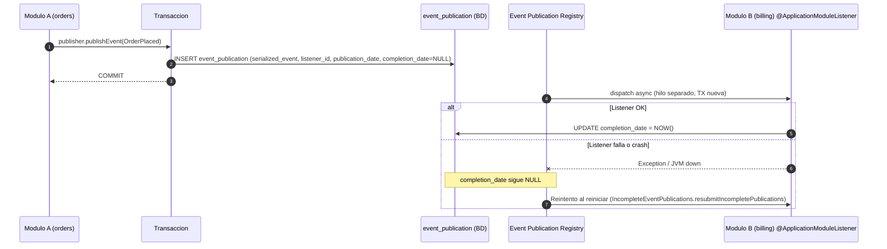

## 60 — Spring Modulith Avanzado

### Propósito
Dominar las características **empresariales** de Spring Modulith que van más allá del simple aislamiento entre módulos (visto en el Módulo 39): **Event Publication Registry persistente**, **`@ApplicationModuleListener`**, **testing modular con `@ApplicationModuleTest`**, **Scenario API** para tests event-driven y **generación automática de documentación** (AsciiDoc + PlantUML/C4). Con esto llevas un monolito modular a estándares de producción.

### Problema que resuelve
En el Módulo 39 ya vimos cómo Modulith detecta acoplamiento entre paquetes. Pero en producción aparecen problemas más profundos:

- **Consistencia eventual entre módulos**: el módulo `orders` publica el evento `OrderPlaced` y el módulo `billing` debe reaccionar. Si el listener falla o el servidor se cae **justo después del commit**, el evento se pierde para siempre. Resultado: pedidos sin factura.
- **Testing acoplado**: quieres testear solo el módulo `billing` sin arrancar todo el `ApplicationContext` (JPA, security, kafka, etc.). Con `@SpringBootTest` tardas 40 s por test.
- **Documentación desactualizada**: los diagramas de arquitectura en Confluence llevan 8 meses obsoletos. Nadie los mantiene.
- **Observabilidad ciega**: no sabes cuánto tarda cada módulo ni cuántos eventos procesa por segundo.

### Cómo lo resuelve
Spring Modulith ofrece un stack completo para monolitos modulares productivos:

1. **Event Publication Registry** (`spring-modulith-events-jpa`): cada evento publicado con `ApplicationEventPublisher` se **persiste en la tabla `event_publication`** dentro de la **misma transacción** que lo originó. Si el listener falla o el servidor se cae, al reiniciar se **reintenta** automáticamente. Garantía at-least-once entre módulos sin Kafka.
2. **`@ApplicationModuleListener`**: combinación mágica de `@Async` + `@Transactional(propagation = REQUIRES_NEW)` + `@TransactionalEventListener(phase = AFTER_COMMIT)`. Cada listener corre en su propio hilo y su propia transacción — un fallo en `billing` NO deshace `orders`.
3. **`@ApplicationModuleTest`**: arranca **solo** el módulo bajo prueba (y sus dependencias declaradas). Los demás módulos se mockean o excluyen. Tests 10× más rápidos.
4. **Scenario API**: DSL fluido para tests de integración event-driven: `scenario.publish(orderEvent).andWaitAtMost(Duration.ofSeconds(5)).forEventOfType(InvoiceIssued.class).toArrive();`. Se acabó `Thread.sleep()`.
5. **Documentation Generator**: `ApplicationModules.of(App.class).createDocumenter().writeDocumentation()` genera `.adoc` + diagramas PlantUML (C4 componente) por cada módulo, siempre sincronizados con el código.
6. **Actuator integration**: expone `/actuator/modulith` con la estructura de módulos, y Micrometer publica métricas por módulo.

### Por qué aprenderlo
Modulith avanzado es la **respuesta pragmática al hype de microservicios**. Muchas empresas descubrieron que Kubernetes + 20 servicios + Kafka fue prematuro. Un monolito modular con Event Publication Registry, listeners transaccionales y documentación autogenerada ofrece el 80% de los beneficios (aislamiento, evolución independiente por equipo) con el 10% del costo operacional. Es la arquitectura que Oliver Drotbohm (creador) recomienda como **paso previo obligatorio** antes de partir a microservicios.



---

### Glosario

#### `Event Publication Registry`
Tabla `event_publication` (JPA/JDBC/MongoDB) que persiste cada evento publicado junto con su listener destino. Provee entrega **at-least-once** sin broker externo.

#### `@ApplicationModuleListener`
Meta-anotación que combina `@Async`, `@Transactional(REQUIRES_NEW)` y `@TransactionalEventListener(AFTER_COMMIT)`. Estándar para escuchar eventos entre módulos.

#### `@ApplicationModuleTest`
Test slice que arranca **solo un módulo** (bootstrap mode configurable: `STANDALONE`, `DIRECT_DEPENDENCIES`, `ALL_DEPENDENCIES`).

#### `Scenario`
API fluida inyectable en tests para publicar eventos y esperar reacciones sin `Thread.sleep`.

#### `ApplicationModules`
Objeto reflectivo (`ApplicationModules.of(App.class)`) que representa la topología de módulos. Base para `verify()`, `Documenter` y actuator.

#### `ModuleObservability`
Integración con Micrometer que emite métricas y trazas por módulo (`modulith.module.invocations`).

#### `CompletedEventPublications`
Bean para consultar/purgar eventos ya procesados. Evita que la tabla crezca infinitamente.

---

### Conceptos

#### 1. Event Publication Registry con JPA
- **Qué es** — Persistencia transaccional de eventos publicados vía `ApplicationEventPublisher`. Modulith crea la tabla `event_publication` y la usa como **outbox pattern** integrado.
- **Por qué importa** — Elimina la clásica pregunta "¿qué pasa si el servidor se cae entre el `save()` y el `publishEvent()`?". Aquí la publicación y el evento están en la misma transacción SQL.
- **Código**:
  ```xml
  <dependency>
      <groupId>org.springframework.modulith</groupId>
      <artifactId>spring-modulith-starter-jpa</artifactId>
  </dependency>
  <dependency>
      <groupId>org.springframework.modulith</groupId>
      <artifactId>spring-modulith-events-jpa</artifactId>
  </dependency>
  ```
  ```yaml
  spring:
    modulith:
      events:
        jdbc:
          schema-initialization:
            enabled: true         # Crea tabla event_publication al arrancar (solo dev)
        republish-outstanding-events-on-restart: true
  ```
  ```java
  // Modulo orders: publica el evento DENTRO de la transaccion del save
  @Service
  @Slf4j
  @RequiredArgsConstructor
  public class OrderService {

      private final OrderRepository orderRepository;
      private final ApplicationEventPublisher events;

      @Transactional
      public Order placeOrder(final PlaceOrderCommand cmd) {
          final Order order = orderRepository.save(Order.from(cmd));
          // El evento se serializa e inserta en event_publication en ESTA misma TX
          events.publishEvent(new OrderPlaced(order.getId(), order.getTotal()));
          log.info("Order {} placed and event queued", order.getId());
          return order;
      }
  }
  ```

#### 2. `@ApplicationModuleListener` transaccional y asíncrono
- **Qué es** — Anotación que reemplaza el combo manual `@Async + @TransactionalEventListener + @Transactional(REQUIRES_NEW)`. Cada invocación corre en su propio hilo y su propia transacción.
- **Por qué importa** — Un fallo en el listener **no** deshace la transacción del publicador. Y si el listener explota, la fila en `event_publication` queda con `completion_date = NULL` para reintento.
- **Código**:
  ```java
  // Modulo billing: escucha eventos del modulo orders
  @Component
  @Slf4j
  @RequiredArgsConstructor
  public class InvoiceCreator {

      private final InvoiceRepository invoiceRepository;

      @ApplicationModuleListener // async + TX nueva + AFTER_COMMIT
      void on(final OrderPlaced event) {
          log.info("Creating invoice for order {}", event.orderId());
          invoiceRepository.save(Invoice.from(event));
          // Si esto lanza excepcion, la fila en event_publication NO se marca completa
          // y sera reintentada al reiniciar la app (o via resubmitIncompletePublications).
      }
  }
  ```
  ```java
  // Habilita procesamiento asincrono
  @Configuration
  @EnableAsync
  public class AsyncConfig { }
  ```

#### 3. Testing modular con `@ApplicationModuleTest`
- **Qué es** — Test slice específico de Modulith. Detecta el módulo del paquete del test y arranca **solo** ese módulo. Configurable con `bootstrapMode`.
- **Por qué importa** — Arranque de contexto en 2-3 s en lugar de 40 s. Fuerza a que el módulo sea realmente autocontenido.
- **Código**:
  ```java
  package com.example.app.billing;

  @ApplicationModuleTest(mode = BootstrapMode.DIRECT_DEPENDENCIES)
  @Import(TestcontainersConfig.class)
  @Slf4j
  class BillingModuleTests {

      @Autowired InvoiceCreator invoiceCreator;
      @Autowired InvoiceRepository invoices;

      @Test
      void createsInvoiceOnOrderPlaced() {
          invoiceCreator.on(new OrderPlaced(42L, new BigDecimal("199.90")));
          assertThat(invoices.findByOrderId(42L)).isPresent();
      }
  }
  ```

#### 4. Scenario API para tests event-driven
- **Qué es** — DSL fluido inyectable (`Scenario scenario`) que publica un evento y **espera** hasta que otro evento aparezca o una condición se cumpla, con timeout explícito.
- **Por qué importa** — Elimina `Thread.sleep(2000)` y `Awaitility` boilerplate. Los tests de integración event-driven se leen como especificación.
- **Código**:
  ```java
  @ApplicationModuleTest
  class OrderBillingScenarioTests {

      @Test
      void invoiceIsIssuedAfterOrderPlaced(final Scenario scenario) {
          scenario.publish(new OrderPlaced(99L, new BigDecimal("500.00")))
                  .andWaitAtMost(Duration.ofSeconds(5))
                  .forEventOfType(InvoiceIssued.class)
                  .matching(evt -> evt.orderId() == 99L)
                  .toArrive();
      }

      @Test
      void invoiceStateChanges(final Scenario scenario) {
          scenario.stimulate(() -> orderService.placeOrder(sampleCmd()))
                  .andWaitForStateChange(() -> invoiceRepository.findByOrderId(99L))
                  .andVerify(inv -> assertThat(inv).isPresent());
      }
  }
  ```

#### 5. Documentation Generator (AsciiDoc + PlantUML)
- **Qué es** — API programática que inspecciona los módulos y genera `.adoc` + diagramas PlantUML C4 (Componente) por módulo. Se ejecuta como test o build step.
- **Por qué importa** — Documentación **siempre sincronizada** con el código. Si un módulo agrega una dependencia no declarada, aparece automáticamente en el diagrama (o rompe `verify()`).
- **Código**:
  ```java
  @Test
  void writesDocumentationSnippets() {
      ApplicationModules modules = ApplicationModules.of(Application.class);
      modules.verify(); // Falla si hay ciclos o dependencias no declaradas

      new Documenter(modules)
              .writeModulesAsPlantUml()             // target/spring-modulith-docs/components.puml
              .writeIndividualModulesAsPlantUml()   // Uno por modulo
              .writeDocumentation();                // AsciiDoc con canvas de cada modulo
  }
  ```
  ```java
  // package-info.java del modulo orders declara dependencias explicitas
  @ApplicationModule(
      displayName = "Sales Orders",
      allowedDependencies = { "shared", "customers" }
  )
  package com.example.app.orders;

  import org.springframework.modulith.ApplicationModule;
  ```

---

### Edge Cases

| Problema | Causa | Solución |
|----------|-------|----------|
| **Eventos duplicados** | Al reiniciar tras un crash, un listener que ya había ejecutado 90% de su trabajo pero no marcó `completion_date` se **reintenta**. | Diseña listeners **idempotentes**: usa una clave natural (`orderId`) con `UNIQUE`, o guarda un `processed_events` con el `eventId`. |
| **Tabla `event_publication` crece indefinidamente** | Cada evento procesado deja una fila con `completion_date` seteado. En un año son millones. | Programa un job que llame a `CompletedEventPublications.deletePublicationsOlderThan(Duration.ofDays(30))`. |
| **Ciclos entre módulos** | `orders` importa `billing.InvoiceService` y `billing` importa `orders.OrderRepository`. `ApplicationModules.verify()` explota. | Refactoriza a comunicación por **eventos** (unidireccional) o extrae interfaces a un módulo `shared`. |
| **Listener falla silenciosamente sin reintento** | El listener usa `@EventListener` normal (no `@ApplicationModuleListener`), por lo que corre en la misma TX del publicador y sin registro. | Migra siempre a `@ApplicationModuleListener`. Verifica en `/actuator/modulith` que aparezca registrado. |
| **`@Async` no está habilitado** | Olvidas `@EnableAsync`. Los listeners corren síncronos y bloquean al publicador. | Agrega `@EnableAsync` en una `@Configuration`. Configura un `TaskExecutor` con pool acotado en producción. |
| **Republicación al arrancar dispara todos los eventos históricos** | `republish-outstanding-events-on-restart: true` en una BD con eventos incompletos antiguos. | Limpia manualmente eventos huérfanos antes de habilitar la republicación, o pon `false` y reintenta bajo demanda vía `IncompleteEventPublications.resubmitIncompletePublications(...)`. |

---

### Ejercicios
1. Crea dos módulos `orders` y `billing` en un mismo Spring Boot. Publica `OrderPlaced` y consúmelo con `@ApplicationModuleListener`. Verifica en H2/PostgreSQL que la tabla `event_publication` recibe la fila.
2. Simula una excepción en `InvoiceCreator`. Reinicia la app y observa cómo el evento se reintenta automáticamente.
3. Escribe un `@ApplicationModuleTest` para el módulo `billing` con `BootstrapMode.STANDALONE` y verifica que **no** arranca el módulo `orders`.
4. Escribe un test con `Scenario` que publique `OrderPlaced` y espere hasta 3 segundos por `InvoiceIssued`.
5. Genera la documentación con `Documenter` y abre el `.puml` en https://plantuml.com/plantuml. Agrega una dependencia no declarada y observa cómo `verify()` falla.

### Cómo ejecutar
Este ejemplo requiere **PostgreSQL** para persistir el Event Publication Registry.

```bash
cd 60-spring-modulith

# Levanta PostgreSQL
docker compose up -d postgres

# Ejecuta la aplicacion
mvn spring-boot:run

# Prueba: crea una orden
curl -X POST http://localhost:8080/api/orders \
     -H "Content-Type: application/json" \
     -d '{"customerId": 1, "total": 199.90}'

# Verifica la tabla del registry
docker exec -it modulith-postgres psql -U modulith -d modulith \
    -c "SELECT id, event_type, publication_date, completion_date FROM event_publication;"

# Endpoint actuator con la topologia de modulos
curl http://localhost:8080/actuator/modulith | jq

# Ejecuta tests y genera documentacion
mvn test
ls target/spring-modulith-docs/
```

### Archivos del Proyecto

| Archivo | Propósito |
|---------|-----------|
| `pom.xml` | Spring Boot 4.1.0 + `spring-modulith-starter-jpa` + `spring-modulith-events-jpa` + `spring-modulith-actuator`. |
| `docker-compose.yml` | PostgreSQL 16 para persistir `event_publication`. |
| `application.yml` | Configuración del registry JDBC, `republish-outstanding-events-on-restart`, datasource. |
| `Application.java` | `@SpringBootApplication` + `@EnableAsync`. |
| `orders/package-info.java` | `@ApplicationModule(allowedDependencies = {"shared"})` — declara dependencias permitidas. |
| `orders/OrderService.java` | Publica `OrderPlaced` dentro de `@Transactional` (constructor injection, `@Slf4j`). |
| `orders/OrderPlaced.java` | Evento como `record` — payload inmutable serializable. |
| `orders/OrderController.java` | Endpoint REST `POST /api/orders`. |
| `billing/package-info.java` | `@ApplicationModule` del módulo billing. |
| `billing/InvoiceCreator.java` | `@ApplicationModuleListener` idempotente que crea la factura. |
| `billing/InvoiceRepository.java` | JPA repo con `findByOrderId` (clave natural para idempotencia). |
| `shared/EventCleanupJob.java` | `@Scheduled` que purga `CompletedEventPublications` antiguas. |
| `config/AsyncConfig.java` | `@EnableAsync` + `TaskExecutor` con pool acotado. |
| `test/ModulithVerificationTests.java` | `ApplicationModules.of(...).verify()` + genera docs con `Documenter`. |
| `test/BillingModuleTests.java` | `@ApplicationModuleTest(mode = STANDALONE)` para el módulo billing. |
| `test/OrderBillingScenarioTests.java` | Tests event-driven con `Scenario` API. |
