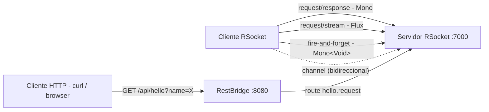

## 61 - RSocket con Spring Boot

### Proposito
Aprender a exponer servicios usando **RSocket**, un protocolo binario reactivo con
soporte nativo para 4 modelos de interaccion y **backpressure** de extremo a extremo,
como alternativa a HTTP/REST y a WebSocket "crudo".

### Problema que resuelve
HTTP tiene UN solo modelo (request/response por conexion). Para streaming largo,
push del servidor, o fire-and-forget se necesitan hacks (long polling, Server-Sent
Events, WebSocket crudo con protocolo hecho a mano). Ademas, no hay control de flujo:
si el productor es mas rapido que el consumidor, alguien colapsa.

### Como lo resuelve
RSocket define **4 modelos** en el propio protocolo y transporta frames binarios
sobre TCP, WebSocket o Aeron. El backpressure se negocia por frame (REQUEST_N),
asi que el consumidor le dice al productor "damelo mas lento" sin buffers infinitos.

Spring Boot 4 lo integra con:
- `@Controller` + `@MessageMapping("ruta")` en el servidor.
- `RSocketRequester` en el cliente (autoconfigurado por `spring-boot-starter-rsocket`).
- Tipos reactivos `Mono` / `Flux` como retorno, mismos que WebFlux.

### Por que aprenderlo
Cada vez mas backends internos (comunicacion servicio-a-servicio, dashboards en
tiempo real, telemetria, gaming, IoT) usan RSocket por su latencia baja, streaming
nativo y backpressure. Es la evolucion natural despues de REST cuando el modelo
request/response ya no alcanza.



### Glosario Basico

| Termino | Significado |
|---|---|
| **RSocket** | Protocolo binario reactivo. Aplica los principios de Reactive Streams al transporte. |
| **Route** | El "endpoint" en RSocket. Cadena tipo `hello.request` que enruta al `@MessageMapping`. |
| **Request/Response** | Un frame pide, un frame responde. Como HTTP pero sobre TCP persistente. |
| **Request/Stream** | Un frame pide, el servidor emite N frames. Adios al polling. |
| **Fire-and-Forget** | Cliente envia y no espera. Ideal para telemetria/eventos. |
| **Channel** | Ambos lados envian `Flux`. Bidireccional puro. |
| **Backpressure** | El consumidor le dice al productor cuantos items puede recibir (`REQUEST_N`). |
| **`@MessageMapping`** | Mapea una ruta RSocket a un metodo, como `@GetMapping` en HTTP. |
| **`RSocketRequester`** | Cliente de alto nivel para hablar RSocket, autoconfigurado. |
| **`Mono` / `Flux`** | Publisher reactivo de 0-1 / 0-N elementos (Reactor). |

### Conceptos

#### 1. Los 4 modelos de interaccion
- **Que es** - RSocket define en el protocolo mismo cuatro maneras de intercambiar
  mensajes: request/response, request/stream, fire-and-forget y channel.
- **Por que importa** - No tienes que inventar un protocolo aplicativo sobre WebSocket
  para hacer streaming; RSocket ya lo trae, con semantica clara y estandar.
- **Codigo** - Ver `HelloController`: cada metodo demuestra un modelo distinto.
- **Analogia** - Un restaurante que ofrece: (1) pedir plato -> te lo traen; (2) pedir
  un menu degustacion -> te van trayendo platos por horas; (3) dejar una nota de
  sugerencia -> nadie te responde; (4) barra de sushi rotativa -> tu vas pidiendo y
  ellos van sirviendo continuamente.

#### 2. Backpressure de extremo a extremo
- **Que es** - Un mecanismo por el que el consumidor le dice al productor "mandame N,
  luego te pido mas". En RSocket va en el propio frame `REQUEST_N`.
- **Por que importa** - Sin backpressure, un productor rapido llena buffers en memoria
  y colapsa la JVM (OOM). Con backpressure, el productor solo produce lo que el
  consumidor puede aceptar.
- **Codigo** - Cuando el test hace `retrieveFlux(...)`, Reactor negocia el `REQUEST_N`
  con el servidor automaticamente.
- **Analogia** - Cinta transportadora con un boton: el que empaqueta al final aprieta
  "damelo mas lento" y el operario al inicio deja de meter cajas.

#### 3. Bridge HTTP -> RSocket
- **Que es** - Un controlador HTTP tradicional (`@RestController`) que actua como
  cliente RSocket internamente. Traduce `GET /api/hello` a una llamada a la ruta
  `hello.request`.
- **Por que importa** - Los frontends web todavia hablan HTTP; el bridge te deja
  migrar el backend a RSocket sin romper clientes existentes.

### Antes vs Ahora

| Aspecto | ANTES (WebSocket crudo + STOMP) | AHORA (RSocket + Spring Boot 4) |
|---|---|---|
| Modelos de interaccion | Solo mensajes; hay que inventar semantica sobre STOMP | 4 modelos nativos en el protocolo |
| Streaming | Se implementa a mano sobre frames | `Flux<T>` nativo |
| Fire-and-forget | Se simula con un mensaje y sin ack | `Mono<Void>` explicito |
| Backpressure | Ninguno; el servidor puede saturar al cliente | Negociado en frame `REQUEST_N` |
| Codigo servidor | `@MessageMapping("/topic/...")` + broker en memoria + STOMP | `@MessageMapping("hello.request")` y retorna `Mono`/`Flux` |
| Codigo cliente | JS + SockJS + StompClient | `RSocketRequester.tcp(...).route(...).retrieveMono(...)` |
| DTO clasico Java 8 | `class Greeting { private String message; getters/setters; equals; hashCode; }` | `record Greeting(String message) {}` |
| `if (obj != null) return obj;` | Chequeo `null` manual | `Mono.justOrEmpty(obj)` |

### FAQ del Alumno

- **Que es una "route" en RSocket?** Es como una URL, pero es una cadena arbitraria
  (`hello.request`, `orders.create.v2`, etc.). No hay verbos HTTP; el modelo lo
  decide el metodo del cliente (`retrieveMono`, `retrieveFlux`, `send`).
- **Por que el puerto 7000 y no 8080?** 8080 lo esta usando el servidor HTTP del
  bridge. RSocket sobre TCP no comparte puerto con HTTP por defecto, asi que le
  damos otro. (Se puede compartir usando transporte `websocket`.)
- **Por que hay dos servidores?** Uno RSocket (7000) para clientes RSocket puros,
  y uno HTTP (8080) para el bridge REST. Son dos capas independientes.
- **`Mono` y `Flux` son iguales que en WebFlux?** Si. RSocket usa los mismos tipos
  de Reactor. Un metodo `Mono<T>` responde con 0-1 items; `Flux<T>` con 0-N.
- **Necesito Netty?** Si, `spring-boot-starter-webflux` lo trae; Netty es el motor
  I/O no bloqueante que usa tanto WebFlux como RSocket.
- **Puedo usar RSocket sobre WebSocket para hablar desde el navegador?** Si, cambiando
  `spring.rsocket.server.transport=websocket` y usando `rsocket-js` en el frontend.
- **Que es `StepVerifier`?** Utilidad de `reactor-test` para probar `Mono`/`Flux`:
  declara los elementos esperados en orden y verifica que se emitan.

### Ejercicios
1. Implementa el 4o modelo (**channel**): metodo `Flux<Greeting> chat(Flux<String> in)`
   que responda a cada mensaje entrante con un `Greeting`.
2. Agrega metadatos: envia un token en el `setupMetadata` y valida en el servidor
   con un `@ConnectMapping`.
3. Cambia el transporte a `websocket` y consume desde una pagina HTML con `rsocket-js`.
4. Mide el efecto del backpressure: haz un `Flux.interval(Duration.ofMillis(1))` en el
   servidor y observa como Reactor limita al cliente lento.

### Como ejecutar

**Build:**
```bash
./build.sh          # Linux / Git Bash
.\build.ps1         # Windows PowerShell
```

**Arrancar la app:**
```bash
java -jar target/rsocket-1.0.0.jar
```
Levanta:
- Servidor RSocket TCP en `localhost:7000`.
- Servidor HTTP (bridge) en `localhost:8080`.

**Probar el bridge HTTP (funciona con curl / navegador):**
```bash
curl "http://localhost:8080/api/hello?name=Ada"
# {"message":"Hello, Ada"}
```

**Probar RSocket directo con `rsc` (CLI de RSocket):**

Instalar `rsc` desde https://github.com/making/rsc/releases y luego:

```bash
# 1) request/response
rsc --request --route hello.request --data Ada tcp://localhost:7000
# -> {"message":"Hello, Ada"}

# 2) request/stream (recibe 3 mensajes, uno por segundo)
rsc --stream --route hello.stream --data Ada tcp://localhost:7000
# -> {"message":"#0 Ada"}
# -> {"message":"#1 Ada"}
# -> {"message":"#2 Ada"}

# 3) fire-and-forget
rsc --fnf --route hello.fire --data Ada tcp://localhost:7000
# -> (sin respuesta; revisa los logs del servidor)
```

**Tests:**
```bash
../apache-maven-3.9.16/bin/mvn -f pom.xml test
```

### Archivos del Proyecto

| Archivo | Proposito |
|---|---|
| `pom.xml` | Dependencias (`spring-boot-starter-rsocket`, `spring-boot-starter-webflux`, `reactor-test`). |
| `build.sh` / `build.ps1` | Scripts de build con toolchain portable (JDK 21 + Maven 3.9). |
| `src/main/resources/application.yml` | Configuracion del puerto RSocket (7000/tcp) y HTTP (8080). |
| `src/main/java/.../SpringRoadmapApplication.java` | Clase principal Spring Boot. |
| `src/main/java/.../domain/Greeting.java` | DTO inmutable como `record`. |
| `src/main/java/.../controller/HelloController.java` | Controlador RSocket con los 3 modelos. |
| `src/main/java/.../controller/RestBridge.java` | Bridge HTTP `GET /api/hello` -> RSocket. |
| `src/main/java/.../config/RSocketClientConfig.java` | Bean `RSocketRequester` para localhost:7000. |
| `src/test/java/.../SpringRoadmapApplicationTests.java` | Smoke test `contextLoads`. |
| `src/test/java/.../controller/HelloControllerRSocketTest.java` | Tests de integracion RSocket con `StepVerifier`. |
