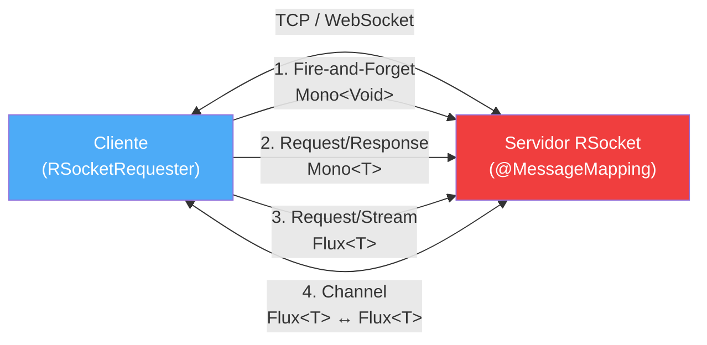

## 61 — RSocket

### Propósito
Aprender a implementar servicios reactivos usando **RSocket**, un protocolo binario **bidireccional** con **backpressure nativo** que corre sobre TCP o WebSocket, y que ofrece 4 modelos de interacción (fire-and-forget, request/response, request/stream, channel) impulsados por Project Reactor.

### Problema que resuelve
Los protocolos actuales tienen limitaciones específicas cuando el negocio necesita **streaming bidireccional en tiempo real**:
- **HTTP/REST** es request/response puro. Para simular streaming se usa polling (ineficiente) o SSE (unidireccional).
- **WebSocket** es "raw": entrega frames de bytes, pero no define semántica (¿es un stream? ¿es una respuesta única? ¿quién controla el flujo?). Debes inventar tu propio protocolo encima.
- **gRPC** soporta streaming, pero fue diseñado principalmente para request/response y su modelo de backpressure depende de HTTP/2 (no siempre respetado).
- Ninguno maneja **backpressure Reactive Streams** end-to-end: si el consumidor va lento, el productor sigue empujando datos hasta reventar la memoria.

Falta un protocolo que combine los **4 modelos de interacción reactivos** con **flow control nativo** y transporte flexible (TCP para intranet, WebSocket para navegador).

### Cómo lo resuelve
**RSocket** es un protocolo binario, asíncrono y multiplexado creado por Netflix y Facebook. Define en su especificación los 4 modelos de interacción como ciudadanos de primera clase, todos con backpressure Reactive Streams:

1. **Fire-and-Forget** — Envías un mensaje y no esperas respuesta (ideal para métricas, logs).
2. **Request/Response** — Como HTTP, pero binario y multiplexado sobre una sola conexión.
3. **Request/Stream** — Una petición, muchas respuestas (ideal para feeds de precios, eventos).
4. **Channel** — Flujos bidireccionales simultáneos (chat, colaboración en tiempo real).

Cada modelo respeta `request(n)` de Reactive Streams: el consumidor le dice al productor cuántos elementos puede recibir. Si el cliente pide 10, el servidor envía 10 y se detiene.

### Por qué aprenderlo
RSocket es la base de sistemas donde el **tiempo real** y la **eficiencia de red** son críticos:
- **Fintech**: streams de precios (cotizaciones, tick-by-tick trading).
- **Gaming**: sincronización de estado bidireccional, matchmaking.
- **IoT**: dispositivos que envían telemetría y reciben comandos simultáneamente.
- **Colaboración**: pizarras compartidas, edición de documentos, chat.
- Empresas como **Netflix**, **Facebook**, **Alibaba** y **Pivotal** lo usan en producción.



---

### Glosario Básico

#### `RSocket`
Protocolo binario, asíncrono, multiplexado y bidireccional sobre TCP, WebSocket o Aeron. Especificación abierta mantenida por la comunidad Reactive Foundation.

#### `Fire-and-Forget`
Modelo `Mono<Void>`. El cliente envía y olvida. No hay ACK ni respuesta. Máximo throughput, cero garantía.

#### `Request/Response`
Modelo `Mono<T>`. Como HTTP pero binario y multiplexado. Miles de peticiones simultáneas sobre **una** conexión TCP.

#### `Request/Stream`
Modelo `Flux<T>`. Una petición del cliente abre un stream ilimitado desde el servidor con backpressure.

#### `Channel`
Modelo `Flux<T>` en ambos sentidos. Cliente y servidor emiten flujos simultáneos independientes.

#### `Payload`
Unidad de datos en RSocket. Contiene `data` (el mensaje) y `metadata` (routing, autenticación, tracing).

#### `MimeType`
Cada payload declara su MimeType para `data` y `metadata`. Común: `application/json`, `message/x.rsocket.routing.v0`.

#### `Resumability`
Capacidad de reanudar una conexión perdida sin perder datos en curso (el protocolo re-negocia el estado).

#### `Leasing`
Mecanismo de control de capacidad: el servidor emite "leases" al cliente diciéndole cuántas peticiones puede enviar en una ventana de tiempo. Backpressure a nivel de conexión.

---

### Conceptos

#### 1. Servidor RSocket con `@Controller` + `@MessageMapping`
- **Qué es** — Con `spring-boot-starter-rsocket`, Spring Boot 4.1.0 levanta un servidor Netty RSocket. Los endpoints se declaran con `@MessageMapping` (equivalente a `@RequestMapping` de HTTP).
- **Código**:
  ```xml
  <dependency>
      <groupId>org.springframework.boot</groupId>
      <artifactId>spring-boot-starter-rsocket</artifactId>
  </dependency>
  ```
  ```yaml
  spring:
    rsocket:
      server:
        port: 7000
        transport: tcp   # o 'websocket' para navegadores
  ```

#### 2. Los 4 Modelos de Interacción
- **Qué es** — El tipo de retorno de `@MessageMapping` determina el modelo. Spring lo mapea automáticamente.
- **Código**:
  ```java
  @Controller
  @Slf4j
  @RequiredArgsConstructor
  public class PriceController {

      private final PriceService priceService;

      // 1. Fire-and-Forget: recibe evento, no responde
      @MessageMapping("audit.log")
      public Mono<Void> logAudit(final AuditEvent event) {
          log.info("Audit event received: {}", event.action());
          return priceService.saveAudit(event); // Mono<Void>
      }

      // 2. Request/Response: una petición, una respuesta
      @MessageMapping("price.get")
      public Mono<Price> getPrice(final String symbol) {
          return priceService.findBySymbol(symbol);
      }

      // 3. Request/Stream: una petición, muchas respuestas
      @MessageMapping("price.stream")
      public Flux<Price> streamPrices(final String symbol) {
          return priceService.streamPrices(symbol); // emite cada 500ms
      }

      // 4. Channel: flujo bidireccional
      @MessageMapping("price.channel")
      public Flux<Price> priceChannel(final Flux<String> symbols) {
          return symbols
              .doOnNext(s -> log.info("Client subscribed to: {}", s))
              .flatMap(priceService::streamPrices);
      }
  }
  ```

#### 3. Cliente con `RSocketRequester`
- **Qué es** — El cliente Spring usa `RSocketRequester` (equivalente a `WebClient` para HTTP). Se construye con `RSocketRequester.Builder` y expone métodos fluidos.
- **Código**:
  ```java
  @Configuration
  public class RSocketClientConfig {

      @Bean
      public RSocketRequester rSocketRequester(final RSocketRequester.Builder builder) {
          return builder
              .rsocketConnector(connector -> connector.reconnect(Retry.fixedDelay(5, Duration.ofSeconds(2))))
              .tcp("localhost", 7000);
      }
  }

  @Service
  @RequiredArgsConstructor
  @Slf4j
  public class PriceClient {

      private final RSocketRequester requester;

      public Flux<Price> subscribeToPrices(final String symbol) {
          return requester
              .route("price.stream")
              .data(symbol)
              .retrieveFlux(Price.class)
              .doOnNext(p -> log.info("Received: {}", p));
      }
  }
  ```

#### 4. Metadata Routing y Seguridad en `@ConnectMapping`
- **Qué es** — RSocket separa `data` (payload) de `metadata` (routing, auth). El "setup payload" es el primer mensaje al abrir la conexión: perfecto para autenticar una sola vez con JWT. Spring lo intercepta con `@ConnectMapping`.
- **Código**:
  ```java
  @Controller
  @Slf4j
  @RequiredArgsConstructor
  public class ConnectionHandler {

      private final JwtValidator jwtValidator;

      @ConnectMapping
      public Mono<Void> onConnect(final RSocketRequester requester,
                                  @Header("Authorization") final String token) {
          return jwtValidator.validate(token)
              .doOnSuccess(claims -> log.info("Client connected: user={}", claims.subject()))
              .switchIfEmpty(Mono.error(new RejectedSetupException("Invalid JWT")))
              .then();
      }
  }
  ```

#### 5. Transports: TCP vs WebSocket
- **Qué es** — RSocket es agnóstico al transporte. **TCP** ofrece la mejor latencia para servicios internos (microservicio ↔ microservicio). **WebSocket** permite que un navegador (con `rsocket-js`) hable RSocket directamente.
- **Código** (servidor con WebSocket):
  ```yaml
  spring:
    rsocket:
      server:
        port: 7000
        transport: websocket
        mapping-path: /rsocket   # WS endpoint en /rsocket
  ```
  ```javascript
  // Cliente browser con rsocket-js
  import { RSocketConnector } from 'rsocket-core';
  import { WebsocketClientTransport } from 'rsocket-websocket-client';

  const connector = new RSocketConnector({
      transport: new WebsocketClientTransport({ url: 'ws://localhost:7000/rsocket' }),
  });
  ```

---

### Edge Cases y Errores Comunes

| Error | Causa | Solución |
|-------|-------|----------|
| Cliente consume memoria hasta OOM en un stream | El suscriptor llama `subscribe()` sin controlar demanda (equivale a `request(Long.MAX_VALUE)`), el servidor produce sin límite y el buffer del cliente crece. | Usar operadores con backpressure explícito: `.limitRate(50)`, `.onBackpressureBuffer(1000)`, o `BaseSubscriber` con `request(n)` manual. |
| `Payload frame mimetype mismatch` al deserializar | El cliente envía JSON pero el servidor está configurado con CBOR (default en algunos setups) o viceversa. | Fijar explícitamente `.dataMimeType(MimeTypeUtils.APPLICATION_JSON)` en el builder del `RSocketRequester` y en `spring.rsocket.server.data-mime-type`. |
| JWT expira a mitad de sesión pero sigue funcionando | El JWT solo se valida en `@ConnectMapping` (setup payload). Una vez abierto el canal, no se re-valida en cada mensaje. | Guardar el `Instant` de expiración y validar en cada `@MessageMapping` con un filtro, o usar `PayloadInterceptor` para reautenticación periódica. Alternativamente, usar leasing con TTL corto. |
| Conexión TCP se cae y el cliente no se reconecta | Sin `reconnect()` en el connector, una desconexión de red mata el stream sin recuperación. | Configurar `connector.reconnect(Retry.backoff(...))` en el builder. Para no perder datos, activar **resumability** con `connector.resume(new Resume())`. |
| Channel se cierra prematuramente si el cliente deja de emitir | En channel, cerrar el `Flux<T>` de entrada del cliente cierra todo el canal (incluyendo el flujo del servidor). | No completar el flujo de entrada hasta que se termine la sesión. Usar `Sinks.Many` para mantenerlo abierto. |

---

### Ejercicios
1. **Chat bidireccional**: implementa un endpoint `chat.room` con modelo Channel donde múltiples clientes se conectan y ven en tiempo real los mensajes que envían los demás. Usa `Sinks.Many.multicast()` para el fan-out.
2. **Stream de precios**: crea `PriceService.streamPrices(symbol)` que use `Flux.interval(Duration.ofMillis(500))` para emitir un precio aleatorio cada 500ms. Prueba backpressure limitando el cliente con `.limitRate(2)`.
3. **Fire-and-Forget de auditoría**: expone `audit.log` para recibir eventos y guardarlos en Mongo reactivo. Verifica que el cliente no espere respuesta.
4. **Autenticación JWT en setup**: implementa `@ConnectMapping` que rechace conexiones sin token válido. Usa `RejectedSetupException`.
5. **Cliente `rsc` CLI**: instala la herramienta [rsc](https://github.com/making/rsc) y prueba tus endpoints desde línea de comandos sin escribir un cliente Java.

### Cómo ejecutar
```bash
cd 61-rsocket
mvn spring-boot:run
# Servidor escuchando RSocket en TCP puerto 7000

# Probar con rsc CLI (request/stream)
rsc --stream --route price.stream --data '"AAPL"' tcp://localhost:7000

# Probar request/response
rsc --request --route price.get --data '"AAPL"' tcp://localhost:7000

# Fire-and-forget
rsc --fnf --route audit.log --data '{"action":"login"}' tcp://localhost:7000
```

### Archivos del Proyecto
| Archivo | Propósito |
|---------|-----------|
| `pom.xml` | Dependencia `spring-boot-starter-rsocket` (Spring Boot 4.1.0). |
| `application.yml` | Configuración del servidor RSocket (puerto 7000, transporte TCP). |
| `controller/PriceController.java` | Los 4 modelos (`@MessageMapping`): fire, req/res, stream, channel. |
| `controller/ConnectionHandler.java` | `@ConnectMapping` para validar JWT en setup payload. |
| `service/PriceService.java` | Lógica reactiva: `Flux<Price>` con `Flux.interval` y backpressure. |
| `service/JwtValidator.java` | Validación del token del setup. |
| `domain/Price.java` | Record con `symbol`, `value`, `timestamp`. |
| `domain/AuditEvent.java` | Record para el fire-and-forget de auditoría. |
| `config/RSocketClientConfig.java` | `RSocketRequester` cliente con `reconnect` y `resume`. |
| `client/PriceClient.java` | Cliente Java que consume los 4 modelos. |
