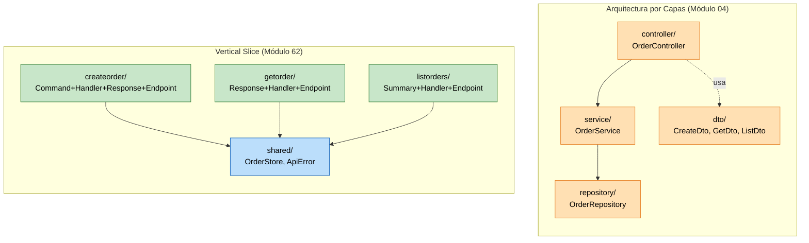

## 62 — Vertical Slice Architecture

### Propósito
Aprender a organizar el código **por feature (vertical)** en vez de por capa técnica (horizontal), agrupando en una sola carpeta todo lo que necesita una funcionalidad (request DTO, handler con la lógica, response DTO y endpoint HTTP).

### Problema que resuelve
En la arquitectura tradicional por capas (controller / service / repository) cada feature está **desparramada** en 3–6 carpetas. Agregar una funcionalidad implica tocar N archivos en N carpetas distintas, y eliminarla es casi imposible sin dejar huérfanos. El `OrderService` termina con 900 líneas y 30 métodos que se pisan entre sí, un cambio en el DTO `OrderDto` rompe features no relacionadas, y los merges son un infierno.

### Cómo lo resuelve
Vertical Slice invierte el criterio de agrupación: **una feature = una carpeta autocontenida**. Todo lo específico de "crear orden" vive en `features/createorder/` (Command + Handler + Response + Endpoint). Todo lo específico de "obtener orden" vive en `features/getorder/`. Solo lo que realmente comparten (aquí el `OrderStore` en memoria) vive en `shared/`. Consecuencias:

- Alta cohesión: los cambios de una feature quedan confinados a su carpeta.
- Bajo acoplamiento entre features: los DTOs no se comparten, cada slice moldea el suyo.
- Feature toggles / deprecación triviales: borrar la carpeta borra la feature.
- Ideal para equipos medianos con muchas features pequeñas (CRM, back-office, dashboards, wizards).

### Por qué aprenderlo
Es el estilo estándar en el mundo .NET (con MediatR) y cada vez más común en Spring/Java. Aparece explícitamente en libros y charlas de Jimmy Bogard, Vaughn Vernon y en las guías de "Feature-driven Package by Feature". Empresas que migran monolitos de arquitectura por capas a microservicios frecuentemente hacen un paso intermedio: **primero reorganizan el monolito por vertical slices**, y de ahí ya es directo extraer cada slice a un microservicio.



### Glosario Básico

| Término | Explicación |
|---|---|
| **Feature slice** | Carpeta autocontenida con todo lo necesario para una funcionalidad (request, handler, response, endpoint). |
| **Command** | DTO de entrada que representa una intención de MODIFICAR estado (crear, actualizar, borrar). |
| **Query** | DTO de entrada que representa una intención de LEER estado (por id, listar, buscar). |
| **Handler** | Clase con la lógica de una sola feature. Método público único: `handle(...)`. |
| **Endpoint** | El `@RestController` con UN solo mapping. Delega al Handler. |
| **Shared** | Lo que de verdad se reutiliza entre features (persistencia, errores comunes). Se mantiene mínimo a propósito. |
| **CQRS-lite** | Convención de nombres Command/Query para separar lecturas de escrituras, sin llegar al CQRS "puro" con dos bases de datos. |

### Conceptos

#### 1) Feature slice como unidad de organización
- **Qué es** — En lugar de agrupar por rol técnico (`controller/`, `service/`), agrupas por comportamiento del negocio (`createorder/`, `getorder/`). Cada slice tiene el mínimo necesario y nada más.
- **Por qué importa** — La cohesión se dispara: el 90% de los cambios se concentran en 1 carpeta. Los merges dejan de chocar.
- **Código** — Ver `features/createorder/` con 4 archivos (`CreateOrderCommand`, `CreateOrderResponse`, `CreateOrderHandler`, `CreateOrderEndpoint`).
- **Analogía** — En el supermercado por capas, un cambio en "cómo se envuelve la carne" obliga a coordinar bodega, reponedores y cajeros. En vertical slice, la "estación de carne envuelta" tiene su propio envoltorio, su propio cajero y su propio stock: cambias la estación y no molestas a las otras.
- **Casos empresariales** — Back-offices con muchas pantallas de tipo wizard, sistemas de trámites gubernamentales (una carpeta por trámite), plataformas SaaS donde cada plan tiene features distintas.

#### 2) Command / Query / Handler (CQRS-lite)
- **Qué es** — Nombrar los DTOs y clases según su intención: `XxxCommand` para escrituras, `XxxQuery` para lecturas, `XxxHandler` para la lógica. No hay dos bases de datos; solo hay **convención semántica**.
- **Por qué importa** — Con solo mirar el nombre sabes si un método muta el estado. Prepara el terreno para adoptar CQRS real, MediatR-style dispatchers, event sourcing o auditoría de comandos.
- **Código** — `CreateOrderCommand` es un command (escribe). `GetOrderResponse` es la respuesta a una query implícita por id.
- **Analogía** — El mismo mostrador atiende "quiero pedir" (command) y "cuánto vale" (query), pero el software las trata como dos flujos distintos.
- **Casos empresariales** — Auditoría regulatoria (grabar todos los commands), read models optimizados en Redis, sistemas con lecturas 100x más frecuentes que las escrituras.

#### 3) Endpoint delgado + Handler grueso
- **Qué es** — El `@RestController` no tiene lógica: recibe, delega, arma la respuesta HTTP. Toda la validación y reglas viven en el Handler.
- **Por qué importa** — El Handler se testea con `new Handler(store)`, sin arrancar Spring ni MockMvc. Los tests son 10x más rápidos y determinísticos.
- **Código** — Ver `CreateOrderEndpoint.create(...)` de 5 líneas vs `CreateOrderHandler.handle(...)` con validaciones.
- **Analogía** — El cajero (endpoint) solo cobra y entrega ticket; el cocinero (handler) es quien prepara.
- **Casos empresariales** — APIs REST + gRPC + colas Kafka pueden reusar el mismo Handler con distintos "endpoints".

### Antes (Capas Horizontales) vs Ahora (Vertical Slice)

Comparación explícita contra la arquitectura del **módulo 04-spring-mvc-rest**.

| Aspecto | ANTES: Capas horizontales (módulo 04) | AHORA: Vertical Slice (módulo 62) |
|---|---|---|
| **Agrupación** | Por rol técnico: `controller/`, `service/`, `repository/`, `dto/` | Por feature: `features/createorder/`, `features/getorder/`, ... |
| **Añadir feature** | Tocar 4–6 archivos en 4–6 carpetas | Crear una carpeta nueva con 4 archivos juntos |
| **Borrar feature** | Buscar y borrar métodos dispersos en `OrderController`, `OrderService`, `OrderRepository`, `OrderDto` | Borrar la carpeta `features/xxx/` |
| **Tamaño de clases** | `OrderService` de 900 líneas con 30 métodos | `CreateOrderHandler` de 40 líneas, un solo `handle()` |
| **DTOs** | `OrderDto` compartido → cambios afectan a features no relacionadas | Cada feature tiene sus propios DTOs (Command, Response, Summary) |
| **Merge conflicts** | Frecuentes en `OrderController` y `OrderService` (todos tocan los mismos archivos) | Raros: cada dev trabaja en carpetas distintas |
| **Testing** | Depender de mocks del Service completo | Handler puro con `new` en un test unitario simple |
| **Escalado a microservicios** | Difícil: hay que untangle qué método pertenece a qué servicio | Directo: mueves la carpeta `features/xxx/` a otro repo |
| **Curva de aprendizaje** | Familiar para quien aprendió MVC | Requiere disciplina para NO caer en tentaciones de compartir "por reuso" |

### Vertical Slice vs Hexagonal vs DDD Táctico vs Monolito Modular

| Criterio | Vertical Slice (62) | Hexagonal (38) | DDD Táctico (42) | Monolito Modular (39) |
|---|---|---|---|---|
| **Unidad de organización** | Feature (carpeta) | Puerto + adaptadores | Bounded context | Módulo con API pública |
| **Complejidad** | Baja | Media | Alta | Media |
| **Reglas de aislamiento** | Convención, no forzado por compilador | Interfaces (puertos) fuerzan aislamiento | Bounded context + Ubiquitous Language | `package internal` verificado por Spring Modulith |
| **Cuándo elegir** | Muchas features CRUD-like, equipo mediano, iteración rápida | Necesitas cambiar tecnología de infra (BD, mensajería) sin tocar el dominio | Dominio de negocio COMPLEJO con reglas ricas (banca, seguros) | Camino intermedio entre monolito y microservicios |
| **Cuándo NO elegir** | Dominio con lógica muy compartida entre features (banca núcleo) | Aplicaciones simples (over-engineering) | CRUDs simples (over-engineering) | Cuando ya sabes que necesitas microservicios reales |
| **Compatibilidad** | Combina bien con Hexagonal DENTRO de cada slice | Combina con DDD | Combina con Modular | Combina con Vertical Slice por módulo |

**Regla práctica:** para 80% de proyectos empresariales medianos, **Vertical Slice > Capas horizontales**. Cuando la complejidad del dominio crece, cada slice puede evolucionar internamente a Hexagonal + DDD.

### FAQ del Alumno

1. **¿No estoy duplicando código si cada feature tiene sus propios DTOs?** — Un poco, sí. Pero la duplicación local es más barata que el acoplamiento global. La regla es "duplica hasta que duela; solo entonces extrae a `shared/`".
2. **¿Por qué el Handler es `@Component` y no `@Service`?** — Técnicamente son equivalentes. `@Component` evita cargar la metáfora de la arquitectura por capas ("service layer"). Puedes usar `@Service` si prefieres.
3. **¿Puedo poner varias features en un mismo `@RestController`?** — Puedes, pero pierdes lo bueno de Vertical Slice. Un endpoint = un archivo.
4. **¿Y si dos features necesitan validar lo mismo (ej. formato de email)?** — Extráelo a `shared/` **solo cuando la regla se comparta 3+ veces** y sea idéntica. Antes de eso, duplícalo.
5. **¿Dónde va la persistencia?** — En `shared/` si es realmente compartida (como el `OrderStore` aquí), o dentro de cada slice si es específica de la feature.
6. **¿Esto es CQRS?** — Es "CQRS-lite" o "CQRS de nombres". No implica dos bases de datos ni event sourcing. Es la puerta de entrada disciplinada a CQRS "puro" si algún día lo necesitas.
7. **¿Cómo hago autenticación/CORS/logging con Vertical Slice?** — Cross-cutting concerns siguen igual: filtros, interceptores y `@ControllerAdvice` a nivel global. No entran en los slices.
8. **¿Qué pasa cuando dos features quieren tocar la misma entidad al mismo tiempo?** — Concurrencia se resuelve en `shared/` (transacciones, locks optimistas). Los slices no ven la complejidad.
9. **¿Por qué el listado devuelve `OrderSummary` y no `GetOrderResponse`?** — Porque cada slice moldea su respuesta. El listado no necesita `amount`; enviar menos datos es más rápido y desacopla.
10. **¿Este patrón sirve para GraphQL o gRPC?** — Sí. El "endpoint" cambia (resolver GraphQL, servicio gRPC), pero el Handler se reutiliza intacto.

### Ejercicios

1. **Agregar la feature `cancelorder`**: crea `features/cancelorder/` con Command, Handler, Response y Endpoint (`POST /api/orders/{id}/cancel`). Actualiza el status a `CANCELLED`. Devuelve 404 si el id no existe.
2. **Reemplazar `OrderStore` por JPA**: introducir Spring Data JPA solo en `shared/`. Ninguna feature debe importar `EntityManager` directamente.
3. **Agregar validación con `jakarta.validation`**: reemplazar las validaciones manuales del `CreateOrderHandler` por `@Valid` + `@NotBlank` + `@Positive` en el Command. Manejar `MethodArgumentNotValidException` con un `@ControllerAdvice` global.
4. **Introducir un dispatcher tipo MediatR**: crear una interfaz `Command<R>` y una clase `Dispatcher` que reciba cualquier command y encuentre su handler correspondiente por convención. Comparar tamaño de los endpoints antes y después.
5. **Migrar el listado a paginación**: cambiar `ListOrdersHandler` para aceptar `Pageable` y devolver `Page<OrderSummary>`.

### Cómo ejecutar

```bash
# Git Bash / Linux / macOS
./build.sh

# PowerShell
./build.ps1

# Modo desarrollo con auto-reload
../apache-maven-3.9.16/bin/mvn spring-boot:run

# Ejecutar el JAR ya construido
java -jar target/vertical-slice-architecture-1.0.0.jar
```

Probar endpoints (aplicación en el puerto 8080):

```bash
# Crear una orden
curl -X POST http://localhost:8080/api/orders \
  -H "Content-Type: application/json" \
  -d '{"customer":"Ana","amount":10.50}'

# Obtener una orden por id
curl http://localhost:8080/api/orders/1

# Listar todas
curl http://localhost:8080/api/orders

# Listar filtrado por status
curl "http://localhost:8080/api/orders?status=CREATED"

# Validación fallida => 400
curl -X POST http://localhost:8080/api/orders \
  -H "Content-Type: application/json" \
  -d '{"customer":"","amount":0}'
```

### Archivos del Proyecto

| Archivo | Propósito |
|---|---|
| `pom.xml` | Coordenadas Maven (`com.springroadmap:vertical-slice-architecture:1.0.0`), starter web + starter test, finalName. |
| `build.sh` / `build.ps1` | Scripts portables que usan `../jdk-21.0.11+10` + `../apache-maven-3.9.16`. |
| `src/main/resources/application.yml` | Configuración mínima (puerto 8080, nombre de la app). |
| `VerticalSliceApplication.java` | `main()` con `SpringApplication.run(...)`. |
| `shared/OrderStore.java` | `@Component` con `ConcurrentHashMap` + `AtomicLong` + record `StoredOrder`. |
| `shared/ApiError.java` | Record de error uniforme. |
| `features/createorder/CreateOrderCommand.java` | Record de entrada. |
| `features/createorder/CreateOrderResponse.java` | Record de salida (id, status). |
| `features/createorder/CreateOrderHandler.java` | Lógica: valida, guarda, devuelve response. |
| `features/createorder/CreateOrderEndpoint.java` | `POST /api/orders` → 201 + Location. |
| `features/getorder/GetOrderResponse.java` | Record de detalle. |
| `features/getorder/GetOrderHandler.java` | Devuelve `Optional<GetOrderResponse>`. |
| `features/getorder/GetOrderEndpoint.java` | `GET /api/orders/{id}` → 200 / 404. |
| `features/listorders/OrderSummary.java` | Record ligero para listado. |
| `features/listorders/ListOrdersHandler.java` | Filtra por status opcional. |
| `features/listorders/ListOrdersEndpoint.java` | `GET /api/orders?status=X` → 200. |
| `test/.../VerticalSliceApplicationTests.java` | `@SpringBootTest` verificando `contextLoads`. |
| `test/.../createorder/CreateOrderHandlerTest.java` | 3 tests unitarios puros. |
| `test/.../getorder/GetOrderHandlerTest.java` | 2 tests unitarios puros. |
| `test/.../listorders/ListOrdersHandlerTest.java` | Test de filtrado por status. |
| `test/.../createorder/CreateOrderEndpointTest.java` | MockMvc standalone: 201 + 400. |
| `test/.../getorder/GetOrderEndpointTest.java` | MockMvc standalone: 200 + 404. |
