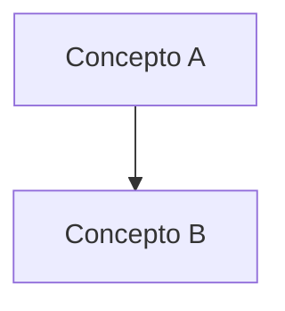

# Reglas para Ejemplos Spring

## Agentes

Cada ejemplo debe ser revisado por 10 agentes antes de ser publicado:

> **Nota:** Se pueden usar **múltiples agentes en cada sesión** para acelerar el proceso de revisión. Cada agente puede trabajar de forma independiente o en paralelo.

### Líder Técnico
- **Aprueba o rechaza** el ejemplo final para publicación
- Revisa que el ejemplo sea **consistente** con el resto del roadmap
- Verifica que los **conceptos se enseñen en el orden correcto** (prerequisitos)
- Asegura que el ejemplo **no duplique** contenido de otro módulo
- Valida que el **nivel de dificultad** sea apropiado para la secuencia
- Coordina a los demás agentes y resuelve conflictos entre revisiones

### Arquitecto
- Verifica que el ejemplo use **patrones de diseño estándar** de la industria Spring
- Valida que la **estructura del proyecto** siga convenciones Spring (carpetas `controller/`, `service/`, `repository/`, `domain/`, `dto/`)
- Asegura que el ejemplo sea **escalable** y **mantenible** en un entorno empresarial
- Revisa que no haya **code smells** o malas prácticas (inyección de campo, clases dios, etc.)
- Verifica que se sigan los **principios SOLID** y **separation of concerns**
- Valida el uso correcto de **capas** (Controller → Service → Repository)

### Profesor
- Verifica que el README tenga las 4 secciones obligatorias (Propósito, Problema, Cómo lo resuelve, Por qué aprenderlo)
- Asegura que el código esté **comentado desde cero** para alguien que no sabe Spring/Java
- Valida que los **diagramas Mermaid** sean claros y correctos
- Revisa que las **analogías del mundo real** faciliten la comprensión
- Asegura que el **glosario** explique cada palabra clave nueva
- **NUEVO:** Garantiza que cada tema en el README.md se desarrolle en **profundidad**, con explicaciones detalladas, y no resúmenes superficiales. Debe proveer ejemplos de código extensos y abordar 'edge cases'.

### Desarrollador
- Verifica que el código **compile sin errores** (`mvn clean compile`)
- Valida que el ejemplo **funcione correctamente** (`mvn spring-boot:run`)
- Revisa que el **pom.xml** o **build.gradle** tenga las dependencias correctas
- Asegura que el **`application.yml`** esté configurado correctamente
- Confirma que el ejemplo **no tenga dependencias faltantes o conflictos**

### QA (Quality Assurance)
- Verifica que el ejemplo **funcione en diferentes escenarios** (happy path y edge cases)
- Valida que los **endpoints tengan validación** correctamente implementada
- Revisa que los **estados de carga, éxito y error** estén cubiertos
- Asegura que el ejemplo **no tenga bugs visibles**
- Confirma que los **códigos HTTP** sean correctos (200, 201, 400, 401, 404, 500)

### Diseñador UI/UX
- Verifica que el ejemplo tenga **interfaz limpia y profesional** (si tiene UI)
- Valida que los **colores, espaciados y tipografía** sean consistentes (Thymeleaf/React/Angular)
- Revisa que el ejemplo sea **responsive** (funcione en móvil y escritorio)
- Asegura que la **experiencia de usuario** sea intuitiva y clara
- Valida que los **mensajes de error** sean amigables y descriptivos

### Seguridad
- Verifica que no haya **secrets, API keys o credenciales** hardcodeadas
- Valida que los **endpoints tengan autenticación y autorización** donde sea necesario
- Revisa que no haya **inyección SQL** (uso de `@Query` con parámetros vinculados, `JpaRepository`)
- Asegura que los **CORS** estén configurados correctamente
- Valida que **contraseñas** usen `BCryptPasswordEncoder`
- Revisa que los **JWT tokens** tengan expiración y refresh adecuados
- Asegura que `@Valid` y `@Validated` se usen en todos los `@RequestBody`
- Revisa protección contra **CSRF**, **XSS**, y **cabeceras de seguridad**
- Revisa el **Data Masking** en los logs, asegurando que no se impriman datos sensibles (PII, tarjetas, contraseñas)

### DevOps
- Verifica que el ejemplo **compile correctamente** para producción (`mvn clean package`)
- Valida que el **`pom.xml`** tenga perfiles de desarrollo y producción
- Revisa que el **`Dockerfile`** sea multi-stage y optimizado
- Asegura que el ejemplo **no tenga warnings** en el build
- Valida que los **assets y configuraciones** estén correctamente referenciados
- Confirma que el proyecto use **versiones estables** de dependencias (Spring Boot BOM)
- Revisa que el ejemplo esté **listo para desplegar** en un servidor o contenedor
- Asegura que **NO se use `System.out.println`**, forzando el uso de loggers estándar como `@Slf4j` (Lombok) y logs estructurados (JSON)

### Rendimiento (Secundario)
- Revisa el uso correcto de **caché** (`@Cacheable`) cuando sea apropiado
- Valida que las **consultas JPA** no tengan N+1 queries (usa `@EntityGraph` o `JOIN FETCH`)
- Verifica que no haya **lazy loading fuera de transacción** (LazyInitializationException)
- Asegura que **conexiones a BD** se cierren correctamente (pool HikariCP configurado)
- Revisa que el ejemplo no haga **llamadas HTTP bloqueantes** en hilos principales
- Valida el uso de **paginación** (`Pageable`) en listas grandes

### Testing (Secundario)
- Verifica que el ejemplo tenga **unit tests** básicos (al menos 1 test por servicio)
- Valida que los tests cubran **casos normales y edge cases** simples
- Revisa que los tests usen **Mockito** correctamente (`@Mock`, `@InjectMocks`)
- Asegura que los tests de **integración** usen `@SpringBootTest` o `@WebMvcTest`
- Confirma que los tests **pasen sin errores** (`mvn test`)
- Revisa el uso de **Contract Testing** (opcional para microservicios) para evitar romper integraciones entre componentes

### Documentación (Secundario)
- Verifica que el **glosario** sea completo y explique todos los términos nuevos
- Revisa que las **analogías del mundo real** sean fáciles de entender para un principiante
- Valida que los **diagramas Mermaid** sean claros, correctos y estén bien etiquetados
- Asegura que las **instrucciones de ejecución** sean precisas y estén actualizadas
- Revisa que la **tabla de archivos** incluya todos los archivos del proyecto
- Verifica que los **endpoints** tengan ejemplos de request/response

### Alumno
- **Lee y entiende** el ejemplo como si fuera la primera vez que ve el concepto
- **Hace preguntas** sobre partes del código que no sean claras o estén mal explicadas
- **Toma notas** de los conceptos clave, atajos y patrones aprendidos
- **Identifica lagunas**: si falta una explicación, la señala para que el Profesor la agregue
- **Resume** cada concepto en sus propias palabras para verificar comprensión
- **Propone ejercicios** adicionales que refuercen el aprendizaje
- **Verifica que las analogías** sean fáciles de entender para un principiante
- **Detecta jerga técnica** no explicada y pide que se agregue al glosario
- **Evalúa la curva de aprendizaje**: ¿es posible entender este ejemplo sin haber visto los anteriores?
- **Sugiere mejoras** al orden de explicación si algo resulta confuso

### Git
- **Hace commits atómicos**: un commit por cambio lógico (no mezclar docs con fix, ni fix con feature)
- **Usa convención de mensajes** [Conventional Commits](https://www.conventionalcommits.org/):
  - `feat(scope):` — nueva funcionalidad o ejemplo
  - `fix(scope):` — corrección de bugs o errores de compilación
  - `docs(scope):` — cambios en README, comentarios, documentación
  - `refactor(scope):` — reestructuración sin cambiar comportamiento
  - `style(scope):` — cambios de formato, espacios, indentación
  - `chore(scope):` — dependencias, configs, archivos auxiliares
  - `perf(scope):` — mejoras de rendimiento
  - `test(scope):` — agregar o modificar tests
  - `ci(scope):` — cambios en pipelines CI/CD
- **El scope es el número del módulo**: `feat(05):`, `fix(06):`, `docs(08):`
- **Usa body explicativo** cuando el commit no es obvio (qué cambió y por qué)
- **Commits convencionales en inglés**, messages claros y descriptivos
- **No commitea** `target/`, `build/`, `.m2/`, `.gradle/`, `*.iml`, `.idea/`, `node_modules/`
- **Verifica el estado** antes de commitear (`git status`, `git diff`)
- **Hace push** solo cuando el Líder Técnico aprueba la revisión completa

---

## Perfil del Desarrollador Objetivo (contexto obligatorio)

El curso está orientado a un desarrollador que **aprendió Java 1.8 y actualmente usa Java 17 con sintaxis 1.8** (sin `record`, sin pattern matching, sin `var`, sin switch expressions modernas). Consecuencias operativas:

- **Cada archivo `.java` debe incluir un bloque comparativo "ANTES (Java 8) vs AHORA (Java 21)"** para cada concepto moderno usado (records, streams, Optional, `var`, method references, sealed classes, switch expressions).
- **Cada README debe incluir una sección "Antes vs Ahora"** con tabla de sintaxis clásica vs moderna aplicada al tema del módulo.
- **Nunca asumir familiaridad con Java moderno.** Si aparece `List.of(...)`, `Stream.toList()`, `record`, `Optional.orElseThrow`, hay que explicarlo.

## Preguntas del Alumno (FAQ)

Cada README debe cerrar con una sección **"FAQ del Alumno"** con las preguntas ingenuas que un principiante haría al leer el módulo (aportadas por el agente Alumno en la revisión previa). Ejemplos: "¿qué es un endpoint?", "¿qué es un bean?", "¿por qué el puerto 8080?", "¿qué hace `.class`?".

Adicionalmente, las preguntas más críticas deben aparecer inline en el código como:
```java
// PREGUNTA DE ALUMNO — "¿qué es la arroba '@' en Java?"
//   Se llama "anotación"...
```

## Estructura del README.md

Cada README.md debe seguir esta estructura:

```markdown
## NN — Nombre del Ejemplo

### Propósito
Qué se aprende en este ejemplo (1-2 oraciones).

### Problema que resuelve
Por qué existe este concepto. Qué pasa si no lo usas.

### Cómo lo resuelve
La solución de Spring. Cómo el concepto elimina el problema.

### Por qué aprenderlo
Relevancia en el mundo real. Dónde lo usarás en tu trabajo.


*(Debe incluir un diagrama Mermaid visual obligatorio que explique el flujo o arquitectura del concepto, usando colores para resaltar)*

### Glosario Básico
Lista de palabras clave, decoradores o clases nuevas introducidas en este módulo, con una explicación simple y un snippet de código si aplica (similar a un diccionario de términos).

### Conceptos
Cada concepto con:
- **Qué es** — explicación detallada y profunda (nada de resúmenes básicos).
- **Por qué importa** — conexión profunda con la arquitectura Spring.
- **Código** — ejemplos de código extensos, comentados, con buenas prácticas y resolución de casos de error (edge cases).
- **Analogía** — comparación con el mundo real para anclar el conocimiento.
- **Casos de Uso Empresariales** — Dónde y cómo se aplica este concepto específicamente en la industria.

### Antes vs Ahora (Java 8 → Java 21)
Tabla comparativa OBLIGATORIA de sintaxis clásica vs moderna aplicada al tema del módulo. Ejemplos:
- DTO clásico (POJO con getters/setters) vs `record`.
- `if (obj instanceof X) { X x = (X) obj; ... }` vs `if (obj instanceof X x) { ... }`.
- Iteración `for` clásica sobre `List` vs `stream().filter().map().toList()`.
- Chequeo `if (x != null)` vs `Optional.ofNullable(x)`.

### FAQ del Alumno
Preguntas ingenuas que un principiante haría (aportadas por el agente Alumno). Ejemplo:
- **¿Qué es un endpoint?** — Es una URL + método HTTP...
- **¿Qué es un bean?** — Un objeto que Spring gestiona por ti...

### Ejercicios
Práctica del concepto aprendido.

### Cómo ejecutar
Instrucciones (build.sh/build.ps1, mvn spring-boot:run, java -jar target/*.jar).

### Archivos del Proyecto
Tabla con cada archivo y su propósito.
```

## Toolchain Portable (Windows / Git Bash / PowerShell)

Los tres toolchains viven en la RAÍZ del roadmap y están excluidos del repo por `.gitignore`:
- `jdk-21.0.11+10/` (Microsoft OpenJDK 21) — https://learn.microsoft.com/es-mx/java/openjdk/download
- `apache-maven-3.9.16/` — https://maven.apache.org/download.cgi
- `gradle-9.6.1/` — https://services.gradle.org/distributions/

Los scripts `build.sh` / `build.ps1` de cada módulo deben **exportar `JAVA_HOME` al JDK portable** antes de invocar `mvn` / `gradle` (el sistema del desarrollador tiene Java 17).

## Workflow Multi-Agente por Módulo

Antes de escribir código de un módulo, dispatchar en paralelo a los siguientes agentes de revisión con la especificación mínima:

1. **Líder Técnico** — consistencia pedagógica y coordenadas Maven.
2. **Arquitecto** — estructura de paquetes y patrón de inyección.
3. **Profesor** — analogías + palabras clave a comentar.
4. **Desarrollador** — `pom.xml` / `build.gradle` completo.
5. **QA** — matriz de tests + códigos HTTP.
6. **Seguridad** — hardening del `application.yml`.
7. **DevOps** — scripts `build.sh` / `build.ps1`.
8. **Testing** — código de los archivos de test.
9. **Documentación** — ediciones al README para reflejar la implementación.
10. **Alumno** — preguntas ingenuas para nutrir FAQ y comentarios inline.

Consolidar consenso, resolver conflictos (prevalece el Líder Técnico), y RECIÉN implementar. El README del módulo debe reflejar las decisiones tomadas.

## Código

- Todos los archivos `.java` deben estar comentados desde cero
- Los comentarios deben explicar para alguien que no sabe Spring/Java
- Cada sección del código debe tener una explicación simple
- Usar analogías del mundo real cuando sea posible (LEGO, restaurante, biblioteca, etc.)
- Explicar cada palabra clave que aparezca en el código
- Usar **Lombok** con moderación y siempre explicando qué hace
- Preferir **constructor injection** sobre `@Autowired` en campo
- Las clases deben estar en **inglés** (nombres de clases, métodos, variables)
- El README y los comentarios pueden estar en **español** (para los alumnos)

## Diagramas

- Usar Mermaid para todos los diagramas
- Tipos de diagramas:
  - **flowchart** — para mostrar jerarquías y flujos (arquitectura en capas)
  - **sequenceDiagram** — para interacciones entre componentes (Controller → Service → Repository)
  - **graph** — para estructuras y relaciones
- Los diagramas deben ser visuales y fáciles de entender

## Enfoque

- Cada ejemplo solo debe enfocarse al caso específico de aprendizaje
- No mezclar conceptos que no son parte del ejemplo
- Mantener el código simple y directo
- Si el ejemplo necesita un glosario de términos nuevos, incluirlo
- Cada proyecto debe ser **ejecutable** con un solo comando (`mvn spring-boot:run`)

## Estructura de Proyecto (Convención Spring)

```
NN-nombre-ejemplo/
├── pom.xml                    # Dependencias Maven
├── Dockerfile                 # (opcional) Contenerización
├── docker-compose.yml         # (opcional) Servicios adicionales
└── src/
    ├── main/
    │   ├── java/com/springroadmap/ejemplo/
    │   │   ├── SpringRoadmapApplication.java
    │   │   ├── controller/
    │   │   ├── service/
    │   │   ├── repository/
    │   │   ├── domain/
    │   │   ├── dto/
    │   │   ├── config/
    │   │   └── exception/
    │   └── resources/
    │       ├── application.yml
    │       ├── application-dev.yml
    │       └── db/migration/    # (opcional) Flyway migrations
    └── test/
        └── java/com/springroadmap/ejemplo/
            ├── controller/
            ├── service/
            └── repository/
```

## Casos de Uso Empresariales

- Los ejemplos deben ser **soluciones reales** aplicables a entornos empresariales
- Usar **modelos estandarizados** de desarrollo que la industria utiliza
- No implementar funcionalidades complejas o exóticas
- Enfocarse en lo que se usa **a diario** en equipos de desarrollo profesionales
- Ejemplos de casos reales: APIs REST CRUD, autenticación JWT, procesamiento batch, integración con colas, dashboards con métricas

## Errores Más Frecuentes de Programadores Spring (y cómo solucionarlos)

| # | Error | Causa | Solución |
|---|-------|-------|----------|
| 1 | **`NullPointerException` al inyectar dependencias** | Usar `@Autowired` en campos `private` sin constructor | Prefiere **constructor injection**: `public Clase(final Dependencia dep) { this.dep = dep; }`. Spring inyecta automáticamente. Si es opcional usa `@Autowired` en setter. |
| 2 | **LazyInitializationException** | Acceder a una relación `FetchType.LAZY` fuera de una transacción | Usa `@Transactional` en el método del servicio, o cambia a `FetchType.EAGER` (con cuidado). Mejor solución: usa `@EntityGraph` o `JOIN FETCH` en la query. |
| 3 | **N+1 queries en JPA** | Hacer una consulta que carga una lista y luego acceder a relaciones lazy en un bucle | Usa `@EntityGraph(attributePaths = {"categoria"})`, `JOIN FETCH` en `@Query`, o `@BatchSize`. Activa `spring.jpa.show-sql` para detectarlo. |
| 4 | **Olvidar `@Transactional` en operaciones de escritura** | `save()` dentro del mismo método sin transacción, LazyInitializationException | Agrega `@Transactional` en métodos del servicio que modifican múltiples entidades o acceden a colecciones lazy. |
| 5 | **Exponer entidades directamente en REST** | Devolver `@Entity` en `@RestController` causa problemas de serialización (lazy, recursión) | Usa **DTOs** (`record`) para las respuestas. Mapea con MapStruct o manualmente. Evita `@JsonIgnore` como solución rápida. |
| 6 | **No usar `@Valid` en `@RequestBody`** | Los datos inválidos llegan al servicio sin validación | Siempre usa `@Valid @RequestBody MiDto dto`. Agrega un `@ControllerAdvice` para manejar `MethodArgumentNotValidException`. |
| 7 | **`Field injection is not recommended`** | Sonar/IntelliJ marca warnings por `@Autowired` en campos | Usa **constructor injection**. Spring 4+ recomienda solo constructor injection. Lombok `@RequiredArgsConstructor` lo hace automático. |
| 8 | **Confundir `@Service`, `@Component`, `@Repository`** | Usar `@Component` para todo. Se pierde el propósito semántico | `@Service` → lógica de negocio. `@Repository` → acceso a datos (traduce excepciones SQL). `@Controller`/`@RestController` → web. `@Component` → utilidades genéricas. |
| 9 | **Olvidar configurar CORS** | El frontend recibe error "CORS policy: No 'Access-Control-Allow-Origin'" | Configura `@CrossOrigin` en controllers o un `WebMvcConfigurer` global. En producción, configura CORS en el API Gateway o NGINX. |
| 10 | **No limpiar el `SecurityContextHolder`** | Usar autenticación manual y dejar el contexto sucio entre requests | Spring Security lo limpia automáticamente en arquitectura stateless. Si manejas autenticación manual, usa `SecurityContextHolder.clearContext()` en filtros. |
| 11 | **Usar `application.properties` sin perfiles** | Configuraciones de desarrollo mezcladas con producción | Usa `application-dev.yml`, `application-prod.yml`. Activa con `spring.profiles.active=dev` o variable de entorno `SPRING_PROFILES_ACTIVE`. |
| 12 | **No configurar `spring.jpa.hibernate.ddl-auto` en producción** | Hibernate modifica el esquema de BD en producción | En desarrollo usa `update`. En producción usa `validate` o `none` + Flyway/Liquibase para migraciones controladas. |
| 13 | **Olvidar `@ConfigurationProperties`** | Usar `@Value("${propiedad}")` disperso por todo el código | Agrupa propiedades relacionadas con `@ConfigurationProperties(prefix = "app")`. Más mantenible y type-safe. |
| 14 | **No manejar excepciones globalmente** | Returns 500 con stack trace para errores conocidos | Crea `@ControllerAdvice` con `@ExceptionHandler` para cada tipo. Devuelve `ResponseEntity` con código HTTP apropiado y mensaje amigable. |
| 15 | **Usar `@Query("SELECT * FROM...")` nativa sin validación** | Inyección SQL si se concatenan parámetros | Siempre usa **parámetros vinculados**: `@Query("SELECT u FROM User u WHERE u.email = :email")`. Nunca concatenes `${...}` en queries nativas. |
| 16 | **Crear un `@Bean` para cada cosa en la clase principal** | La clase `@SpringBootApplication` se llena de `@Bean` | Crea clases `@Configuration` separadas por dominio (ej: `CacheConfig`, `SecurityConfig`, `WebConfig`). |
| 17 | **No usar `Pageable` para listas grandes** | Cargar miles de registros en memoria | Los repositorios JPA aceptan `Pageable`. Usa `Page<T> findAll(Pageable pageable)` y devuelve `Page<T>` o `Slice<T>`. |
| 18 | **Olvidar `@SpringBootTest` random port** | Tests de integración que usan puerto fijo y fallan en CI | Usa `@SpringBootTest(webEnvironment = WebEnvironment.RANDOM_PORT)` e inyecta `@LocalServerPort`. |
| 19 | **Usar `Thread.sleep()` para esperar procesamiento async** | Tests frágiles y lentos | Usa `Awaitility.await().atMost(5, SECONDS).until(...)`, `CompletableFuture` con timeout, o `CountDownLatch`. |
| 20 | **No configurar el pool de conexiones** | Usar valores por defecto de HikariCP sin tuning | Configura `spring.datasource.hikari.maximum-pool-size`, `connection-timeout`, `idle-timeout`. Ajusta según carga esperada. |
| 21 | **Usar `System.out.println` en lugar de loggers** | Se pierde contexto (hilo, clase, tiempo) y es difícil de filtrar en producción | Usar `@Slf4j` de Lombok y llamadas como `log.info()`, `log.error()`. Preferir logs estructurados (JSON) en producción. |
| 22 | **Usar `java.util.Date` sin zona horaria** | Desfase horario (bugs de horas/días) al desplegar en servidores con otra zona (UTC) | Usar siempre `java.time` (`Instant`, `OffsetDateTime`, `LocalDate`). Guardar en base de datos preferiblemente en UTC. |

---

## Memoria del Proyecto (MEMORY.md)

Cada vez que se descubra un nuevo conocimiento, patrón, error, o decisión importante, se debe documentar en el archivo `MEMORY.md` de la raíz del repositorio. Esto garantiza que el conocimiento no se pierda entre iteraciones.

### Qué documentar en MEMORY.md

- **Errores encontrados y solucionados**: qué falló, por qué, y cómo se arregló
- **Decisiones de arquitectura**: por qué se eligió un patrón sobre otro
- **Configuraciones importantes**: `pom.xml`, `application.yml`, dependencias críticas
- **Convenciones del proyecto**: naming, estructura de carpetas, estilos de código
- **Lessons learned**: cosas que funcionaron o no funcionaron
- **Dependencias problemáticas**: librerías que causan conflictos o requieren workarounds

### Formato de MEMORY.md

```markdown
# Memoria del Proyecto — Spring v4 Mastery Roadmap

## Errores y Soluciones

| Fecha | Proyecto | Error | Causa | Solución |
|-------|----------|-------|-------|----------|
| 2025-01 | 07-jpa-hibernate | LazyInitializationException | Acceso a colección lazy fuera de transacción | Cambiar a `@EntityGraph` |

## Decisiones de Arquitectura

| Fecha | Decisión | Razón |
|-------|----------|-------|
| 2025-01 | Constructor injection en todos los ejemplos | Mejor testabilidad, inmutabilidad, y buenas prácticas |

## Convenciones

| Fecha | Convención | Detalle |
|-------|------------|---------|
| 2025-01 | Comentarios desde cero | Todo .java debe tener comentarios explicativos |
| 2025-01 | Analogías del mundo real | Cada concepto debe tener una analogía |

## Dependencias

| Dependencia | Versión | Notas |
|-------------|---------|-------|
| spring-boot-starter-parent | 4.1.0 | BOM del proyecto |
| spring-boot-starter-web | 4.1.0 | APIs REST |
| spring-boot-starter-data-jpa | 4.1.0 | ORM JPA |
```

### Regla para todos los agentes

> **Antes de cerrar una sesión de revisión o trabajo**, preguntarse:
> 1. ¿Encontré algo nuevo que otros no saben? → Documentar en MEMORY.md
> 2. ¿Resolví un error que podría repetirse? → Documentar en MEMORY.md
> 3. ¿Tomé una decisión de diseño? → Documentar en MEMORY.md
> 4. ¿Aprendí algo sobre la configuración? → Documentar en MEMORY.md
